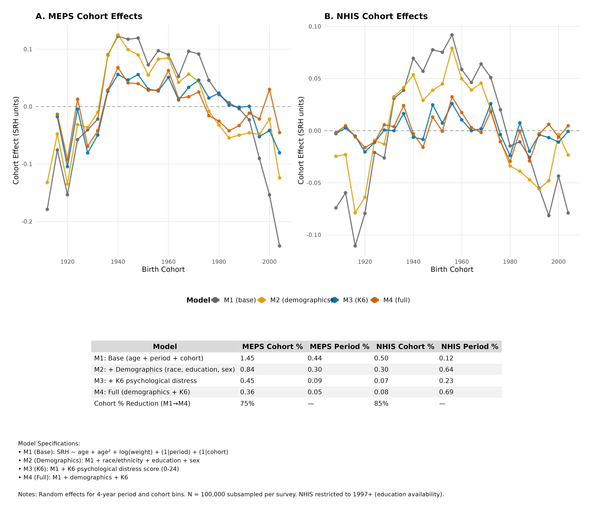

# BHAPC Covariate Sensitivity Analysis: K6 and Demographics
Christine L. Kuryla
2026-02-13

- [Motivation](#motivation)
- [Methods](#methods)
  - [Model specifications](#model-specifications)
  - [K6 availability](#k6-availability)
- [Convergence](#convergence)
- [Variance Decomposition](#variance-decomposition)
  - [MEPS](#meps)
  - [NHIS](#nhis)
  - [Cohort variance reduction](#cohort-variance-reduction)
- [Key Fixed Effects](#key-fixed-effects)
- [Period and Cohort Effects](#period-and-cohort-effects)
  - [Combined comparison across models and
    surveys](#combined-comparison-across-models-and-surveys)
  - [MEPS: Period and cohort effects by
    model](#meps-period-and-cohort-effects-by-model)
  - [NHIS: Period and cohort effects by
    model](#nhis-period-and-cohort-effects-by-model)
- [Key Findings](#key-findings)
- [Limitations](#limitations)
- [Reproducibility](#reproducibility)

# Motivation

A key question for interpreting cohort effects in self-rated health
(SRH) is whether they reflect *true* generational differences or are
artifacts of compositional changes in the population. If the demographic
and health profiles of successive birth cohorts have shifted — for
example, through rising educational attainment, changing racial/ethnic
composition, or increasing psychological distress — then apparent cohort
“effects” on SRH may simply reflect these compositional shifts rather
than genuine generational change.

To test this, we fit a sequence of Bayesian hierarchical APC (BHAPC)
models that progressively add covariates to the baseline specification.
If cohort variance shrinks substantially after adjusting for
demographics and psychological distress, the compositional hypothesis is
supported.

# Methods

## Model specifications

We estimated four nested BHAPC models on NHIS (1997–2018) and MEPS
(1996–2019), each using a 100,000-observation random subsample:

| Model | Specification | Purpose |
|----|----|----|
| **M1** (Baseline) | `srh ~ age + age² + ln(wt)` + random cohort + period | Baseline APC decomposition |
| **M2** (Demographics) | M1 + race + education + sex | Test compositional demographics |
| **M3** (K6 only) | M1 + K6 | Test psychological distress alone |
| **M4** (Full) | M1 + race + education + sex + K6 | All covariates combined |

All models include age (linear + quadratic) as fixed effects,
log-transformed survey weights as a covariate (Graf, 2021), and crossed
random intercepts for 4-year birth cohort and period bins. Models were
estimated via MCMC using rstanarm (4 chains x 6,000 iterations,
adapt_delta = 0.998). Models M3 and M4 are fit on complete cases for K6.

## K6 availability

The Kessler-6 psychological distress scale is not available for all
respondents:

| Survey | N (total) | N (valid K6) | % Missing |
|:-------|----------:|-------------:|----------:|
| MEPS   |     1e+05 |        74078 |      25.9 |
| NHIS   |     1e+05 |        42293 |      57.7 |

MEPS retains approximately 74% of observations for K6-inclusive models;
NHIS retains approximately 42%. Core variables (SRH, age, year, survey
weight) are complete in both surveys.

# Convergence

All 8 models converged successfully (max Rhat = 1.0032, min effective
sample size = 1,816).

# Variance Decomposition

The table below shows the percentage of total SRH variance attributable
to each component across the four model specifications.

### MEPS

| Component | M1 (Base) | M2 (Demog) | M3 (K6) | M4 (Full) |
|:----------|----------:|-----------:|--------:|----------:|
| Cohort    |     1.453 |      0.840 |   0.446 |     0.361 |
| Period    |     0.444 |      0.295 |   0.092 |     0.054 |
| Residual  |    98.103 |     98.865 |  99.461 |    99.585 |

MEPS: Variance components (% of total) by model

### NHIS

| Component | M1 (Base) | M2 (Demog) | M3 (K6) | M4 (Full) |
|:----------|----------:|-----------:|--------:|----------:|
| Cohort    |     0.501 |      0.297 |   0.067 |     0.077 |
| Period    |     0.119 |      0.643 |   0.225 |     0.689 |
| Residual  |    99.380 |     99.060 |  99.707 |    99.235 |

NHIS: Variance components (% of total) by model

### Cohort variance reduction

| Survey | M1 Cohort (%) | M4 Cohort (%) | Reduction (%) |
|:-------|--------------:|--------------:|--------------:|
| MEPS   |           1.5 |           0.4 |          75.1 |
| NHIS   |           0.5 |           0.1 |          84.7 |

Cohort variance reduction from baseline (M1) to full model (M4)

In MEPS, cohort variance drops by approximately 75% from M1 to M4. In
NHIS, the reduction is approximately 85%. In both surveys, adding K6 (M1
→ M3) produces the single largest reduction, with demographics providing
additional but smaller contributions.

# Key Fixed Effects

| Survey | Model | Estimate |     SE | CI Lower (90%) | CI Upper (90%) |
|:-------|:------|---------:|-------:|---------------:|---------------:|
| MEPS   | M3    |  -0.0968 | 0.0008 |        -0.0980 |        -0.0955 |
| MEPS   | M4    |  -0.0939 | 0.0007 |        -0.0951 |        -0.0926 |
| NHIS   | M3    |  -0.0913 | 0.0012 |        -0.0933 |        -0.0894 |
| NHIS   | M4    |  -0.0856 | 0.0012 |        -0.0875 |        -0.0837 |

K6 coefficient across models

The K6 coefficient is strongly negative and consistent across surveys
and specifications: each unit increase in psychological distress (K6
scale) is associated with approximately 0.09 lower SRH, controlling for
age and other covariates.

| Survey | Model | Estimate |     SE |
|:-------|:------|---------:|-------:|
| MEPS   | M1    |  -0.0351 | 0.0020 |
| MEPS   | M2    |  -0.0452 | 0.0019 |
| MEPS   | M3    |  -0.0270 | 0.0022 |
| MEPS   | M4    |  -0.0356 | 0.0020 |
| NHIS   | M1    |  -0.0252 | 0.0018 |
| NHIS   | M2    |  -0.0352 | 0.0018 |
| NHIS   | M3    |  -0.0230 | 0.0021 |
| NHIS   | M4    |  -0.0314 | 0.0019 |

Age coefficient across models

The age coefficient attenuates modestly when covariates are added (from
≈-0.035 to ≈-0.031 in NHIS; ≈-0.035 to ≈-0.036 in MEPS), consistent with
partial confounding between age and health-correlated demographics.

# Period and Cohort Effects

## Combined comparison across models and surveys

<div id="fig-combined-comparison">



Figure 1: Birth cohort effects on SRH across model specifications.
Posterior means with 90% credible intervals. As covariates are added (M1
→ M4), cohort effects flatten toward zero in both surveys.

</div>

## MEPS: Period and cohort effects by model

<div id="fig-meps-2x4">


Figure 2: MEPS period (top) and cohort (bottom) effects across four
model specifications.

</div>

## NHIS: Period and cohort effects by model

<div id="fig-nhis-2x4">


Figure 3: NHIS period (top) and cohort (bottom) effects across four
model specifications.

</div>

# Key Findings

1.  **Cohort effects are largely compositional.** Adding demographics
    and K6 reduces cohort variance by ~75% in MEPS and ~85% in NHIS. The
    residual cohort effects in M4 are negligible (\<0.4% of total
    variance).

2.  **K6 is the most powerful single covariate.** Psychological distress
    alone (M3) accounts for more cohort variance reduction than
    demographics alone (M2), suggesting that rising psychological
    distress in younger cohorts is a primary driver of apparent cohort
    differences in SRH.

3.  **Results are consistent across surveys.** Despite differences in
    survey design, sample composition, and K6 availability, both MEPS
    and NHIS tell the same story: observed birth cohort patterns in SRH
    are substantially explained by compositional changes rather than
    true generational effects.

4.  **The K6 effect is robust.** The K6 coefficient is stable across
    specifications (β ≈ -0.09) and does not change meaningfully when
    demographics are added or removed.

# Limitations

- **K6 missingness** is substantial, especially in NHIS (58%). Models M3
  and M4 are fit on complete cases, which may introduce selection bias
  if missingness is related to distress or health.
- **Cross-sectional identification:** The BHAPC framework relies on
  assumptions to separate age, period, and cohort effects. The covariate
  reduction approach is more interpretable than point estimates of APC
  effects, but is not causal.
- **Subsample of 100,000:** Due to computational constraints of MCMC
  estimation, models use a random subsample rather than the full survey
  data.

# Reproducibility

Analysis scripts: `R/scripts/17_bhapc_nhis_meps_covariates.R` and
subscripts `17a`–`17e`. Pre-computed results in
`output/bhapc_nhis_meps_covariates/`. Methods details:
`output/methods_bhapc.md`.

``` r
sessionInfo()
```

    R version 4.5.0 (2025-04-11)
    Platform: x86_64-pc-linux-gnu
    Running under: Ubuntu 22.04.4 LTS

    Matrix products: default
    BLAS:   /usr/lib/x86_64-linux-gnu/blas/libblas.so.3.10.0 
    LAPACK: /usr/lib/x86_64-linux-gnu/lapack/liblapack.so.3.10.0  LAPACK version 3.10.0

    locale:
     [1] LC_CTYPE=C.UTF-8       LC_NUMERIC=C           LC_TIME=C.UTF-8       
     [4] LC_COLLATE=C.UTF-8     LC_MONETARY=C.UTF-8    LC_MESSAGES=C.UTF-8   
     [7] LC_PAPER=C.UTF-8       LC_NAME=C              LC_ADDRESS=C          
    [10] LC_TELEPHONE=C         LC_MEASUREMENT=C.UTF-8 LC_IDENTIFICATION=C   

    time zone: Etc/UTC
    tzcode source: system (glibc)

    attached base packages:
    [1] stats     graphics  grDevices utils     datasets  methods   base     

    other attached packages:
     [1] knitr_1.51      here_1.0.2      lubridate_1.9.4 forcats_1.0.1  
     [5] stringr_1.6.0   dplyr_1.1.4     purrr_1.2.1     readr_2.1.6    
     [9] tidyr_1.3.2     tibble_3.3.1    ggplot2_4.0.1   tidyverse_2.0.0

    loaded via a namespace (and not attached):
     [1] bit_4.6.0          gtable_0.3.6       jsonlite_2.0.0     crayon_1.5.3      
     [5] compiler_4.5.0     tidyselect_1.2.1   parallel_4.5.0     png_0.1-8         
     [9] scales_1.4.0       yaml_2.3.12        fastmap_1.2.0      R6_2.6.1          
    [13] generics_0.1.4     rprojroot_2.1.1    pillar_1.11.1      RColorBrewer_1.1-3
    [17] tzdb_0.5.0         rlang_1.1.7        stringi_1.8.7      xfun_0.56         
    [21] S7_0.2.1           bit64_4.6.0-1      otel_0.2.0         timechange_0.3.0  
    [25] cli_3.6.5          withr_3.0.2        magrittr_2.0.4     digest_0.6.39     
    [29] grid_4.5.0         vroom_1.7.0        hms_1.1.4          lifecycle_1.0.5   
    [33] vctrs_0.7.1        evaluate_1.0.5     glue_1.8.0         farver_2.1.2      
    [37] rmarkdown_2.30     tools_4.5.0        pkgconfig_2.0.3    htmltools_0.5.9   
