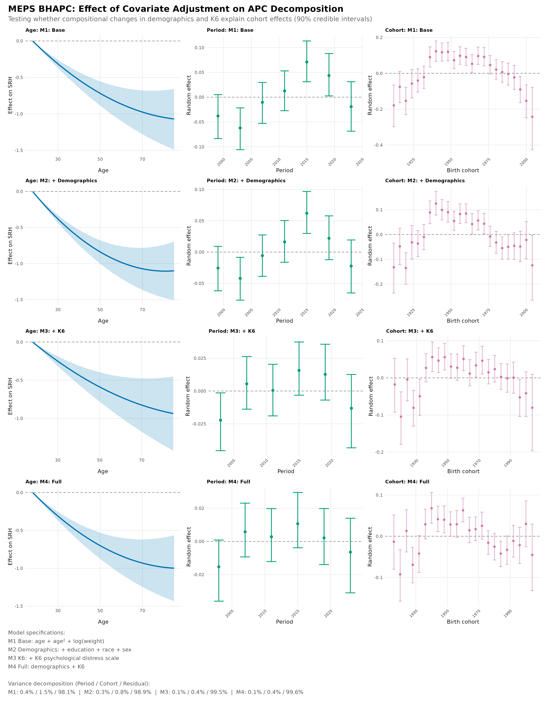
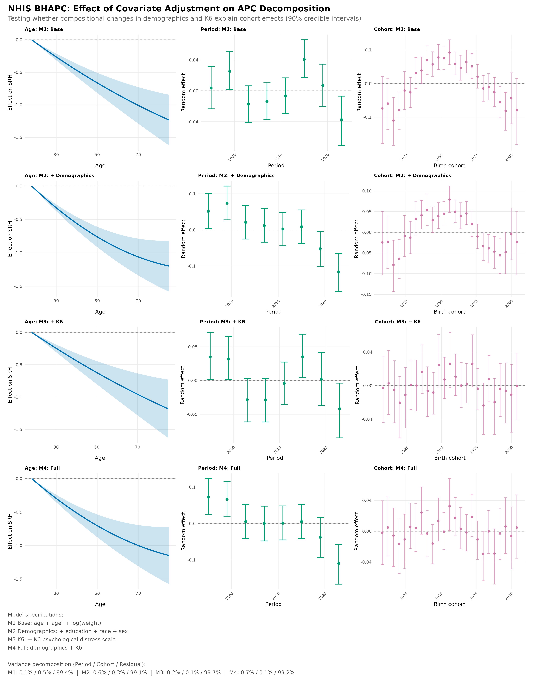
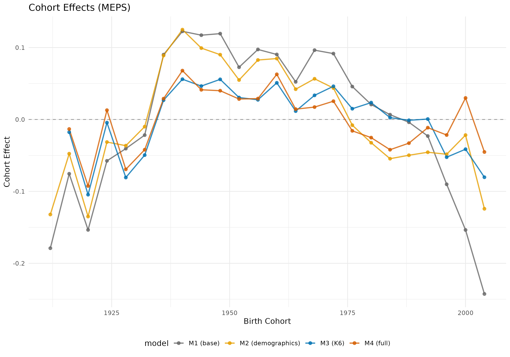
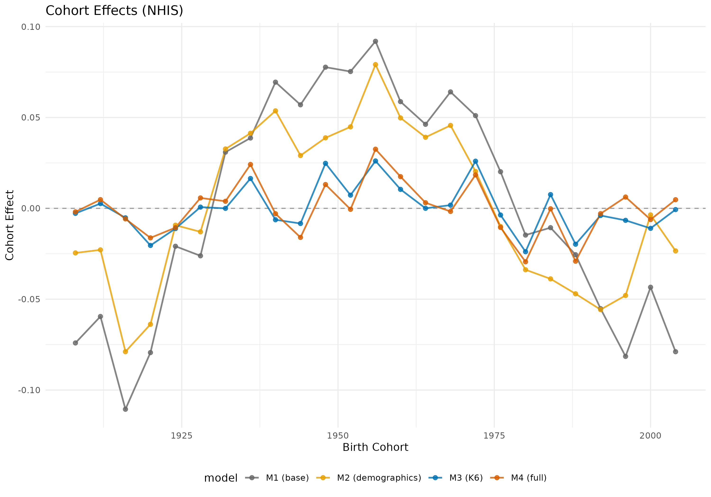
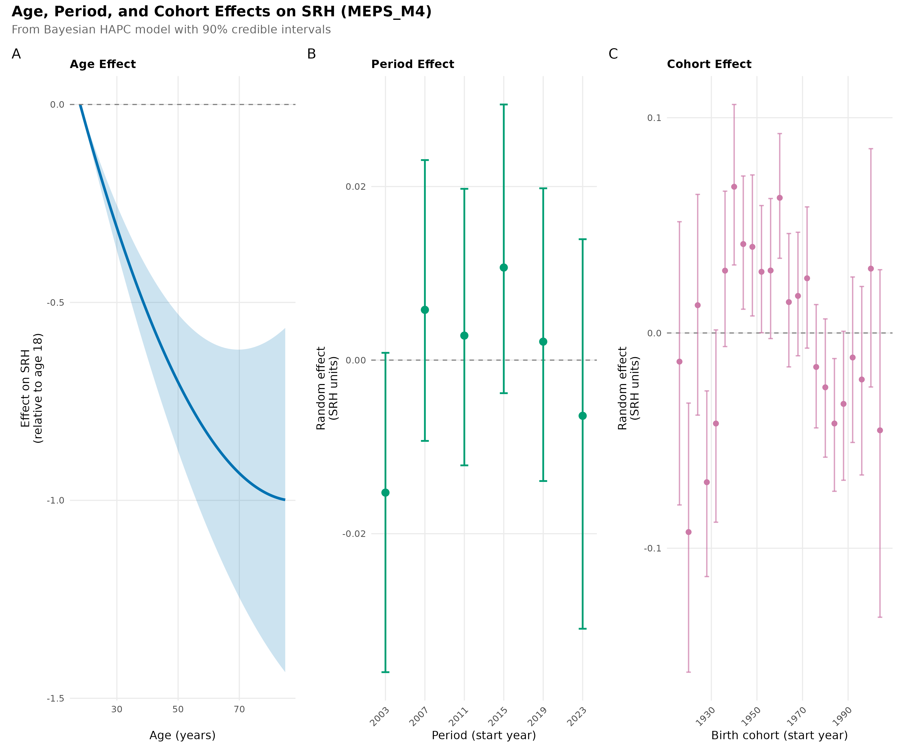
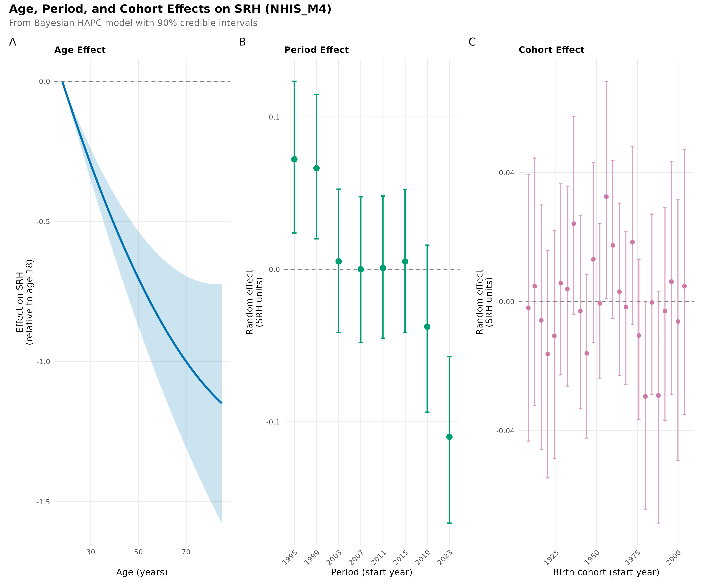

# BHAPC Covariate Sensitivity Analysis — Internal Working Notes
Christine L. Kuryla
2026-02-13

- [Overview](#overview)
- [Setup](#setup)
- [Model Specifications](#model-specifications)
- [Missingness](#missingness)
- [Convergence Diagnostics](#convergence-diagnostics)
- [Variance Decomposition](#variance-decomposition)
  - [Percent Reduction in Cohort Variance (M1 →
    M4)](#percent-reduction-in-cohort-variance-m1--m4)
  - [Detailed Variance by Model](#detailed-variance-by-model)
- [Fixed Effects](#fixed-effects)
  - [K6 Coefficient](#k6-coefficient)
  - [lnWt Coefficient](#lnwt-coefficient)
- [Period and Cohort Effects —
  Figures](#period-and-cohort-effects--figures)
  - [Combined Covariate Comparison](#combined-covariate-comparison)
  - [MEPS: Period and Cohort Effects
    (2x4)](#meps-period-and-cohort-effects-2x4)
  - [NHIS: Period and Cohort Effects
    (2x4)](#nhis-period-and-cohort-effects-2x4)
  - [MEPS: Full APC Grid (4x3)](#meps-full-apc-grid-4x3)
  - [NHIS: Full APC Grid (4x3)](#nhis-full-apc-grid-4x3)
  - [Cohort Effects Close-Up](#cohort-effects-close-up)
  - [Individual M4 APC Panels](#individual-m4-apc-panels)
- [Interpretation](#interpretation)
  - [What drives the MEPS vs NHIS
    difference?](#what-drives-the-meps-vs-nhis-difference)
  - [Key takeaway](#key-takeaway)
  - [Caveats](#caveats)
- [Technical Notes](#technical-notes)
  - [Script lineage](#script-lineage)
  - [Output paths](#output-paths)
  - [Related analyses](#related-analyses)
- [Session Info](#session-info)

# Overview

These are internal working notes for the BHAPC covariate sensitivity
analysis testing whether observed birth cohort effects on SRH are
explained by compositional changes in demographics and psychological
distress (K6).

**Core question:** Do cohort effects in the BHAPC model shrink or
disappear once we control for race, education, sex, and K6 (Kessler-6
psychological distress)?

**Scripts:** `R/scripts/17_bhapc_nhis_meps_covariates.R` (orchestrator)
→ `17a` (MEPS models), `17b` (NHIS models) → `17c` (combined comparison
figure), `17d` (4x3 APC grids), `17e` (2x4 period/cohort figures)

**Output directory:** `output/bhapc_nhis_meps_covariates/`

# Setup

``` r
library(tidyverse)
library(here)
library(knitr)

output_dir <- here::here("output", "bhapc_nhis_meps_covariates")
```

# Model Specifications

Four nested models, each building on the last:

| Model | Formula (random effects: cohort + period) | What it tests |
|----|----|----|
| **M1** (base) | `srh ~ age + age² + lnWt + (1|cohort) + (1|period)` | Baseline APC decomposition |
| **M2** (demographics) | M1 + `race + education + sex` | Compositional demographics |
| **M3** (K6 only) | M1 + `K6` | Psychological distress alone |
| **M4** (full) | M1 + `race + education + sex + K6` | All covariates combined |

**Design decisions:**

- **100k subsample:** Stan MCMC is computationally intensive; 100k
  observations balances precision with feasibility (~8-12 hours per
  model).
- **lnWt as covariate:** Following Graf (2021), log-transformed survey
  weights partially account for complex sampling designs within the
  Bayesian framework.
- **NHIS restricted to 1997+:** Education variable not consistently
  available before 1997 in the harmonized NHIS data.
- **4-year bins:** Age (18-21, 22-25, …, 85-89), period, and cohort
  (period - age midpoint) all use 4-year bins.
- **MCMC config:** 4 chains × 6,000 iterations (3,000 warmup + 3,000
  sampling), adapt_delta = 0.998, default weakly informative priors via
  rstanarm.

# Missingness

K6 availability is the main data concern. Models M3 and M4 are fit only
on complete cases for all covariates including K6.

``` r
miss_meps <- read_csv(file.path(output_dir, "meps", "missingness_report.csv"),
                      show_col_types = FALSE)
miss_nhis <- read_csv(file.path(output_dir, "nhis", "missingness_report.csv"),
                      show_col_types = FALSE)

cat("=== MEPS Missingness ===\n")
```

    === MEPS Missingness ===

``` r
kable(miss_meps, digits = 1)
```

| variable | n_total | n_valid | n_missing | pct_missing |
|:---------|--------:|--------:|----------:|------------:|
| srh      |   1e+05 |  100000 |         0 |         0.0 |
| age      |   1e+05 |  100000 |         0 |         0.0 |
| year     |   1e+05 |  100000 |         0 |         0.0 |
| wt       |   1e+05 |  100000 |         0 |         0.0 |
| race_f   |   1e+05 |  100000 |         0 |         0.0 |
| educ_f   |   1e+05 |   99331 |       669 |         0.7 |
| sex_f    |   1e+05 |  100000 |         0 |         0.0 |
| k6       |   1e+05 |   74078 |     25922 |        25.9 |

``` r
cat("\n=== NHIS Missingness ===\n")
```


    === NHIS Missingness ===

``` r
kable(miss_nhis, digits = 1)
```

| variable | n_total | n_valid | n_missing | pct_missing |
|:---------|--------:|--------:|----------:|------------:|
| srh      |   1e+05 |  100000 |         0 |         0.0 |
| age      |   1e+05 |  100000 |         0 |         0.0 |
| year     |   1e+05 |  100000 |         0 |         0.0 |
| wt       |   1e+05 |  100000 |         0 |         0.0 |
| race_f   |   1e+05 |   99992 |         8 |         0.0 |
| educ_f   |   1e+05 |   97871 |      2129 |         2.1 |
| sex_f    |   1e+05 |  100000 |         0 |         0.0 |
| k6       |   1e+05 |   42293 |     57707 |        57.7 |

**Key observations:**

- MEPS K6: 25.9% missing (74,078 valid of 100,000)
- NHIS K6: **57.7% missing** (42,293 valid of 100,000) — much higher
  than MEPS
- This means M3/M4 for NHIS are fit on a substantially reduced subsample
- Core variables (SRH, age, year, weight) are complete in both surveys
- Education: 0.7% missing in MEPS, 2.1% in NHIS

# Convergence Diagnostics

``` r
conv_meps <- read_csv(file.path(output_dir, "meps", "convergence_diagnostics.csv"),
                      show_col_types = FALSE)
conv_nhis <- read_csv(file.path(output_dir, "nhis", "convergence_diagnostics.csv"),
                      show_col_types = FALSE)

conv_all <- bind_rows(
  conv_meps |> mutate(survey = "MEPS"),
  conv_nhis |> mutate(survey = "NHIS")
) |>
  select(survey, model, max_rhat, min_neff, converged)

kable(conv_all, digits = 4, caption = "Convergence diagnostics for all 8 models")
```

| survey | model | max_rhat | min_neff | converged |
|:-------|:------|---------:|---------:|:----------|
| MEPS   | M1    |   1.0028 |     2208 | TRUE      |
| MEPS   | M2    |   1.0018 |     2311 | TRUE      |
| MEPS   | M3    |   1.0019 |     1816 | TRUE      |
| MEPS   | M4    |   1.0032 |     2033 | TRUE      |
| NHIS   | M1    |   1.0016 |     1823 | TRUE      |
| NHIS   | M2    |   1.0031 |     2030 | TRUE      |
| NHIS   | M3    |   1.0017 |     2266 | TRUE      |
| NHIS   | M4    |   1.0023 |     2505 | TRUE      |

Convergence diagnostics for all 8 models

All 8 models converged: max Rhat \< 1.01, min effective sample size \>
1,800. No divergent transition concerns at adapt_delta = 0.998.

# Variance Decomposition

This is the core result. If covariates explain the cohort effect, cohort
variance should shrink from M1 → M4.

``` r
comp_meps <- read_csv(file.path(output_dir, "meps", "comparison_table.csv"),
                      show_col_types = FALSE)
comp_nhis <- read_csv(file.path(output_dir, "nhis", "comparison_table.csv"),
                      show_col_types = FALSE)

cat("=== MEPS Variance Decomposition (% of total) ===\n")
```

    === MEPS Variance Decomposition (% of total) ===

``` r
kable(comp_meps, digits = 3)
```

| component | M1_base | M2_demog |  M3_k6 | M4_full |
|:----------|--------:|---------:|-------:|--------:|
| Cohort    |   1.453 |    0.840 |  0.446 |   0.361 |
| Period    |   0.444 |    0.295 |  0.092 |   0.054 |
| Residual  |  98.103 |   98.865 | 99.461 |  99.585 |

``` r
cat("\n=== NHIS Variance Decomposition (% of total) ===\n")
```


    === NHIS Variance Decomposition (% of total) ===

``` r
kable(comp_nhis, digits = 3)
```

| component | M1_base | M2_demog |  M3_k6 | M4_full |
|:----------|--------:|---------:|-------:|--------:|
| Cohort    |   0.501 |    0.297 |  0.067 |   0.077 |
| Period    |   0.119 |    0.643 |  0.225 |   0.689 |
| Residual  |  99.380 |   99.060 | 99.707 |  99.235 |

### Percent Reduction in Cohort Variance (M1 → M4)

``` r
# Extract cohort row
meps_cohort <- comp_meps |> filter(component == "Cohort")
nhis_cohort <- comp_nhis |> filter(component == "Cohort")

meps_reduction <- (meps_cohort$M1_base - meps_cohort$M4_full) / meps_cohort$M1_base * 100
nhis_reduction <- (nhis_cohort$M1_base - nhis_cohort$M4_full) / nhis_cohort$M1_base * 100

# Period reduction
meps_period <- comp_meps |> filter(component == "Period")
nhis_period <- comp_nhis |> filter(component == "Period")

meps_period_red <- (meps_period$M1_base - meps_period$M4_full) / meps_period$M1_base * 100

cat("MEPS cohort variance reduction (M1 → M4):", round(meps_reduction, 1), "%\n")
```

    MEPS cohort variance reduction (M1 → M4): 75.1 %

``` r
cat("NHIS cohort variance reduction (M1 → M4):", round(nhis_reduction, 1), "%\n")
```

    NHIS cohort variance reduction (M1 → M4): 84.7 %

``` r
cat("\nMEPS period variance reduction (M1 → M4):", round(meps_period_red, 1), "%\n")
```


    MEPS period variance reduction (M1 → M4): 87.8 %

**Interpretation:**

- **MEPS:** Cohort variance drops from 1.45% → 0.36% (≈75% reduction).
  The biggest jump is M2→M3 (demographics→K6), suggesting K6 is the key
  driver.
- **NHIS:** Cohort variance drops from 0.50% → 0.08% (≈85% reduction).
  Again, adding K6 produces the largest reduction.
- Period variance in MEPS also drops substantially (0.44% → 0.05%).
- NHIS period effects behave oddly — they *increase* with demographics
  (M2), possibly due to correlation between period and education trends.

### Detailed Variance by Model

``` r
# Load individual variance files for more detail
surveys <- c("meps", "nhis")
models <- paste0("m", 1:4)

var_all <- map_dfr(surveys, function(svy) {
  map_dfr(models, function(m) {
    read_csv(file.path(output_dir, svy, paste0("variance_", m, ".csv")),
             show_col_types = FALSE) |>
      mutate(survey = toupper(svy), model = toupper(m))
  })
})

var_summary <- var_all |>
  filter(component != "Total") |>
  select(survey, model, component, variance, pct_of_total) |>
  arrange(survey, model, component)

kable(var_summary, digits = 4,
      caption = "Detailed variance decomposition by survey and model")
```

| survey | model | component  | variance | pct_of_total |
|:-------|:------|:-----------|---------:|-------------:|
| MEPS   | M1    | Residual   |   0.9540 |      98.1031 |
| MEPS   | M1    | cohort_4yr |   0.0141 |       1.4528 |
| MEPS   | M1    | period_4yr |   0.0043 |       0.4441 |
| MEPS   | M2    | Residual   |   0.9127 |      98.8645 |
| MEPS   | M2    | cohort_4yr |   0.0078 |       0.8400 |
| MEPS   | M2    | period_4yr |   0.0027 |       0.2954 |
| MEPS   | M3    | Residual   |   0.7625 |      99.4614 |
| MEPS   | M3    | cohort_4yr |   0.0034 |       0.4462 |
| MEPS   | M3    | period_4yr |   0.0007 |       0.0925 |
| MEPS   | M4    | Residual   |   0.7375 |      99.5845 |
| MEPS   | M4    | cohort_4yr |   0.0027 |       0.3611 |
| MEPS   | M4    | period_4yr |   0.0004 |       0.0543 |
| NHIS   | M1    | Residual   |   1.0486 |      99.3800 |
| NHIS   | M1    | cohort_4yr |   0.0053 |       0.5011 |
| NHIS   | M1    | period_4yr |   0.0013 |       0.1189 |
| NHIS   | M2    | Residual   |   0.9708 |      99.0599 |
| NHIS   | M2    | cohort_4yr |   0.0029 |       0.2966 |
| NHIS   | M2    | period_4yr |   0.0063 |       0.6435 |
| NHIS   | M3    | Residual   |   0.9386 |      99.7074 |
| NHIS   | M3    | cohort_4yr |   0.0006 |       0.0674 |
| NHIS   | M3    | period_4yr |   0.0021 |       0.2252 |
| NHIS   | M4    | Residual   |   0.8752 |      99.2345 |
| NHIS   | M4    | cohort_4yr |   0.0007 |       0.0766 |
| NHIS   | M4    | period_4yr |   0.0061 |       0.6888 |

Detailed variance decomposition by survey and model

# Fixed Effects

``` r
# Load all fixed effects
fe_all <- map_dfr(surveys, function(svy) {
  map_dfr(models, function(m) {
    read_csv(file.path(output_dir, svy, paste0("fixed_effects_", m, ".csv")),
             show_col_types = FALSE) |>
      mutate(survey = toupper(svy), model = toupper(m))
  })
})

# Key coefficients across models
key_terms <- c("age", "lnWt", "k6",
               "race_fNH Black", "race_fNH-Black",
               "educ_fBachelor+", "sex_fMale")

fe_key <- fe_all |>
  filter(term %in% key_terms) |>
  select(survey, model, term, estimate, std_error, ci_lower_90, ci_upper_90) |>
  arrange(survey, term, model)

kable(fe_key, digits = 4,
      caption = "Key fixed effects across models")
```

| survey | model | term            | estimate | std_error | ci_lower_90 | ci_upper_90 |
|:-------|:------|:----------------|---------:|----------:|------------:|------------:|
| MEPS   | M1    | age             |  -0.0351 |    0.0020 |     -0.0384 |     -0.0318 |
| MEPS   | M2    | age             |  -0.0452 |    0.0019 |     -0.0483 |     -0.0420 |
| MEPS   | M3    | age             |  -0.0270 |    0.0022 |     -0.0307 |     -0.0234 |
| MEPS   | M4    | age             |  -0.0356 |    0.0020 |     -0.0389 |     -0.0324 |
| MEPS   | M2    | educ_fBachelor+ |   0.5604 |    0.0096 |      0.5448 |      0.5765 |
| MEPS   | M4    | educ_fBachelor+ |   0.4096 |    0.0102 |      0.3929 |      0.4263 |
| MEPS   | M3    | k6              |  -0.0968 |    0.0008 |     -0.0980 |     -0.0955 |
| MEPS   | M4    | k6              |  -0.0939 |    0.0007 |     -0.0951 |     -0.0926 |
| MEPS   | M1    | lnWt            |   0.2077 |    0.0042 |      0.2006 |      0.2147 |
| MEPS   | M2    | lnWt            |   0.1128 |    0.0051 |      0.1043 |      0.1211 |
| MEPS   | M3    | lnWt            |   0.1573 |    0.0044 |      0.1501 |      0.1645 |
| MEPS   | M4    | lnWt            |   0.0685 |    0.0051 |      0.0600 |      0.0770 |
| MEPS   | M2    | race_fNH Black  |  -0.0768 |    0.0093 |     -0.0921 |     -0.0616 |
| MEPS   | M4    | race_fNH Black  |  -0.1296 |    0.0099 |     -0.1461 |     -0.1133 |
| MEPS   | M2    | sex_fMale       |   0.0923 |    0.0062 |      0.0822 |      0.1024 |
| MEPS   | M4    | sex_fMale       |   0.0286 |    0.0063 |      0.0184 |      0.0389 |
| NHIS   | M1    | age             |  -0.0252 |    0.0018 |     -0.0280 |     -0.0222 |
| NHIS   | M2    | age             |  -0.0352 |    0.0018 |     -0.0382 |     -0.0323 |
| NHIS   | M3    | age             |  -0.0230 |    0.0021 |     -0.0265 |     -0.0198 |
| NHIS   | M4    | age             |  -0.0314 |    0.0019 |     -0.0347 |     -0.0283 |
| NHIS   | M2    | educ_fBachelor+ |   0.7689 |    0.0105 |      0.7515 |      0.7859 |
| NHIS   | M4    | educ_fBachelor+ |   0.6541 |    0.0152 |      0.6290 |      0.6792 |
| NHIS   | M3    | k6              |  -0.0913 |    0.0012 |     -0.0933 |     -0.0894 |
| NHIS   | M4    | k6              |  -0.0856 |    0.0012 |     -0.0875 |     -0.0837 |
| NHIS   | M1    | lnWt            |  -0.0002 |    0.0008 |     -0.0014 |      0.0011 |
| NHIS   | M2    | lnWt            |  -0.0031 |    0.0008 |     -0.0044 |     -0.0018 |
| NHIS   | M3    | lnWt            |   0.0544 |    0.0065 |      0.0439 |      0.0651 |
| NHIS   | M4    | lnWt            |   0.0213 |    0.0065 |      0.0105 |      0.0319 |
| NHIS   | M2    | race_fNH-Black  |  -0.2585 |    0.0098 |     -0.2746 |     -0.2427 |
| NHIS   | M4    | race_fNH-Black  |  -0.2773 |    0.0141 |     -0.3005 |     -0.2546 |
| NHIS   | M2    | sex_fMale       |   0.0506 |    0.0063 |      0.0401 |      0.0609 |
| NHIS   | M4    | sex_fMale       |  -0.0290 |    0.0092 |     -0.0439 |     -0.0142 |

Key fixed effects across models

### K6 Coefficient

``` r
fe_k6 <- fe_all |>
  filter(term == "k6") |>
  select(survey, model, estimate, std_error, ci_lower_90, ci_upper_90)

kable(fe_k6, digits = 4, caption = "K6 coefficient by survey and model")
```

| survey | model | estimate | std_error | ci_lower_90 | ci_upper_90 |
|:-------|:------|---------:|----------:|------------:|------------:|
| MEPS   | M3    |  -0.0968 |    0.0008 |     -0.0980 |     -0.0955 |
| MEPS   | M4    |  -0.0939 |    0.0007 |     -0.0951 |     -0.0926 |
| NHIS   | M3    |  -0.0913 |    0.0012 |     -0.0933 |     -0.0894 |
| NHIS   | M4    |  -0.0856 |    0.0012 |     -0.0875 |     -0.0837 |

K6 coefficient by survey and model

K6 effect is strongly negative and consistent:

- **MEPS M3:** β_K6 = -0.097 (without demographics)
- **MEPS M4:** β_K6 = -0.094 (with demographics)
- **NHIS M3:** β_K6 = -0.091
- **NHIS M4:** β_K6 = -0.086

Each unit increase in K6 (higher distress) is associated with ≈0.09
lower SRH, controlling for age and other covariates. Very stable across
specifications.

### lnWt Coefficient

``` r
fe_lnwt <- fe_all |>
  filter(term == "lnWt") |>
  select(survey, model, estimate, std_error)

kable(fe_lnwt, digits = 4, caption = "lnWt coefficient by survey and model")
```

| survey | model | estimate | std_error |
|:-------|:------|---------:|----------:|
| MEPS   | M1    |   0.2077 |    0.0042 |
| MEPS   | M2    |   0.1128 |    0.0051 |
| MEPS   | M3    |   0.1573 |    0.0044 |
| MEPS   | M4    |   0.0685 |    0.0051 |
| NHIS   | M1    |  -0.0002 |    0.0008 |
| NHIS   | M2    |  -0.0031 |    0.0008 |
| NHIS   | M3    |   0.0544 |    0.0065 |
| NHIS   | M4    |   0.0213 |    0.0065 |

lnWt coefficient by survey and model

**Key MEPS vs NHIS difference:** The lnWt coefficient is much larger in
MEPS (0.21 in M1, shrinking to 0.07 in M4) than in NHIS (≈0 across all
models). This suggests MEPS survey weights carry more information about
SRH-relevant characteristics. The substantial drop in MEPS lnWt from
M1→M4 indicates that the covariates (especially K6) absorb what the
weight was proxying for.

See also: `R/scripts/21_sanity_check_combined.R` for the lnWt
sensitivity analysis without lnWt.

# Period and Cohort Effects — Figures

## Combined Covariate Comparison

This figure compares cohort effects across M1–M4 for both surveys side
by side.

``` r
knitr::include_graphics(here::here("output", "bhapc_nhis_meps_covariates",
                                    "combined_covariate_comparison.png"))
```

<div id="fig-combined-comparison">


Figure 1: Combined covariate comparison: cohort effects across models
and surveys

</div>

**Reading this figure:** Each panel shows the posterior mean cohort
random effects (with 90% CIs) for one model. As we move from M1 → M4,
the cohort effects flatten toward zero, indicating that the covariates
absorb the between-cohort variation in SRH.

## MEPS: Period and Cohort Effects (2x4)

``` r
knitr::include_graphics(here::here("output", "bhapc_nhis_meps_covariates",
                                    "meps_figure_2x4_period_cohort.png"))
```

<div id="fig-meps-2x4">


Figure 2: MEPS period and cohort effects across four models

</div>

## NHIS: Period and Cohort Effects (2x4)

``` r
knitr::include_graphics(here::here("output", "bhapc_nhis_meps_covariates",
                                    "nhis_figure_2x4_period_cohort.png"))
```

<div id="fig-nhis-2x4">


Figure 3: NHIS period and cohort effects across four models

</div>

## MEPS: Full APC Grid (4x3)

``` r
knitr::include_graphics(here::here("output", "bhapc_nhis_meps_covariates",
                                    "meps_figure3_4x3.png"))
```

<div id="fig-meps-4x3">



Figure 4: MEPS age, period, and cohort effects across four models

</div>

## NHIS: Full APC Grid (4x3)

``` r
knitr::include_graphics(here::here("output", "bhapc_nhis_meps_covariates",
                                    "nhis_figure3_4x3.png"))
```

<div id="fig-nhis-4x3">



Figure 5: NHIS age, period, and cohort effects across four models

</div>

## Cohort Effects Close-Up

``` r
knitr::include_graphics(here::here("output", "bhapc_nhis_meps_covariates",
                                    "meps", "cohort_effects_comparison.png"))
```

<div id="fig-meps-cohort">



Figure 6: MEPS cohort effects comparison across models

</div>

``` r
knitr::include_graphics(here::here("output", "bhapc_nhis_meps_covariates",
                                    "nhis", "cohort_effects_comparison.png"))
```

<div id="fig-nhis-cohort">



Figure 7: NHIS cohort effects comparison across models

</div>

## Individual M4 APC Panels

``` r
knitr::include_graphics(here::here("output", "bhapc_nhis_meps_covariates",
                                    "meps", "figure3_m4.png"))
```

<div id="fig-meps-m4">



Figure 8: MEPS M4 (full model) APC effects

</div>

``` r
knitr::include_graphics(here::here("output", "bhapc_nhis_meps_covariates",
                                    "nhis", "figure3_m4.png"))
```

<div id="fig-nhis-m4">



Figure 9: NHIS M4 (full model) APC effects

</div>

# Interpretation

## What drives the MEPS vs NHIS difference?

1.  **Baseline cohort variance is larger in MEPS** (1.45% vs 0.50%).
    MEPS may capture more health-relevant cohort variation due to its
    expenditure/ utilization focus and panel structure.

2.  **K6 missingness differs dramatically:** MEPS retains 74% of
    observations for K6 models; NHIS retains only 42%. The NHIS K6
    models are fit on a more selected subsample, which could affect the
    apparent reduction.

3.  **lnWt plays a bigger role in MEPS:** The weight coefficient is
    substantial in MEPS (0.21) and near-zero in NHIS. As covariates are
    added, MEPS lnWt shrinks (0.21 → 0.07), suggesting the weights proxy
    for health-related characteristics that the covariates now capture
    directly.

4.  **NHIS period effects are anomalous:** Period variance *increases*
    from M1 to M2, possibly because education trends are confounded with
    period in NHIS (1997+ restriction means education composition
    changes systematically across periods).

## Key takeaway

In both surveys, **K6 is the most powerful single covariate** for
explaining cohort variation in SRH. Adding demographics alone (M2)
reduces cohort variance by ~40-45%, but adding K6 (M3 or M4) reduces it
by 75-85%. This is consistent with the compositional hypothesis:
apparent cohort “effects” on SRH are substantially explained by rising
psychological distress in younger cohorts.

## Caveats

- **Cross-sectional identification:** BHAPC still relies on functional
  form assumptions to separate APC effects. The covariate analysis is
  more robust (does K6 absorb cohort variance?) but not causal.
- **K6 missingness is non-random:** Respondents missing K6 may differ
  systematically from those with valid K6 scores.
- **100k subsample:** Results may differ slightly with the full sample,
  though the subsample is random.
- **lnWt sensitivity:** Separate analysis
  (`output/bhapc_sensitivity_no_lnwt/`) confirms main findings hold
  without the lnWt covariate.

# Technical Notes

## Script lineage

    17_bhapc_nhis_meps_covariates.R   ← Orchestrator (sources 17a and 17b)
      ├── 17a_bhapc_meps_covariates.R ← Fits M1-M4 for MEPS, saves CSVs + RDS
      ├── 17b_bhapc_nhis_covariates.R ← Fits M1-M4 for NHIS, saves CSVs + RDS
      ├── 17c_combined_covariate_figure.R ← Combined comparison figure
      ├── 17d_nhis_meps_4x3_apc_figures.R ← 4x3 APC grid figures
      └── 17e_nhis_meps_2x4_period_cohort.R ← 2x4 period/cohort figures

## Output paths

- **CSVs:** `output/bhapc_nhis_meps_covariates/{meps,nhis}/`
  - `comparison_table.csv`, `convergence_diagnostics.csv`,
    `missingness_report.csv`
  - `fixed_effects_m{1-4}.csv`, `variance_m{1-4}.csv`
- **Model objects:**
  `output/bhapc_nhis_meps_covariates/{meps,nhis}/bhapc_m{1-4}.rds`
- **Figures (top-level):** `output/bhapc_nhis_meps_covariates/`
  - `combined_covariate_comparison.{png,pdf}`
  - `{meps,nhis}_figure3_4x3.{png,pdf}`
  - `{meps,nhis}_figure_2x4_period_cohort.{png,pdf}`
- **Figures (per-survey):**
  `output/bhapc_nhis_meps_covariates/{meps,nhis}/`
  - `cohort_effects_comparison.png`, `figure3_m4.png`

## Related analyses

- **lnWt sensitivity:** `output/bhapc_sensitivity_no_lnwt/` — confirms
  results hold without the survey weight covariate
- **Full random effects (6 surveys):** `output/bhapc_full_random/` —
  baseline BHAPC without covariates across all surveys
- **Methods text:** `output/methods_bhapc.md`

# Session Info

``` r
sessionInfo()
```

    R version 4.5.0 (2025-04-11)
    Platform: x86_64-pc-linux-gnu
    Running under: Ubuntu 22.04.4 LTS

    Matrix products: default
    BLAS:   /usr/lib/x86_64-linux-gnu/blas/libblas.so.3.10.0 
    LAPACK: /usr/lib/x86_64-linux-gnu/lapack/liblapack.so.3.10.0  LAPACK version 3.10.0

    locale:
     [1] LC_CTYPE=C.UTF-8       LC_NUMERIC=C           LC_TIME=C.UTF-8       
     [4] LC_COLLATE=C.UTF-8     LC_MONETARY=C.UTF-8    LC_MESSAGES=C.UTF-8   
     [7] LC_PAPER=C.UTF-8       LC_NAME=C              LC_ADDRESS=C          
    [10] LC_TELEPHONE=C         LC_MEASUREMENT=C.UTF-8 LC_IDENTIFICATION=C   

    time zone: Etc/UTC
    tzcode source: system (glibc)

    attached base packages:
    [1] stats     graphics  grDevices utils     datasets  methods   base     

    other attached packages:
     [1] knitr_1.51      here_1.0.2      lubridate_1.9.4 forcats_1.0.1  
     [5] stringr_1.6.0   dplyr_1.1.4     purrr_1.2.1     readr_2.1.6    
     [9] tidyr_1.3.2     tibble_3.3.1    ggplot2_4.0.1   tidyverse_2.0.0

    loaded via a namespace (and not attached):
     [1] bit_4.6.0          gtable_0.3.6       jsonlite_2.0.0     crayon_1.5.3      
     [5] compiler_4.5.0     tidyselect_1.2.1   parallel_4.5.0     png_0.1-8         
     [9] scales_1.4.0       yaml_2.3.12        fastmap_1.2.0      R6_2.6.1          
    [13] generics_0.1.4     rprojroot_2.1.1    pillar_1.11.1      RColorBrewer_1.1-3
    [17] tzdb_0.5.0         rlang_1.1.7        stringi_1.8.7      xfun_0.56         
    [21] S7_0.2.1           bit64_4.6.0-1      otel_0.2.0         timechange_0.3.0  
    [25] cli_3.6.5          withr_3.0.2        magrittr_2.0.4     digest_0.6.39     
    [29] grid_4.5.0         vroom_1.7.0        hms_1.1.4          lifecycle_1.0.5   
    [33] vctrs_0.7.1        evaluate_1.0.5     glue_1.8.0         farver_2.1.2      
    [37] rmarkdown_2.30     tools_4.5.0        pkgconfig_2.0.3    htmltools_0.5.9   
