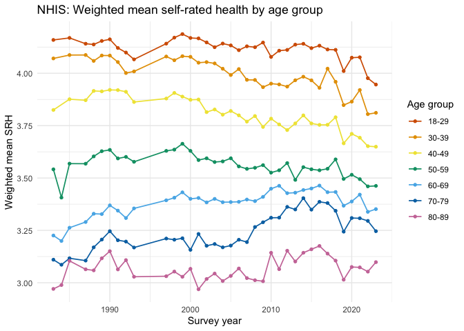

# SRH-Age Over Time Phenomenon
Christine L. Kuryla

- [SRH-Age Relationship over Time](#srh-age-relationship-over-time)
- [SRH per age group over time (figures and
  tables)](#srh-per-age-group-over-time-figures-and-tables)
  - [NHIS](#nhis)

# SRH-Age Relationship over Time

**Purpose**: Determine the relationship between age and SRH (Self-Rated
Health) over time using six datasets.

**Data**: NHIS, BRFSS, MEPS, CPS, NHANES, GSS

**Outputs**: Visualizations and tables of:

1.  Weighted mean SRH by age group over time.

2.  Weighted regression results showing the relationship between age and
    SRH over time for different age groups.

#### Load packages and source functions

#### Load data

# SRH per age group over time (figures and tables)

## NHIS

| age_group | year | mean_srh |        se | ci_lower | ci_upper |
|:----------|-----:|---------:|----------:|---------:|---------:|
| 18-29     | 1983 | 4.159031 | 0.0116524 | 4.136180 | 4.181882 |
| 18-29     | 1985 | 4.168720 | 0.0132081 | 4.142819 | 4.194621 |
| 18-29     | 1987 | 4.141006 | 0.0117975 | 4.117871 | 4.164142 |
| 18-29     | 1988 | 4.137377 | 0.0120459 | 4.113754 | 4.160999 |
| 18-29     | 1989 | 4.154302 | 0.0121758 | 4.130425 | 4.178179 |
| 18-29     | 1990 | 4.162097 | 0.0134529 | 4.135715 | 4.188478 |
| 18-29     | 1991 | 4.120768 | 0.0121346 | 4.096972 | 4.144565 |
| 18-29     | 1992 | 4.099060 | 0.0143402 | 4.070939 | 4.127181 |
| 18-29     | 1993 | 4.066227 | 0.0134086 | 4.039933 | 4.092522 |
| 18-29     | 1997 | 4.141492 | 0.0137076 | 4.114611 | 4.168373 |
| 18-29     | 1998 | 4.170063 | 0.0143087 | 4.142003 | 4.198122 |
| 18-29     | 1999 | 4.187040 | 0.0151946 | 4.157243 | 4.216837 |
| 18-29     | 2000 | 4.168555 | 0.0133644 | 4.142347 | 4.194763 |
| 18-29     | 2001 | 4.166345 | 0.0133898 | 4.140088 | 4.192603 |
| 18-29     | 2002 | 4.147279 | 0.0135863 | 4.120636 | 4.173922 |
| 18-29     | 2003 | 4.124418 | 0.0147575 | 4.095478 | 4.153358 |
| 18-29     | 2004 | 4.141967 | 0.0148525 | 4.112841 | 4.171093 |
| 18-29     | 2005 | 4.132989 | 0.0144367 | 4.104678 | 4.161300 |
| 18-29     | 2006 | 4.110178 | 0.0166037 | 4.077618 | 4.142738 |
| 18-29     | 2007 | 4.128759 | 0.0178051 | 4.093843 | 4.163675 |
| 18-29     | 2008 | 4.124337 | 0.0190908 | 4.086899 | 4.161774 |
| 18-29     | 2009 | 4.146710 | 0.0181792 | 4.111060 | 4.182360 |
| 18-29     | 2010 | 4.077963 | 0.0164840 | 4.045638 | 4.110288 |
| 18-29     | 2011 | 4.107790 | 0.0160090 | 4.076396 | 4.139184 |
| 18-29     | 2012 | 4.111556 | 0.0175751 | 4.077091 | 4.146021 |
| 18-29     | 2013 | 4.136662 | 0.0170180 | 4.103290 | 4.170035 |
| 18-29     | 2014 | 4.140788 | 0.0166573 | 4.108123 | 4.173453 |
| 18-29     | 2015 | 4.119899 | 0.0175694 | 4.085445 | 4.154353 |
| 18-29     | 2016 | 4.131798 | 0.0176556 | 4.097175 | 4.166421 |
| 18-29     | 2017 | 4.113506 | 0.0198917 | 4.074498 | 4.152514 |
| 18-29     | 2018 | 4.111816 | 0.0201312 | 4.072338 | 4.151294 |
| 18-29     | 2019 | 4.010575 | 0.0197072 | 3.971929 | 4.049222 |
| 18-29     | 2020 | 4.074240 | 0.0193231 | 4.036347 | 4.112133 |
| 18-29     | 2021 | 4.076350 | 0.0190004 | 4.039090 | 4.113611 |
| 18-29     | 2022 | 3.976514 | 0.0184505 | 3.940332 | 4.012696 |
| 18-29     | 2023 | 3.946033 | 0.0183378 | 3.910072 | 3.981994 |
| 30-39     | 1983 | 4.070742 | 0.0134897 | 4.044288 | 4.097195 |
| 30-39     | 1985 | 4.086926 | 0.0126153 | 4.062187 | 4.111665 |
| 30-39     | 1987 | 4.087207 | 0.0108660 | 4.065899 | 4.108515 |
| 30-39     | 1988 | 4.059045 | 0.0138603 | 4.031865 | 4.086226 |
| 30-39     | 1989 | 4.084746 | 0.0126968 | 4.059847 | 4.109645 |
| 30-39     | 1990 | 4.084507 | 0.0116962 | 4.061571 | 4.107444 |
| 30-39     | 1991 | 4.053454 | 0.0115523 | 4.030800 | 4.076108 |
| 30-39     | 1992 | 4.001139 | 0.0151773 | 3.971376 | 4.030902 |
| 30-39     | 1993 | 4.008784 | 0.0127088 | 3.983861 | 4.033706 |
| 30-39     | 1997 | 4.079972 | 0.0125311 | 4.055398 | 4.104546 |
| 30-39     | 1998 | 4.062230 | 0.0123908 | 4.037932 | 4.086529 |
| 30-39     | 1999 | 4.081461 | 0.0133044 | 4.055370 | 4.107551 |
| 30-39     | 2000 | 4.078491 | 0.0134337 | 4.052147 | 4.104835 |
| 30-39     | 2001 | 4.050358 | 0.0138709 | 4.023157 | 4.077559 |
| 30-39     | 2002 | 4.053341 | 0.0132709 | 4.027317 | 4.079366 |
| 30-39     | 2003 | 4.046979 | 0.0136905 | 4.020132 | 4.073827 |
| 30-39     | 2004 | 4.021435 | 0.0141279 | 3.993730 | 4.049140 |
| 30-39     | 2005 | 3.991650 | 0.0154854 | 3.961282 | 4.022017 |
| 30-39     | 2006 | 4.020171 | 0.0184704 | 3.983951 | 4.056392 |
| 30-39     | 2007 | 3.968551 | 0.0159645 | 3.937244 | 3.999858 |
| 30-39     | 2008 | 3.968041 | 0.0199038 | 3.929009 | 4.007073 |
| 30-39     | 2009 | 3.933652 | 0.0176978 | 3.898946 | 3.968358 |
| 30-39     | 2010 | 3.950588 | 0.0156490 | 3.919899 | 3.981276 |
| 30-39     | 2011 | 3.946699 | 0.0153476 | 3.916602 | 3.976795 |
| 30-39     | 2012 | 3.936344 | 0.0153483 | 3.906246 | 3.966443 |
| 30-39     | 2013 | 3.966625 | 0.0177706 | 3.931776 | 4.001474 |
| 30-39     | 2014 | 3.983634 | 0.0178086 | 3.948711 | 4.018557 |
| 30-39     | 2015 | 3.966232 | 0.0167959 | 3.933295 | 3.999169 |
| 30-39     | 2016 | 3.930635 | 0.0194299 | 3.892533 | 3.968738 |
| 30-39     | 2017 | 4.022005 | 0.0173443 | 3.987992 | 4.056018 |
| 30-39     | 2018 | 3.959317 | 0.0177430 | 3.924523 | 3.994112 |
| 30-39     | 2019 | 3.848021 | 0.0172390 | 3.814215 | 3.881827 |
| 30-39     | 2020 | 3.864625 | 0.0178805 | 3.829561 | 3.899689 |
| 30-39     | 2021 | 3.920023 | 0.0167433 | 3.887189 | 3.952857 |
| 30-39     | 2022 | 3.804803 | 0.0180261 | 3.769454 | 3.840153 |
| 30-39     | 2023 | 3.811141 | 0.0172512 | 3.777311 | 3.844971 |
| 40-49     | 1983 | 3.824762 | 0.0170282 | 3.791369 | 3.858154 |
| 40-49     | 1985 | 3.876006 | 0.0199766 | 3.836831 | 3.915180 |
| 40-49     | 1987 | 3.871266 | 0.0170580 | 3.837815 | 3.904717 |
| 40-49     | 1988 | 3.915681 | 0.0158966 | 3.884507 | 3.946855 |
| 40-49     | 1989 | 3.913644 | 0.0154349 | 3.883376 | 3.943912 |
| 40-49     | 1990 | 3.920563 | 0.0152637 | 3.890631 | 3.950496 |
| 40-49     | 1991 | 3.919608 | 0.0138116 | 3.892523 | 3.946693 |
| 40-49     | 1992 | 3.911696 | 0.0186568 | 3.875110 | 3.948282 |
| 40-49     | 1993 | 3.862804 | 0.0146340 | 3.834106 | 3.891501 |
| 40-49     | 1997 | 3.879274 | 0.0157636 | 3.848362 | 3.910187 |
| 40-49     | 1998 | 3.905982 | 0.0148164 | 3.876926 | 3.935037 |
| 40-49     | 1999 | 3.888571 | 0.0151818 | 3.858799 | 3.918343 |
| 40-49     | 2000 | 3.873221 | 0.0153822 | 3.843056 | 3.903386 |
| 40-49     | 2001 | 3.874833 | 0.0149776 | 3.845461 | 3.904204 |
| 40-49     | 2002 | 3.814492 | 0.0174675 | 3.780238 | 3.848746 |
| 40-49     | 2003 | 3.827027 | 0.0157365 | 3.796167 | 3.857886 |
| 40-49     | 2004 | 3.802540 | 0.0155662 | 3.772014 | 3.833065 |
| 40-49     | 2005 | 3.819926 | 0.0153046 | 3.789914 | 3.849939 |
| 40-49     | 2006 | 3.799212 | 0.0202355 | 3.759530 | 3.838895 |
| 40-49     | 2007 | 3.769402 | 0.0225299 | 3.725220 | 3.813583 |
| 40-49     | 2008 | 3.795898 | 0.0191282 | 3.758388 | 3.833409 |
| 40-49     | 2009 | 3.743710 | 0.0200575 | 3.704376 | 3.783043 |
| 40-49     | 2010 | 3.783255 | 0.0188925 | 3.746206 | 3.820303 |
| 40-49     | 2011 | 3.755688 | 0.0182760 | 3.719849 | 3.791528 |
| 40-49     | 2012 | 3.728930 | 0.0177435 | 3.694135 | 3.763725 |
| 40-49     | 2013 | 3.760474 | 0.0186440 | 3.723913 | 3.797035 |
| 40-49     | 2014 | 3.798995 | 0.0180720 | 3.763556 | 3.834435 |
| 40-49     | 2015 | 3.760493 | 0.0176161 | 3.725947 | 3.795038 |
| 40-49     | 2016 | 3.753678 | 0.0203182 | 3.713834 | 3.793523 |
| 40-49     | 2017 | 3.753978 | 0.0202037 | 3.714358 | 3.793598 |
| 40-49     | 2018 | 3.790096 | 0.0209754 | 3.748963 | 3.831229 |
| 40-49     | 2019 | 3.665462 | 0.0214158 | 3.623465 | 3.707458 |
| 40-49     | 2020 | 3.710869 | 0.0198960 | 3.671852 | 3.749886 |
| 40-49     | 2021 | 3.692410 | 0.0197528 | 3.653675 | 3.731146 |
| 40-49     | 2022 | 3.651937 | 0.0189318 | 3.614812 | 3.689063 |
| 40-49     | 2023 | 3.649232 | 0.0188225 | 3.612320 | 3.686143 |
| 50-59     | 1983 | 3.541323 | 0.0194388 | 3.503203 | 3.579442 |
| 50-59     | 1984 | 3.406555 | 0.0245852 | 3.358343 | 3.454767 |
| 50-59     | 1985 | 3.568612 | 0.0279823 | 3.513738 | 3.623486 |
| 50-59     | 1987 | 3.568212 | 0.0195930 | 3.529790 | 3.606634 |
| 50-59     | 1988 | 3.603106 | 0.0184777 | 3.566870 | 3.639341 |
| 50-59     | 1989 | 3.628072 | 0.0211385 | 3.586619 | 3.669525 |
| 50-59     | 1990 | 3.634086 | 0.0202573 | 3.594361 | 3.673811 |
| 50-59     | 1991 | 3.593329 | 0.0197132 | 3.554671 | 3.631987 |
| 50-59     | 1992 | 3.600880 | 0.0257753 | 3.550334 | 3.651425 |
| 50-59     | 1993 | 3.577376 | 0.0188880 | 3.540336 | 3.614416 |
| 50-59     | 1997 | 3.629475 | 0.0180392 | 3.594100 | 3.664850 |
| 50-59     | 1998 | 3.635433 | 0.0175221 | 3.601071 | 3.669794 |
| 50-59     | 1999 | 3.663459 | 0.0200311 | 3.624178 | 3.702741 |
| 50-59     | 2000 | 3.629373 | 0.0187418 | 3.592621 | 3.666126 |
| 50-59     | 2001 | 3.585740 | 0.0185896 | 3.549286 | 3.622195 |
| 50-59     | 2002 | 3.593981 | 0.0219785 | 3.550881 | 3.637081 |
| 50-59     | 2003 | 3.576174 | 0.0190642 | 3.538789 | 3.613560 |
| 50-59     | 2004 | 3.579246 | 0.0169632 | 3.545981 | 3.612512 |
| 50-59     | 2005 | 3.594035 | 0.0177357 | 3.559255 | 3.628815 |
| 50-59     | 2006 | 3.555308 | 0.0205076 | 3.515092 | 3.595524 |
| 50-59     | 2007 | 3.543655 | 0.0237217 | 3.497137 | 3.590174 |
| 50-59     | 2008 | 3.548835 | 0.0232677 | 3.503206 | 3.594463 |
| 50-59     | 2009 | 3.561369 | 0.0202662 | 3.521627 | 3.601112 |
| 50-59     | 2010 | 3.525768 | 0.0195051 | 3.487518 | 3.564018 |
| 50-59     | 2011 | 3.536797 | 0.0182622 | 3.500984 | 3.572609 |
| 50-59     | 2012 | 3.571192 | 0.0178861 | 3.536117 | 3.606267 |
| 50-59     | 2013 | 3.491052 | 0.0192030 | 3.453395 | 3.528710 |
| 50-59     | 2014 | 3.551882 | 0.0198707 | 3.512915 | 3.590848 |
| 50-59     | 2015 | 3.541642 | 0.0194305 | 3.503538 | 3.579745 |
| 50-59     | 2016 | 3.536837 | 0.0203514 | 3.496927 | 3.576746 |
| 50-59     | 2017 | 3.544091 | 0.0234295 | 3.498146 | 3.590037 |
| 50-59     | 2018 | 3.589011 | 0.0187870 | 3.552170 | 3.625853 |
| 50-59     | 2019 | 3.495529 | 0.0196911 | 3.456914 | 3.534143 |
| 50-59     | 2020 | 3.515494 | 0.0194488 | 3.477354 | 3.553633 |
| 50-59     | 2021 | 3.494525 | 0.0189956 | 3.457275 | 3.531776 |
| 50-59     | 2022 | 3.460116 | 0.0191438 | 3.422575 | 3.497658 |
| 50-59     | 2023 | 3.462330 | 0.0203457 | 3.422431 | 3.502228 |
| 60-69     | 1983 | 3.225475 | 0.0195638 | 3.187110 | 3.263840 |
| 60-69     | 1984 | 3.199462 | 0.0196723 | 3.160884 | 3.238040 |
| 60-69     | 1985 | 3.262615 | 0.0237308 | 3.216079 | 3.309152 |
| 60-69     | 1987 | 3.289862 | 0.0204279 | 3.249802 | 3.329921 |
| 60-69     | 1988 | 3.329371 | 0.0187905 | 3.292523 | 3.366220 |
| 60-69     | 1989 | 3.327790 | 0.0220221 | 3.284605 | 3.370976 |
| 60-69     | 1990 | 3.369376 | 0.0214119 | 3.327387 | 3.411366 |
| 60-69     | 1991 | 3.344348 | 0.0204974 | 3.304152 | 3.384543 |
| 60-69     | 1992 | 3.309002 | 0.0260101 | 3.257995 | 3.360008 |
| 60-69     | 1993 | 3.354929 | 0.0219918 | 3.311803 | 3.398055 |
| 60-69     | 1997 | 3.393583 | 0.0210670 | 3.352270 | 3.434896 |
| 60-69     | 1998 | 3.405782 | 0.0234623 | 3.359772 | 3.451792 |
| 60-69     | 1999 | 3.431607 | 0.0237930 | 3.384948 | 3.478265 |
| 60-69     | 2000 | 3.400547 | 0.0225083 | 3.356408 | 3.444686 |
| 60-69     | 2001 | 3.404750 | 0.0228313 | 3.359977 | 3.449523 |
| 60-69     | 2002 | 3.383557 | 0.0232245 | 3.338013 | 3.429101 |
| 60-69     | 2003 | 3.400346 | 0.0234348 | 3.354390 | 3.446302 |
| 60-69     | 2004 | 3.384569 | 0.0220099 | 3.341407 | 3.427731 |
| 60-69     | 2005 | 3.385192 | 0.0216478 | 3.342740 | 3.427644 |
| 60-69     | 2006 | 3.386342 | 0.0258877 | 3.335576 | 3.437108 |
| 60-69     | 2007 | 3.397248 | 0.0250002 | 3.348222 | 3.446274 |
| 60-69     | 2008 | 3.389584 | 0.0254935 | 3.339590 | 3.439577 |
| 60-69     | 2009 | 3.410007 | 0.0234702 | 3.363981 | 3.456033 |
| 60-69     | 2010 | 3.448860 | 0.0232197 | 3.403325 | 3.494394 |
| 60-69     | 2011 | 3.462750 | 0.0221262 | 3.419360 | 3.506139 |
| 60-69     | 2012 | 3.427652 | 0.0207589 | 3.386943 | 3.468361 |
| 60-69     | 2013 | 3.429971 | 0.0208852 | 3.389014 | 3.470927 |
| 60-69     | 2014 | 3.442624 | 0.0212561 | 3.400940 | 3.484308 |
| 60-69     | 2015 | 3.449916 | 0.0210168 | 3.408701 | 3.491130 |
| 60-69     | 2016 | 3.463790 | 0.0192182 | 3.426103 | 3.501477 |
| 60-69     | 2017 | 3.432126 | 0.0225777 | 3.387850 | 3.476401 |
| 60-69     | 2018 | 3.433223 | 0.0211468 | 3.391754 | 3.474693 |
| 60-69     | 2019 | 3.367762 | 0.0183662 | 3.331745 | 3.403778 |
| 60-69     | 2020 | 3.387939 | 0.0188082 | 3.351056 | 3.424822 |
| 60-69     | 2021 | 3.420733 | 0.0185021 | 3.384450 | 3.457016 |
| 60-69     | 2022 | 3.338442 | 0.0192333 | 3.300725 | 3.376159 |
| 60-69     | 2023 | 3.351617 | 0.0176525 | 3.317000 | 3.386234 |
| 70-79     | 1983 | 3.109968 | 0.0267751 | 3.057461 | 3.162474 |
| 70-79     | 1984 | 3.085869 | 0.0226032 | 3.041543 | 3.130194 |
| 70-79     | 1985 | 3.116859 | 0.0244218 | 3.068967 | 3.164751 |
| 70-79     | 1987 | 3.105688 | 0.0207568 | 3.064984 | 3.146393 |
| 70-79     | 1988 | 3.168969 | 0.0227634 | 3.124329 | 3.213608 |
| 70-79     | 1989 | 3.206202 | 0.0211724 | 3.164682 | 3.247722 |
| 70-79     | 1990 | 3.246126 | 0.0212420 | 3.204470 | 3.287782 |
| 70-79     | 1991 | 3.202949 | 0.0244731 | 3.154956 | 3.250941 |
| 70-79     | 1992 | 3.196652 | 0.0293933 | 3.139011 | 3.254293 |
| 70-79     | 1993 | 3.168174 | 0.0266307 | 3.115950 | 3.220397 |
| 70-79     | 1997 | 3.210917 | 0.0205093 | 3.170697 | 3.251136 |
| 70-79     | 1998 | 3.205372 | 0.0228556 | 3.160551 | 3.250192 |
| 70-79     | 1999 | 3.212339 | 0.0234491 | 3.166355 | 3.258323 |
| 70-79     | 2000 | 3.157059 | 0.0220988 | 3.113723 | 3.200395 |
| 70-79     | 2001 | 3.232928 | 0.0248234 | 3.184249 | 3.281608 |
| 70-79     | 2002 | 3.176559 | 0.0263538 | 3.124878 | 3.228239 |
| 70-79     | 2003 | 3.184836 | 0.0263789 | 3.133106 | 3.236565 |
| 70-79     | 2004 | 3.169011 | 0.0251141 | 3.119762 | 3.218260 |
| 70-79     | 2005 | 3.177452 | 0.0249680 | 3.128489 | 3.226415 |
| 70-79     | 2006 | 3.205275 | 0.0266135 | 3.153085 | 3.257465 |
| 70-79     | 2007 | 3.194063 | 0.0315675 | 3.132158 | 3.255968 |
| 70-79     | 2008 | 3.266064 | 0.0308907 | 3.205487 | 3.326642 |
| 70-79     | 2009 | 3.288772 | 0.0292201 | 3.231471 | 3.346073 |
| 70-79     | 2010 | 3.310132 | 0.0260019 | 3.259142 | 3.361123 |
| 70-79     | 2011 | 3.310725 | 0.0235311 | 3.264580 | 3.356870 |
| 70-79     | 2012 | 3.362138 | 0.0261359 | 3.310885 | 3.413391 |
| 70-79     | 2013 | 3.349852 | 0.0267766 | 3.297343 | 3.402362 |
| 70-79     | 2014 | 3.403881 | 0.0230759 | 3.358628 | 3.449133 |
| 70-79     | 2015 | 3.348913 | 0.0271859 | 3.295601 | 3.402225 |
| 70-79     | 2016 | 3.386265 | 0.0235282 | 3.340126 | 3.432405 |
| 70-79     | 2017 | 3.380457 | 0.0227224 | 3.335898 | 3.425016 |
| 70-79     | 2018 | 3.343562 | 0.0230454 | 3.298369 | 3.388754 |
| 70-79     | 2019 | 3.243793 | 0.0216339 | 3.201369 | 3.286218 |
| 70-79     | 2020 | 3.309080 | 0.0195478 | 3.270746 | 3.347413 |
| 70-79     | 2021 | 3.307684 | 0.0199294 | 3.268602 | 3.346766 |
| 70-79     | 2022 | 3.295295 | 0.0207042 | 3.254694 | 3.335896 |
| 70-79     | 2023 | 3.246299 | 0.0204522 | 3.206191 | 3.286406 |
| 80-89     | 1983 | 2.970597 | 0.0410253 | 2.890146 | 3.051049 |
| 80-89     | 1984 | 2.989039 | 0.0321890 | 2.925915 | 3.052162 |
| 80-89     | 1985 | 3.104407 | 0.0393836 | 3.027175 | 3.181639 |
| 80-89     | 1987 | 3.064119 | 0.0370186 | 2.991525 | 3.136714 |
| 80-89     | 1988 | 3.059165 | 0.0361102 | 2.988352 | 3.129977 |
| 80-89     | 1989 | 3.116621 | 0.0348880 | 3.048205 | 3.185037 |
| 80-89     | 1990 | 3.150710 | 0.0351923 | 3.081697 | 3.219723 |
| 80-89     | 1991 | 3.063577 | 0.0336726 | 2.997544 | 3.129610 |
| 80-89     | 1992 | 3.108146 | 0.0481558 | 3.013711 | 3.202580 |
| 80-89     | 1993 | 3.028663 | 0.0378473 | 2.954443 | 3.102882 |
| 80-89     | 1997 | 3.031120 | 0.0311016 | 2.970129 | 3.092110 |
| 80-89     | 1998 | 3.053273 | 0.0339264 | 2.986743 | 3.119804 |
| 80-89     | 1999 | 3.028525 | 0.0341089 | 2.961636 | 3.095413 |
| 80-89     | 2000 | 3.066517 | 0.0325344 | 3.002716 | 3.130318 |
| 80-89     | 2001 | 2.968769 | 0.0327549 | 2.904536 | 3.033002 |
| 80-89     | 2002 | 3.017838 | 0.0361702 | 2.946907 | 3.088769 |
| 80-89     | 2003 | 3.043804 | 0.0307494 | 2.983504 | 3.104104 |
| 80-89     | 2004 | 3.008183 | 0.0287444 | 2.951814 | 3.064551 |
| 80-89     | 2005 | 3.032631 | 0.0303228 | 2.973167 | 3.092094 |
| 80-89     | 2006 | 3.068099 | 0.0334271 | 3.002548 | 3.133650 |
| 80-89     | 2007 | 3.022325 | 0.0367459 | 2.950266 | 3.094385 |
| 80-89     | 2008 | 3.012187 | 0.0411310 | 2.931528 | 3.092846 |
| 80-89     | 2009 | 3.007183 | 0.0354043 | 2.937755 | 3.076612 |
| 80-89     | 2010 | 3.143018 | 0.0313553 | 3.081529 | 3.204506 |
| 80-89     | 2011 | 3.064854 | 0.0316384 | 3.002811 | 3.126898 |
| 80-89     | 2012 | 3.152918 | 0.0316504 | 3.090850 | 3.214985 |
| 80-89     | 2013 | 3.101526 | 0.0335969 | 3.035641 | 3.167410 |
| 80-89     | 2014 | 3.143116 | 0.0312965 | 3.081743 | 3.204489 |
| 80-89     | 2015 | 3.159689 | 0.0297990 | 3.101253 | 3.218126 |
| 80-89     | 2016 | 3.175609 | 0.0316662 | 3.113511 | 3.237707 |
| 80-89     | 2017 | 3.138994 | 0.0330481 | 3.074186 | 3.203802 |
| 80-89     | 2018 | 3.105593 | 0.0346195 | 3.037703 | 3.173482 |
| 80-89     | 2019 | 3.014469 | 0.0293302 | 2.956952 | 3.071986 |
| 80-89     | 2020 | 3.075222 | 0.0282068 | 3.019907 | 3.130536 |
| 80-89     | 2021 | 3.073293 | 0.0294455 | 3.015550 | 3.131036 |
| 80-89     | 2022 | 3.052971 | 0.0314101 | 2.991375 | 3.114567 |
| 80-89     | 2023 | 3.098437 | 0.0269382 | 3.045611 | 3.151263 |

Table. Self-rated health by age group and year (NHIS)
