NHIS Mortality
================
Christine Lucille Kuryla
2025-02-17

# Summary

This R Markdown file performs a survival analysis examining the
relationship between self-rated health (SRH) and mortality using NHIS
(National Health Interview Survey) data. The analysis has two main
components:

*Overall Analysis:* Uses weighted Cox proportional hazards models
Examines the relationship between SRH and mortality across different
time periods Finds that the coefficient/hazard ratio becomes less
extreme over time (moves closer to zero), suggesting the association
between self-rated health and mortality has weakened over time

*Age-Stratified Analysis:* Breaks down the analysis by age groups:
18-29, 30-39, 40-49, 50-59, 60-69, and 70+ Uses rolling time windows
(e.g., 1986-2001, 1991-2006, etc.)

Results show:

Strongest association (most negative coefficients) in older age groups,
particularly 70+ Weakest association in younger age groups (18-29) All
age groups show a trend toward less extreme coefficients over time
(lines moving upward toward zero) Clear age gradient in the strength of
the association between SRH and mortality

## Load data

``` r
data_nhis_raw <- read_csv(here("big_data/NHIS/nhis_00002.csv")) 
```

    ## Rows: 6178774 Columns: 29
    ## ── Column specification ────────────────────────────────────────────────────────
    ## Delimiter: ","
    ## chr  (5): NHISHID, NHISPID, HHX, FMX, PX
    ## dbl (24): YEAR, SERIAL, STRATA, PSU, HHWEIGHT, PERNUM, PERWEIGHT, SAMPWEIGHT...
    ## 
    ## ℹ Use `spec()` to retrieve the full column specification for this data.
    ## ℹ Specify the column types or set `show_col_types = FALSE` to quiet this message.

``` r
data_nhis_mort_filter <- data_nhis_raw %>% 
  mutate(srh = 6 - HEALTH) %>% 
  filter(srh %in% 1:5) %>% 
  filter(AGE %in% 18:99) %>% 
  filter(MORTELIG == 1) %>% 
  filter(MORTDODY > YEAR) %>% 
  filter(MORTDODY != 9999) %>% 
  filter(YEAR >= 1981) %>% 
  filter(MORTSTAT %in% 1:2) %>% 
  mutate(mortstat_recoded = case_when(MORTSTAT == 1 ~ 1, #deceased
                                      MORTSTAT == 2 ~ 0 #alive
                                      )) %>% 
  mutate(srh_binary = case_when(srh %in% 3:5 ~ "Good-VG-Excellent",
                                srh %in% 1:2 ~ "Fair-Poor"
                                )) %>% 
  mutate(survtime = MORTDODY - YEAR)
```

# Weighted Cox Survival Analysis

## All combined

``` r
  # Create survey design object
survey_design <- svydesign(
    ids = ~1,
    weights = ~MORTWT,
    data = data_nhis_mort_filter %>% filter(!(is.na(MORTWT)))
  )
  
svycoxph(
      Surv(time = YEAR, time2 = MORTDODY, event = mortstat_recoded) ~ srh,
      design = survey_design
    )
```

    ## Call:
    ## svycoxph(formula = Surv(time = YEAR, time2 = MORTDODY, event = mortstat_recoded) ~ 
    ##     srh, design = survey_design)
    ## 
    ##          coef exp(coef)  se(coef) robust se      z      p
    ## srh -0.151944  0.859036  0.001301  0.001433 -106.1 <2e-16
    ## 
    ## Likelihood ratio test=  on 1 df, p=
    ## n= 445476, number of events= 445476

## Rolling Window

``` r
library(tidyverse)
library(survival)
library(survey)
library(broom)

# Define time periods
time_periods <- list(
  period1 = 1986:2000,
  period2 = 1993:2007,
  period3 = 2000:2014,
  period4 = 2007:2018#,
 # period5 = 2009:2018  # Updated to match actual data availability
)

time_periods <- list(
 # period1 = 1981:1991,
  period2 = 1986:1996,
  period3 = 1991:2001,
  period4 = 1996:2006,
  period5 = 2001:2011,  # Updated to match actual data availability
  period6 = 2006:2018
)

time_periods <- list(
 # period1 = 1981:1996,
  period2 = 1986:2001,
  period3 = 1991:2006,
  period4 = 1996:2011,
  period5 = 2001:2016,  # Updated to match actual data availability
  period6 = 2006:2018
)

# Function to run weighted Cox model for a specific time period
run_weighted_cox_model <- function(data, years) {
  # Print diagnostic information
  cat(sprintf("\nProcessing years %d-%d\n", min(years), max(years)))
  
  # Subset data for the specific period
  model_data <- data %>%
    filter(YEAR %in% years)
  
  # Create survey design object
  survey_design <- svydesign(
    ids = ~1,
    # strata = ~STRATA,
    weights = ~MORTWT,
    data = model_data %>% filter(!(is.na(MORTWT)))#,
    # nest = TRUE
  )
  
  # Fit the weighted Cox model
  model <- svycoxph(
    Surv(time = YEAR, time2 = MORTDODY, event = MORTSTAT) ~ srh,
    design = survey_design
  )
  
  # Extract coefficients and statistics
  results <- tidy(model) %>%
    mutate(
      period_start = min(years),
      period_end = max(years),
      exp_coef = exp(estimate),
      exp_coef_se = exp(estimate) * std.error
    )
  
  return(results)
}

# Run models for all time periods
results_df <- map_df(names(time_periods), function(period_name) {
  years <- time_periods[[period_name]]
  run_weighted_cox_model(data_nhis_mort_filter, years)
}) %>%
  mutate(period = paste(period_start, "-", period_end))
```

    ## 
    ## Processing years 1986-2001
    ## Independent Sampling design (with replacement)
    ## svydesign(ids = ~1, weights = ~MORTWT, data = model_data %>% 
    ##     filter(!(is.na(MORTWT))))
    ## 
    ## Processing years 1991-2006
    ## Independent Sampling design (with replacement)
    ## svydesign(ids = ~1, weights = ~MORTWT, data = model_data %>% 
    ##     filter(!(is.na(MORTWT))))
    ## 
    ## Processing years 1996-2011
    ## Independent Sampling design (with replacement)
    ## svydesign(ids = ~1, weights = ~MORTWT, data = model_data %>% 
    ##     filter(!(is.na(MORTWT))))
    ## 
    ## Processing years 2001-2016
    ## Independent Sampling design (with replacement)
    ## svydesign(ids = ~1, weights = ~MORTWT, data = model_data %>% 
    ##     filter(!(is.na(MORTWT))))
    ## 
    ## Processing years 2006-2018
    ## Independent Sampling design (with replacement)
    ## svydesign(ids = ~1, weights = ~MORTWT, data = model_data %>% 
    ##     filter(!(is.na(MORTWT))))

``` r
# Create coefficient plot
coef_plot <- ggplot(results_df, aes(x = period, y = estimate)) +
  geom_point(size = 3) +
  geom_errorbar(aes(ymin = estimate - std.error, 
                    ymax = estimate + std.error),
                width = 0.2) +
  theme_minimal() +
  theme(axis.text.x = element_text(angle = 45, hjust = 1)) +
  labs(title = "Weighted Cox PH Coefficients Across Time Periods",
       x = "Time Period",
       y = "Coefficient (with SE)")

# Create hazard ratio plot
exp_coef_plot <- ggplot(results_df, aes(x = period, y = exp_coef)) +
  geom_point(size = 3) +
  geom_errorbar(aes(ymin = exp_coef - exp_coef_se, 
                    ymax = exp_coef + exp_coef_se),
                width = 0.2) +
  theme_minimal() +
  theme(axis.text.x = element_text(angle = 45, hjust = 1)) +
  labs(title = "Weighted Hazard Ratios Across Time Periods",
       x = "Time Period",
       y = "Hazard Ratio (with SE)")

# Create summary table
results_table <- results_df %>%
  select(period,
         coefficient = estimate, 
         se_coef = std.error,
         hazard_ratio = exp_coef,
         hr_se = exp_coef_se) %>%
  arrange(period)

# Display results
print("Numerical Results:")
```

    ## [1] "Numerical Results:"

``` r
print(results_table)
```

    ## # A tibble: 5 × 5
    ##   period      coefficient se_coef hazard_ratio   hr_se
    ##   <chr>             <dbl>   <dbl>        <dbl>   <dbl>
    ## 1 1986 - 2001      -0.172 0.00146        0.842 0.00123
    ## 2 1991 - 2006      -0.154 0.00173        0.857 0.00149
    ## 3 1996 - 2011      -0.137 0.00224        0.872 0.00195
    ## 4 2001 - 2016      -0.118 0.00282        0.889 0.00250
    ## 5 2006 - 2018      -0.103 0.00405        0.903 0.00366

``` r
# Display plots
print(coef_plot)
```

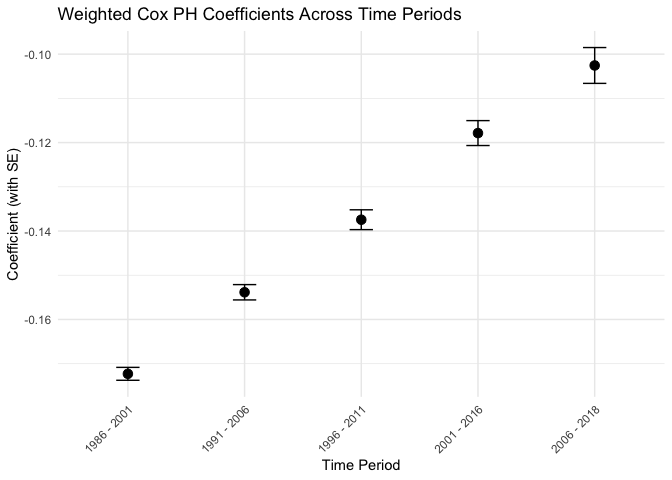<!-- -->

``` r
print(exp_coef_plot)
```

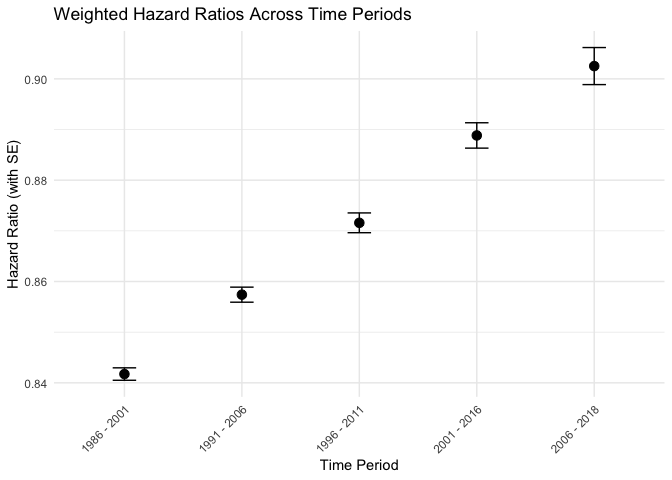<!-- -->

``` r
# Save results if needed
# write_csv(results_table, "weighted_cox_results.csv")
# ggsave("weighted_cox_coefficients.png", coef_plot)
# ggsave("weighted_cox_hazard_ratios.png", exp_coef_plot)
```

## Rolling window subsetted by age

``` r
library(tidyverse)
library(survival)
library(survey)
library(broom)


age_groups <- list(
  "18-29" = c(18, 29),
  "30-39" = c(30, 39),
  "40-49" = c(40, 49),
  "50-59" = c(50, 59),
  "60-69" = c(60, 69),
  "70+" = c(70, Inf)
)

# Modified function with better error handling
run_weighted_cox_model_age_grouped <- function(data, years, age_range, age_group_name) {
  # Subset data
  model_data <- data %>%
    filter(YEAR %in% years,
           AGE >= age_range[1],
           AGE <= age_range[2])
  
  # Only proceed if we have sufficient data
  if(nrow(model_data) < 10 || sum(model_data$MORTSTAT) < 5) {
    warning(sprintf("Insufficient data for age group %s in years %d-%d", 
                    age_group_name, min(years), max(years)))
    return(tibble(
      term = "srh",
      estimate = NA_real_,
      std.error = NA_real_,
      statistic = NA_real_,
      p.value = NA_real_,
      period_start = min(years),
      period_end = max(years),
      exp_coef = NA_real_,
      exp_coef_se = NA_real_,
      age_group = age_group_name
    ))
  }
  
  # Create survey design object
  survey_design <- svydesign(
    ids = ~1,
   # strata = ~STRATA,
    weights = ~MORTWT,
    data = model_data %>% filter(!(is.na(MORTWT)))#,
   # nest = TRUE
  )
  
  # Fit the weighted Cox model
  tryCatch({
    model <- svycoxph(
      Surv(time = YEAR, time2 = MORTDODY, event = MORTSTAT) ~ srh,
      design = survey_design
    )
    
    # Extract results
    results <- tidy(model) %>%
      mutate(
        period_start = min(years),
        period_end = max(years),
        exp_coef = exp(estimate),
        exp_coef_se = exp(estimate) * std.error,
        age_group = age_group_name
      )
    
    return(results)
  }, error = function(e) {
    warning(sprintf("Error in model for age group %s in years %d-%d: %s", 
                    age_group_name, min(years), max(years), e$message))
    return(tibble(
      term = "srh",
      estimate = NA_real_,
      std.error = NA_real_,
      statistic = NA_real_,
      p.value = NA_real_,
      period_start = min(years),
      period_end = max(years),
      exp_coef = NA_real_,
      exp_coef_se = NA_real_,
      age_group = age_group_name
    ))
  })
}

# Run models for all time periods and age groups
results_df <- map_df(names(time_periods), function(period_name) {
  years <- time_periods[[period_name]]
  map_df(names(age_groups), function(age_group) {
    run_weighted_cox_model_age_grouped(data_nhis_mort_filter, years, age_groups[[age_group]], age_group)
  })
}) %>%
  mutate(period = paste(period_start, "-", period_end))
```

    ## Independent Sampling design (with replacement)
    ## svydesign(ids = ~1, weights = ~MORTWT, data = model_data %>% 
    ##     filter(!(is.na(MORTWT))))
    ## Independent Sampling design (with replacement)
    ## svydesign(ids = ~1, weights = ~MORTWT, data = model_data %>% 
    ##     filter(!(is.na(MORTWT))))
    ## Independent Sampling design (with replacement)
    ## svydesign(ids = ~1, weights = ~MORTWT, data = model_data %>% 
    ##     filter(!(is.na(MORTWT))))
    ## Independent Sampling design (with replacement)
    ## svydesign(ids = ~1, weights = ~MORTWT, data = model_data %>% 
    ##     filter(!(is.na(MORTWT))))
    ## Independent Sampling design (with replacement)
    ## svydesign(ids = ~1, weights = ~MORTWT, data = model_data %>% 
    ##     filter(!(is.na(MORTWT))))
    ## Independent Sampling design (with replacement)
    ## svydesign(ids = ~1, weights = ~MORTWT, data = model_data %>% 
    ##     filter(!(is.na(MORTWT))))
    ## Independent Sampling design (with replacement)
    ## svydesign(ids = ~1, weights = ~MORTWT, data = model_data %>% 
    ##     filter(!(is.na(MORTWT))))
    ## Independent Sampling design (with replacement)
    ## svydesign(ids = ~1, weights = ~MORTWT, data = model_data %>% 
    ##     filter(!(is.na(MORTWT))))
    ## Independent Sampling design (with replacement)
    ## svydesign(ids = ~1, weights = ~MORTWT, data = model_data %>% 
    ##     filter(!(is.na(MORTWT))))
    ## Independent Sampling design (with replacement)
    ## svydesign(ids = ~1, weights = ~MORTWT, data = model_data %>% 
    ##     filter(!(is.na(MORTWT))))
    ## Independent Sampling design (with replacement)
    ## svydesign(ids = ~1, weights = ~MORTWT, data = model_data %>% 
    ##     filter(!(is.na(MORTWT))))
    ## Independent Sampling design (with replacement)
    ## svydesign(ids = ~1, weights = ~MORTWT, data = model_data %>% 
    ##     filter(!(is.na(MORTWT))))
    ## Independent Sampling design (with replacement)
    ## svydesign(ids = ~1, weights = ~MORTWT, data = model_data %>% 
    ##     filter(!(is.na(MORTWT))))
    ## Independent Sampling design (with replacement)
    ## svydesign(ids = ~1, weights = ~MORTWT, data = model_data %>% 
    ##     filter(!(is.na(MORTWT))))
    ## Independent Sampling design (with replacement)
    ## svydesign(ids = ~1, weights = ~MORTWT, data = model_data %>% 
    ##     filter(!(is.na(MORTWT))))
    ## Independent Sampling design (with replacement)
    ## svydesign(ids = ~1, weights = ~MORTWT, data = model_data %>% 
    ##     filter(!(is.na(MORTWT))))
    ## Independent Sampling design (with replacement)
    ## svydesign(ids = ~1, weights = ~MORTWT, data = model_data %>% 
    ##     filter(!(is.na(MORTWT))))
    ## Independent Sampling design (with replacement)
    ## svydesign(ids = ~1, weights = ~MORTWT, data = model_data %>% 
    ##     filter(!(is.na(MORTWT))))
    ## Independent Sampling design (with replacement)
    ## svydesign(ids = ~1, weights = ~MORTWT, data = model_data %>% 
    ##     filter(!(is.na(MORTWT))))
    ## Independent Sampling design (with replacement)
    ## svydesign(ids = ~1, weights = ~MORTWT, data = model_data %>% 
    ##     filter(!(is.na(MORTWT))))
    ## Independent Sampling design (with replacement)
    ## svydesign(ids = ~1, weights = ~MORTWT, data = model_data %>% 
    ##     filter(!(is.na(MORTWT))))
    ## Independent Sampling design (with replacement)
    ## svydesign(ids = ~1, weights = ~MORTWT, data = model_data %>% 
    ##     filter(!(is.na(MORTWT))))
    ## Independent Sampling design (with replacement)
    ## svydesign(ids = ~1, weights = ~MORTWT, data = model_data %>% 
    ##     filter(!(is.na(MORTWT))))
    ## Independent Sampling design (with replacement)
    ## svydesign(ids = ~1, weights = ~MORTWT, data = model_data %>% 
    ##     filter(!(is.na(MORTWT))))
    ## Independent Sampling design (with replacement)
    ## svydesign(ids = ~1, weights = ~MORTWT, data = model_data %>% 
    ##     filter(!(is.na(MORTWT))))
    ## Independent Sampling design (with replacement)
    ## svydesign(ids = ~1, weights = ~MORTWT, data = model_data %>% 
    ##     filter(!(is.na(MORTWT))))
    ## Independent Sampling design (with replacement)
    ## svydesign(ids = ~1, weights = ~MORTWT, data = model_data %>% 
    ##     filter(!(is.na(MORTWT))))
    ## Independent Sampling design (with replacement)
    ## svydesign(ids = ~1, weights = ~MORTWT, data = model_data %>% 
    ##     filter(!(is.na(MORTWT))))
    ## Independent Sampling design (with replacement)
    ## svydesign(ids = ~1, weights = ~MORTWT, data = model_data %>% 
    ##     filter(!(is.na(MORTWT))))
    ## Independent Sampling design (with replacement)
    ## svydesign(ids = ~1, weights = ~MORTWT, data = model_data %>% 
    ##     filter(!(is.na(MORTWT))))

``` r
# Create plots with different colors for age groups
#coef_plot <- ggplot(results_df %>% filter(!is.na(estimate)), 

surv_plot_age_group <- function(results_df){  
coef_plot <-  ggplot(results_df %>% filter(!is.na(estimate)), 
                    aes(x = period, y = estimate, color = age_group, group = age_group)) +
  geom_point(size = 3, position = position_dodge(width = 0.3)) +
  geom_line() +
  geom_errorbar(aes(ymin = estimate - std.error, 
                    ymax = estimate + std.error),
                width = 0.2,
                position = position_dodge(width = 0.3)) +
  theme_minimal() +
  theme(axis.text.x = element_text(angle = 45, hjust = 1),
    #    legend.title = element_text(face = "bold"),
        legend.position = "right") +
#  scale_color_brewer(palette = "Set2") +
  labs(title = "Weighted Cox PH Coefficients",
       subtitle = "Across Time Periods by Age Group",
    #   subtitle = "Missing values indicate insufficient data or model convergence issues",
       x = "Time Period",
       y = "Coefficient (with SE)",
       color = "Age Group")

# Create plot for hazard ratios
exp_coef_plot <- ggplot(results_df %>% filter(!is.na(exp_coef)), 
                        aes(x = period, y = exp_coef, color = age_group, group = age_group)) +
  geom_point(size = 3, position = position_dodge(width = 0.3)) +
  geom_line() +
  geom_errorbar(aes(ymin = exp_coef - exp_coef_se, 
                    ymax = exp_coef + exp_coef_se),
                width = 0.2,
                position = position_dodge(width = 0.3)) +
  theme_minimal() +
  theme(axis.text.x = element_text(angle = 45, hjust = 1),
       # legend.title = element_text(face = "bold"),
        legend.position = "right") +
#  scale_color_brewer(palette = "Set2") +
  labs(title = "Weighted Hazard Ratios",
       subtitle = "Across Time Periods by Age Group",
    #   subtitle = "Missing values indicate insufficient data or model convergence issues",
       x = "Time Period",
       y = "Hazard Ratio (with SE)",
       color = "Age Group")

# Create summary table
results_table <- results_df %>%
  select(period,
         age_group,
         coefficient = estimate, 
         se_coef = std.error,
         hazard_ratio = exp_coef,
         hr_se = exp_coef_se) %>%
  arrange(period, age_group)

# Display results
print("Numerical Results:")
print(results_table)

# Display plots
print(coef_plot)
print(exp_coef_plot)
}


######## Apply function

time_periods <- list(
 # period1 = 1981:1991,
  period2 = 1986:1996,
  period3 = 1991:2001,
  period4 = 1996:2006,
  period5 = 2001:2011,  # Updated to match actual data availability
  period6 = 2006:2018
)

results_df <- map_df(names(time_periods), function(period_name) {
  years <- time_periods[[period_name]]
  map_df(names(age_groups), function(age_group) {
    run_weighted_cox_model_age_grouped(data_nhis_mort_filter, years, age_groups[[age_group]], age_group)
  })
}) %>%
  mutate(period = paste(period_start, "-", period_end))
```

    ## Independent Sampling design (with replacement)
    ## svydesign(ids = ~1, weights = ~MORTWT, data = model_data %>% 
    ##     filter(!(is.na(MORTWT))))
    ## Independent Sampling design (with replacement)
    ## svydesign(ids = ~1, weights = ~MORTWT, data = model_data %>% 
    ##     filter(!(is.na(MORTWT))))
    ## Independent Sampling design (with replacement)
    ## svydesign(ids = ~1, weights = ~MORTWT, data = model_data %>% 
    ##     filter(!(is.na(MORTWT))))
    ## Independent Sampling design (with replacement)
    ## svydesign(ids = ~1, weights = ~MORTWT, data = model_data %>% 
    ##     filter(!(is.na(MORTWT))))
    ## Independent Sampling design (with replacement)
    ## svydesign(ids = ~1, weights = ~MORTWT, data = model_data %>% 
    ##     filter(!(is.na(MORTWT))))
    ## Independent Sampling design (with replacement)
    ## svydesign(ids = ~1, weights = ~MORTWT, data = model_data %>% 
    ##     filter(!(is.na(MORTWT))))
    ## Independent Sampling design (with replacement)
    ## svydesign(ids = ~1, weights = ~MORTWT, data = model_data %>% 
    ##     filter(!(is.na(MORTWT))))
    ## Independent Sampling design (with replacement)
    ## svydesign(ids = ~1, weights = ~MORTWT, data = model_data %>% 
    ##     filter(!(is.na(MORTWT))))
    ## Independent Sampling design (with replacement)
    ## svydesign(ids = ~1, weights = ~MORTWT, data = model_data %>% 
    ##     filter(!(is.na(MORTWT))))
    ## Independent Sampling design (with replacement)
    ## svydesign(ids = ~1, weights = ~MORTWT, data = model_data %>% 
    ##     filter(!(is.na(MORTWT))))
    ## Independent Sampling design (with replacement)
    ## svydesign(ids = ~1, weights = ~MORTWT, data = model_data %>% 
    ##     filter(!(is.na(MORTWT))))
    ## Independent Sampling design (with replacement)
    ## svydesign(ids = ~1, weights = ~MORTWT, data = model_data %>% 
    ##     filter(!(is.na(MORTWT))))
    ## Independent Sampling design (with replacement)
    ## svydesign(ids = ~1, weights = ~MORTWT, data = model_data %>% 
    ##     filter(!(is.na(MORTWT))))
    ## Independent Sampling design (with replacement)
    ## svydesign(ids = ~1, weights = ~MORTWT, data = model_data %>% 
    ##     filter(!(is.na(MORTWT))))
    ## Independent Sampling design (with replacement)
    ## svydesign(ids = ~1, weights = ~MORTWT, data = model_data %>% 
    ##     filter(!(is.na(MORTWT))))
    ## Independent Sampling design (with replacement)
    ## svydesign(ids = ~1, weights = ~MORTWT, data = model_data %>% 
    ##     filter(!(is.na(MORTWT))))
    ## Independent Sampling design (with replacement)
    ## svydesign(ids = ~1, weights = ~MORTWT, data = model_data %>% 
    ##     filter(!(is.na(MORTWT))))
    ## Independent Sampling design (with replacement)
    ## svydesign(ids = ~1, weights = ~MORTWT, data = model_data %>% 
    ##     filter(!(is.na(MORTWT))))
    ## Independent Sampling design (with replacement)
    ## svydesign(ids = ~1, weights = ~MORTWT, data = model_data %>% 
    ##     filter(!(is.na(MORTWT))))
    ## Independent Sampling design (with replacement)
    ## svydesign(ids = ~1, weights = ~MORTWT, data = model_data %>% 
    ##     filter(!(is.na(MORTWT))))
    ## Independent Sampling design (with replacement)
    ## svydesign(ids = ~1, weights = ~MORTWT, data = model_data %>% 
    ##     filter(!(is.na(MORTWT))))
    ## Independent Sampling design (with replacement)
    ## svydesign(ids = ~1, weights = ~MORTWT, data = model_data %>% 
    ##     filter(!(is.na(MORTWT))))
    ## Independent Sampling design (with replacement)
    ## svydesign(ids = ~1, weights = ~MORTWT, data = model_data %>% 
    ##     filter(!(is.na(MORTWT))))
    ## Independent Sampling design (with replacement)
    ## svydesign(ids = ~1, weights = ~MORTWT, data = model_data %>% 
    ##     filter(!(is.na(MORTWT))))
    ## Independent Sampling design (with replacement)
    ## svydesign(ids = ~1, weights = ~MORTWT, data = model_data %>% 
    ##     filter(!(is.na(MORTWT))))
    ## Independent Sampling design (with replacement)
    ## svydesign(ids = ~1, weights = ~MORTWT, data = model_data %>% 
    ##     filter(!(is.na(MORTWT))))
    ## Independent Sampling design (with replacement)
    ## svydesign(ids = ~1, weights = ~MORTWT, data = model_data %>% 
    ##     filter(!(is.na(MORTWT))))
    ## Independent Sampling design (with replacement)
    ## svydesign(ids = ~1, weights = ~MORTWT, data = model_data %>% 
    ##     filter(!(is.na(MORTWT))))
    ## Independent Sampling design (with replacement)
    ## svydesign(ids = ~1, weights = ~MORTWT, data = model_data %>% 
    ##     filter(!(is.na(MORTWT))))
    ## Independent Sampling design (with replacement)
    ## svydesign(ids = ~1, weights = ~MORTWT, data = model_data %>% 
    ##     filter(!(is.na(MORTWT))))

``` r
surv_plot_age_group(results_df)
```

    ## [1] "Numerical Results:"
    ## # A tibble: 30 × 6
    ##    period      age_group coefficient se_coef hazard_ratio   hr_se
    ##    <chr>       <chr>           <dbl>   <dbl>        <dbl>   <dbl>
    ##  1 1986 - 1996 18-29         -0.0256 0.00860        0.975 0.00839
    ##  2 1986 - 1996 30-39         -0.0582 0.00601        0.943 0.00567
    ##  3 1986 - 1996 40-49         -0.0938 0.00459        0.910 0.00418
    ##  4 1986 - 1996 50-59         -0.145  0.00374        0.865 0.00324
    ##  5 1986 - 1996 60-69         -0.187  0.00320        0.829 0.00265
    ##  6 1986 - 1996 70+           -0.207  0.00306        0.813 0.00249
    ##  7 1991 - 2001 18-29         -0.0478 0.0111         0.953 0.0106 
    ##  8 1991 - 2001 30-39         -0.0612 0.00746        0.941 0.00702
    ##  9 1991 - 2001 40-49         -0.0955 0.00547        0.909 0.00497
    ## 10 1991 - 2001 50-59         -0.125  0.00451        0.883 0.00398
    ## # ℹ 20 more rows

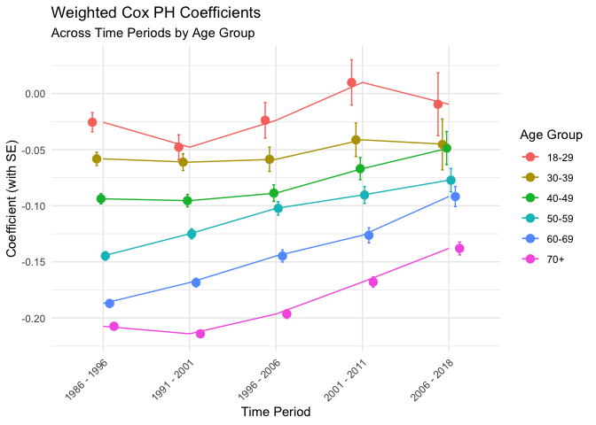<!-- -->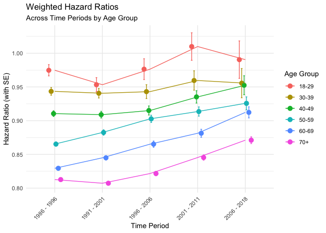<!-- -->

``` r
time_periods <- list(
 # period1 = 1981:1996,
  period2 = 1986:2001,
  period3 = 1991:2006,
  period4 = 1996:2011,
  period5 = 2001:2016,  # Updated to match actual data availability
  period6 = 2006:2018
)

results_df <- map_df(names(time_periods), function(period_name) {
  years <- time_periods[[period_name]]
  map_df(names(age_groups), function(age_group) {
    run_weighted_cox_model_age_grouped(data_nhis_mort_filter, years, age_groups[[age_group]], age_group)
  })
}) %>%
  mutate(period = paste(period_start, "-", period_end))
```

    ## Independent Sampling design (with replacement)
    ## svydesign(ids = ~1, weights = ~MORTWT, data = model_data %>% 
    ##     filter(!(is.na(MORTWT))))
    ## Independent Sampling design (with replacement)
    ## svydesign(ids = ~1, weights = ~MORTWT, data = model_data %>% 
    ##     filter(!(is.na(MORTWT))))
    ## Independent Sampling design (with replacement)
    ## svydesign(ids = ~1, weights = ~MORTWT, data = model_data %>% 
    ##     filter(!(is.na(MORTWT))))
    ## Independent Sampling design (with replacement)
    ## svydesign(ids = ~1, weights = ~MORTWT, data = model_data %>% 
    ##     filter(!(is.na(MORTWT))))
    ## Independent Sampling design (with replacement)
    ## svydesign(ids = ~1, weights = ~MORTWT, data = model_data %>% 
    ##     filter(!(is.na(MORTWT))))
    ## Independent Sampling design (with replacement)
    ## svydesign(ids = ~1, weights = ~MORTWT, data = model_data %>% 
    ##     filter(!(is.na(MORTWT))))
    ## Independent Sampling design (with replacement)
    ## svydesign(ids = ~1, weights = ~MORTWT, data = model_data %>% 
    ##     filter(!(is.na(MORTWT))))
    ## Independent Sampling design (with replacement)
    ## svydesign(ids = ~1, weights = ~MORTWT, data = model_data %>% 
    ##     filter(!(is.na(MORTWT))))
    ## Independent Sampling design (with replacement)
    ## svydesign(ids = ~1, weights = ~MORTWT, data = model_data %>% 
    ##     filter(!(is.na(MORTWT))))
    ## Independent Sampling design (with replacement)
    ## svydesign(ids = ~1, weights = ~MORTWT, data = model_data %>% 
    ##     filter(!(is.na(MORTWT))))
    ## Independent Sampling design (with replacement)
    ## svydesign(ids = ~1, weights = ~MORTWT, data = model_data %>% 
    ##     filter(!(is.na(MORTWT))))
    ## Independent Sampling design (with replacement)
    ## svydesign(ids = ~1, weights = ~MORTWT, data = model_data %>% 
    ##     filter(!(is.na(MORTWT))))
    ## Independent Sampling design (with replacement)
    ## svydesign(ids = ~1, weights = ~MORTWT, data = model_data %>% 
    ##     filter(!(is.na(MORTWT))))
    ## Independent Sampling design (with replacement)
    ## svydesign(ids = ~1, weights = ~MORTWT, data = model_data %>% 
    ##     filter(!(is.na(MORTWT))))
    ## Independent Sampling design (with replacement)
    ## svydesign(ids = ~1, weights = ~MORTWT, data = model_data %>% 
    ##     filter(!(is.na(MORTWT))))
    ## Independent Sampling design (with replacement)
    ## svydesign(ids = ~1, weights = ~MORTWT, data = model_data %>% 
    ##     filter(!(is.na(MORTWT))))
    ## Independent Sampling design (with replacement)
    ## svydesign(ids = ~1, weights = ~MORTWT, data = model_data %>% 
    ##     filter(!(is.na(MORTWT))))
    ## Independent Sampling design (with replacement)
    ## svydesign(ids = ~1, weights = ~MORTWT, data = model_data %>% 
    ##     filter(!(is.na(MORTWT))))
    ## Independent Sampling design (with replacement)
    ## svydesign(ids = ~1, weights = ~MORTWT, data = model_data %>% 
    ##     filter(!(is.na(MORTWT))))
    ## Independent Sampling design (with replacement)
    ## svydesign(ids = ~1, weights = ~MORTWT, data = model_data %>% 
    ##     filter(!(is.na(MORTWT))))
    ## Independent Sampling design (with replacement)
    ## svydesign(ids = ~1, weights = ~MORTWT, data = model_data %>% 
    ##     filter(!(is.na(MORTWT))))
    ## Independent Sampling design (with replacement)
    ## svydesign(ids = ~1, weights = ~MORTWT, data = model_data %>% 
    ##     filter(!(is.na(MORTWT))))
    ## Independent Sampling design (with replacement)
    ## svydesign(ids = ~1, weights = ~MORTWT, data = model_data %>% 
    ##     filter(!(is.na(MORTWT))))
    ## Independent Sampling design (with replacement)
    ## svydesign(ids = ~1, weights = ~MORTWT, data = model_data %>% 
    ##     filter(!(is.na(MORTWT))))
    ## Independent Sampling design (with replacement)
    ## svydesign(ids = ~1, weights = ~MORTWT, data = model_data %>% 
    ##     filter(!(is.na(MORTWT))))
    ## Independent Sampling design (with replacement)
    ## svydesign(ids = ~1, weights = ~MORTWT, data = model_data %>% 
    ##     filter(!(is.na(MORTWT))))
    ## Independent Sampling design (with replacement)
    ## svydesign(ids = ~1, weights = ~MORTWT, data = model_data %>% 
    ##     filter(!(is.na(MORTWT))))
    ## Independent Sampling design (with replacement)
    ## svydesign(ids = ~1, weights = ~MORTWT, data = model_data %>% 
    ##     filter(!(is.na(MORTWT))))
    ## Independent Sampling design (with replacement)
    ## svydesign(ids = ~1, weights = ~MORTWT, data = model_data %>% 
    ##     filter(!(is.na(MORTWT))))
    ## Independent Sampling design (with replacement)
    ## svydesign(ids = ~1, weights = ~MORTWT, data = model_data %>% 
    ##     filter(!(is.na(MORTWT))))

``` r
surv_plot_age_group(results_df)
```

    ## [1] "Numerical Results:"
    ## # A tibble: 30 × 6
    ##    period      age_group coefficient se_coef hazard_ratio   hr_se
    ##    <chr>       <chr>           <dbl>   <dbl>        <dbl>   <dbl>
    ##  1 1986 - 2001 18-29         -0.0333 0.00800        0.967 0.00773
    ##  2 1986 - 2001 30-39         -0.0618 0.00552        0.940 0.00519
    ##  3 1986 - 2001 40-49         -0.0947 0.00414        0.910 0.00376
    ##  4 1986 - 2001 50-59         -0.135  0.00338        0.874 0.00296
    ##  5 1986 - 2001 60-69         -0.174  0.00292        0.840 0.00245
    ##  6 1986 - 2001 70+           -0.202  0.00268        0.817 0.00219
    ##  7 1991 - 2006 18-29         -0.0335 0.0103         0.967 0.00995
    ##  8 1991 - 2006 30-39         -0.0562 0.00698        0.945 0.00659
    ##  9 1991 - 2006 40-49         -0.0908 0.00504        0.913 0.00460
    ## 10 1991 - 2006 50-59         -0.115  0.00411        0.892 0.00366
    ## # ℹ 20 more rows

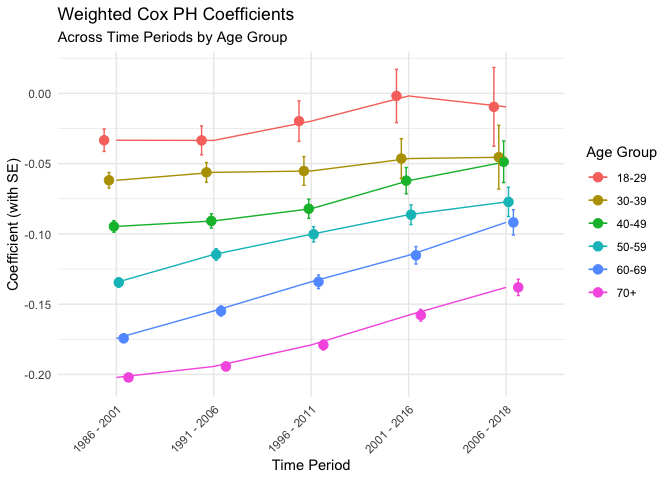<!-- -->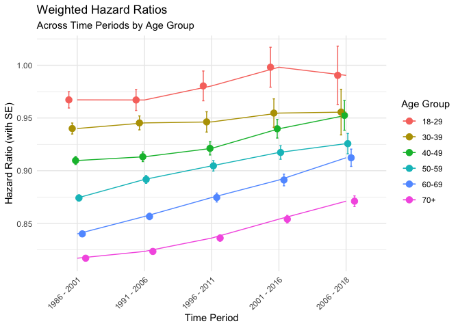<!-- -->

# Kaplan-Meier

## KM all ages

``` r
#################################
# Load Libraries
#################################

library(survey)     # For svydesign, svykm, etc.
library(dplyr)      # Core Tidyverse data manipulation
library(purrr)      # For functional programming (map_* functions)
library(tidyr)      # For data tidying
library(ggplot2)    # For plotting

#################################
# Calculate Weighted Kaplan-Meier
#################################

# svykm(...) returns a list of survival curve objects
# each element corresponds to a level of srh_binary.
km_fit <- svykm(
  formula = Surv(survtime, mortstat_recoded) ~ srh_binary,
  design  = survey_design,
  se      = FALSE  # If you want standard errors & confidence intervals
)

#################################
# Convert km_fit to a Tidy Data Frame
#################################

# `km_fit` is a list where each component corresponds to a level of srh_binary.
# The name of each list element is the level (e.g., "Fair-Poor" or "Good-Excellent").

km_df <- map2_df(
  .x = km_fit,
  .y = names(km_fit),
  ~ {
    tibble(
      time         = .x$time,
      surv         = .x$surv,
      # If se=TRUE, svykm also provides approximate 95% confidence intervals:
      surv_lower   = .x$lower,
      surv_upper   = .x$upper,
      srh_binary   = .y  # The group label
    )
  }
)

# Peek at the resulting data frame
glimpse(km_df)
```

    ## Rows: 68
    ## Columns: 3
    ## $ time       <dbl> 0, 1, 2, 3, 4, 5, 6, 7, 8, 9, 10, 11, 12, 13, 14, 15, 16, 1…
    ## $ surv       <dbl> 1.00000000, 0.91894877, 0.84303523, 0.77058412, 0.70127992,…
    ## $ srh_binary <chr> "Fair-Poor", "Fair-Poor", "Fair-Poor", "Fair-Poor", "Fair-P…

``` r
#################################
# Plot the Survey-Weighted KM Curves with ggplot2
#################################

km_plot <- ggplot(km_df, aes(x = time, y = surv, color = srh_binary)) +
  geom_step(size = 1) +  # The main KM curve
  geom_line(
  #  aes(#ymin = surv_lower, ymax = surv_upper, 
      #  fill = srh_binary),
  #  alpha = 0.2,
    color = NA    # No outline for the ribbon
 # 
    ) +
  labs(
    x = "Time (years)",
    y = "Survival Probability",
    color = "Self-Rated Health",
    fill  = "Self-Rated Health",
    title = "Survey-Weighted Kaplan-Meier Curves by SRH"
  ) +
  theme_minimal() +
  theme(
    legend.position = "bottom"
  )
```

    ## Warning: Using `size` aesthetic for lines was deprecated in ggplot2 3.4.0.
    ## ℹ Please use `linewidth` instead.
    ## This warning is displayed once every 8 hours.
    ## Call `lifecycle::last_lifecycle_warnings()` to see where this warning was
    ## generated.

``` r
# Render the plot
print(km_plot)
```

    ## Warning: Removed 68 rows containing missing values or values outside the scale range
    ## (`geom_line()`).

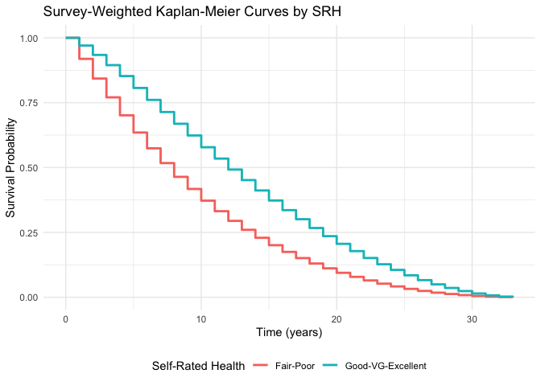<!-- -->

## KM age subsets

``` r
library(survey)      # For complex survey design & survival analysis
library(survival)    # For Surv objects
library(dplyr)       # For data manipulation
library(ggplot2)     # For plotting
library(purrr)       # For functional programming (map2_df)
library(tibble)      # For tibbles

# Example age groups:
age_groups <- list(
  "18-29" = c(18, 29),
  "30-39" = c(30, 39),
  "40-49" = c(40, 49),
  "50-59" = c(50, 59),
  "60-69" = c(60, 69),
  "70+"   = c(70, Inf)
)

############################################################################
# Define a function that subsets data by a chosen age group and 
# produces survey-weighted Kaplan-Meier estimates and a ggplot2 survival curve.
############################################################################

weighted_km_analysis <- function(
    survey_design,            # A 'survey' package design object
    age_groups_list,          # A named list of age ranges (like the one above)
    selected_age_group,       # A string key to pick an age range (e.g., "18-29")
    time_col         = "survtime",         # The column name for time-to-event
    event_col        = "mortstat_recoded", # The column name for event indicator
    group_col        = "srh_binary",       # The column used to group curves
    se               = FALSE               # Whether to compute standard errors
) {
  
  # ----------------------------------------------------------------------
  # 1. Subset the design by the selected age group
  # ----------------------------------------------------------------------
  # Extract the numeric range (e.g., c(18, 29)) from the named list
  age_range <- age_groups_list[[selected_age_group]]
  
  # Subset the design object for individuals within the chosen age range
  # Assumes your underlying data has an 'age' variable in the design
  subset_design <- subset(
    survey_design, 
    AGE >= age_range[1] & AGE <= age_range[2]
  )
  
  # ----------------------------------------------------------------------
  # 2. Fit the survey-weighted Kaplan-Meier model
  # ----------------------------------------------------------------------
  # The Surv() function takes time and event indicator (1=event, 0=censored)
  # 'group_col' is the grouping variable (e.g., "srh_binary")
  # 'svykm()' applies a Kaplan-Meier estimator that respects survey weights
  
  # Dynamically build the formula: Surv(time_col, event_col) ~ group_col
  km_formula <- as.formula(
    paste0("Surv(", time_col, ", ", event_col, ") ~ ", group_col)
  )
  
  km_fit <- svykm(
    formula = km_formula,
    design  = subset_design,
    se      = se
  )
  
  # ----------------------------------------------------------------------
  # 3. Convert the svykm result into a tidy data frame
  # ----------------------------------------------------------------------
  # km_fit is a list of survival curve objects, each named by level of 'group_col'
  km_df <- map2_df(
    .x = km_fit,
    .y = names(km_fit),
    ~ {
      tibble(
        time         = .x$time,
        surv         = .x$surv,
        surv_lower   = .x$lower,  # Available if se=TRUE, else NA
        surv_upper   = .x$upper,  # Available if se=TRUE, else NA
        group_value  = .y         # The group label, e.g. "Fair-Poor"
      )
    }
  )
  
  # ----------------------------------------------------------------------
  # 4. Plot the survival curves using ggplot2
  # ----------------------------------------------------------------------
  # We plot a step function for the survival probability,
  # optionally adding confidence bands if se=TRUE.
  
  km_plot <- ggplot(km_df, aes(x = time, y = surv, color = group_value)) +
    geom_step(size = 1) +
    # If confidence intervals are present, you could add geom_ribbon or
    # geom_line(...) to depict the lower and upper bounds:
    # geom_ribbon(aes(ymin = surv_lower, ymax = surv_upper, fill = group_value),
    #             alpha = 0.2, color = NA) +
    labs(
      x     = "Time (years)",
      y     = "Survival Probability",
      color = group_col,
    #  title = paste0("Survey-Weighted KM Curves by ", group_col, 
                   #  " (Age Group: ", selected_age_group, ")")
      title = "KM Curves by SRH",
      subtitle = paste0("Age Group: ", selected_age_group)
    ) +
    theme_minimal() +
    theme(legend.position = "bottom")
  
  # ----------------------------------------------------------------------
  # 5. Return the tidy data frame and the plot
  # ----------------------------------------------------------------------
  return(list(km_data = km_df, km_plot = km_plot))
}

############################################################################
# Example Usage
############################################################################

# Suppose your existing survey design object is called 'survey_design' 
# and it contains variables:
# - 'age'                  = respondent's age
# - 'survtime'             = time variable
# - 'mortstat_recoded'     = event indicator (1=death, 0=alive)
# - 'srh_binary'           = "Good-Excellent" vs "Fair-Poor"

# Let's run the function for the 30-39 age group:
results_30_39 <- weighted_km_analysis(
  survey_design       = survey_design,
  age_groups_list     = age_groups,
  selected_age_group  = "30-39",
  time_col            = "survtime",
  event_col           = "mortstat_recoded",
  group_col           = "srh_binary",
  se                  = FALSE
)

# Extract the resulting data frame:
km_df_30_39   <- results_30_39$km_data
# Plot object:
km_plot_30_39 <- results_30_39$km_plot
# Display the plot:
print(km_plot_30_39)
```

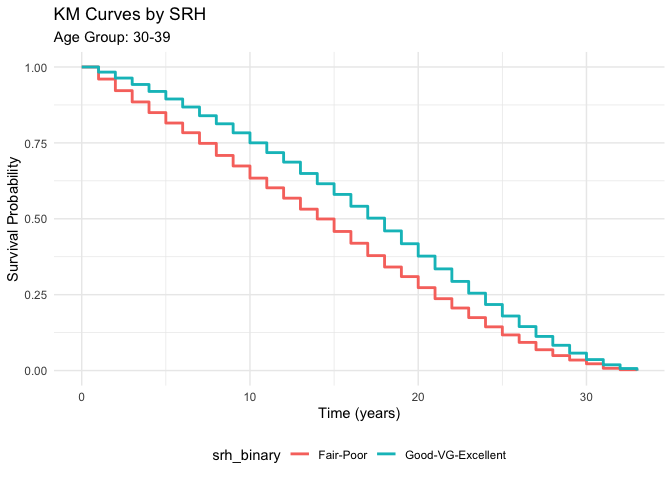<!-- -->

``` r
results_18_29 <- weighted_km_analysis(
  survey_design       = survey_design,
  age_groups_list     = age_groups,
  selected_age_group  = "18-29"#,
 # time_col            = "survtime",
 # event_col           = "mortstat_recoded",
 # group_col           = "srh_binary",
 # se                  = FALSE
)
results_18_29$km_plot
```

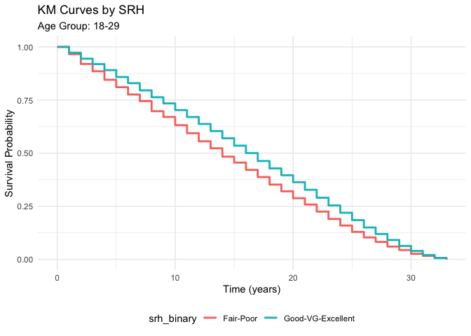<!-- -->

``` r
results_40_49 <- weighted_km_analysis(
  survey_design       = survey_design,
  age_groups_list     = age_groups,
  selected_age_group  = "40-49"#,
  # time_col            = "survtime",
  # event_col           = "mortstat_recoded",
  # group_col           = "srh_binary",
  # se                  = FALSE
)
results_40_49$km_plot
```

<!-- -->

``` r
results_50_59 <- weighted_km_analysis(
  survey_design       = survey_design,
  age_groups_list     = age_groups,
  selected_age_group  = "50-59"#,
  # time_col            = "survtime",
  # event_col           = "mortstat_recoded",
  # group_col           = "srh_binary",
  # se                  = FALSE
)
results_50_59$km_plot
```

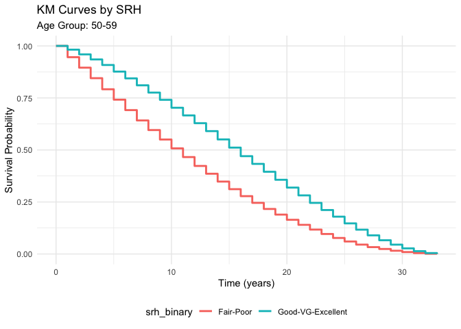<!-- -->

``` r
results_60_69 <- weighted_km_analysis(
  survey_design       = survey_design,
  age_groups_list     = age_groups,
  selected_age_group  = "60-69"#,
  # time_col            = "survtime",
  # event_col           = "mortstat_recoded",
  # group_col           = "srh_binary",
  # se                  = FALSE
)
results_60_69$km_plot
```

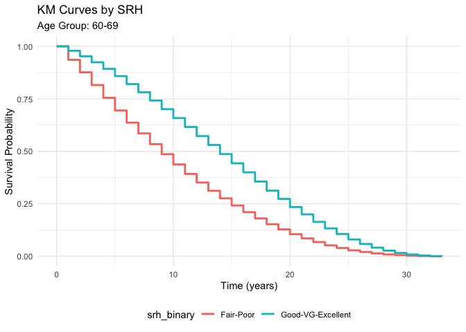<!-- -->

``` r
results_70 <- weighted_km_analysis(
  survey_design       = survey_design,
  age_groups_list     = age_groups,
  selected_age_group  = "70+"#,
  # time_col            = "survtime",
  # event_col           = "mortstat_recoded",
  # group_col           = "srh_binary",
  # se                  = FALSE
)
results_70$km_plot
```

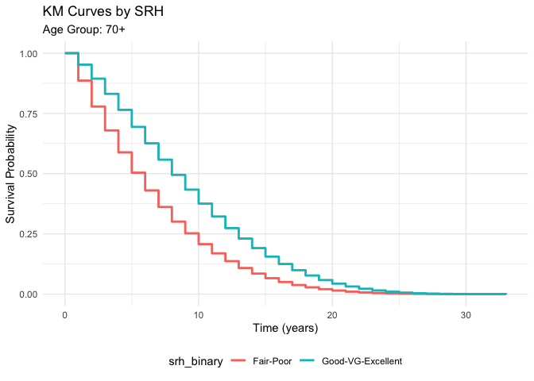<!-- -->

# Unweighted

## Cox PH for Rolling Window
