BRFSS New
================
Christine Lucille Kuryla
2025-01-11

For reference, here is the data aggregation process.

``` r
library(haven)

# intersect col 1993 to 2023
all_year_col <- c( "_STATE",   "_STSTR",   "_PSU",     "IDATE" , "IYEAR"  ,  "DISPCODE" , "GENHLTH",  "PHYSHLTH", "MENTHLTH", "POORHLTH", "SEATBELT", "CHILDREN", "SMOKE100",
"MARITAL" , "EDUCA"  , "PREGNANT", "_AGEG5YR") # "EXEROFT1" "EXERHMM1" "EXEROFT2", "EXERHMM2"

# more col
more_col <- c("_AGE80", "AGE", "_AGE", "SEX", "_SEX", "_IMPAGE", "_LLCPWT")

# file list
brfss_year_to_file <- read_csv(here("big_data/BRFSS/BRFSS_year_file_key.csv"))

# data_brfss_1993 <- read_xpt(here("big_data/BRFSS/CDBRFS93.XPT"))

file_paths <- brfss_year_to_file %>% 
  filter(!(brfss_year %in% 1990:1992)) %>% 
  pull(file_name) 


# Not all variables are in every year
safe_select <- function(df, cols) {
  # 1. Identify which columns from cols are missing in df
  missing_cols <- setdiff(cols, names(df))
  # 2. Create those missing columns in df filled with NA
  if (length(missing_cols) > 0) {
    df[missing_cols] <- NA
  }
  # 3. Finally, select and return only the columns in col_list  (now we are assured they exist, even if NA)
  df %>% select(all_of(cols))
}

# columns of interest
col_list <- vctrs::vec_c(all_year_col, more_col)

# create an empty list to store processed data frames
all_dfs <- vector("list", length = length(file_paths))

# get data from files
for (i in seq_along(file_paths)) {
  
  tmp_df <- read_xpt(paste0(here("big_data/BRFSS/"), file_paths[i], ".XPT"))
  
  # Safely select our columns of interest (any columns not in tmp_df will be NA)
  tmp_df_selected <- safe_select(tmp_df, col_list)
  
  # Store processed data frame
  all_dfs[[i]] <- tmp_df_selected
}

data_brfss_raw <- bind_rows(all_dfs)

# write_csv(data_brfss_raw, here("big_data/BRFSS/brfss_selected_not_recoded_20230111.csv"))
```

### Load data

``` r
data_brfss_raw <- read_csv(here("big_data/BRFSS/brfss_selected_not_recoded_20230111.csv"))
```

    ## Rows: 10436579 Columns: 24
    ## ── Column specification ────────────────────────────────────────────────────────
    ## Delimiter: ","
    ## chr  (1): IDATE
    ## dbl (22): _STATE, _STSTR, _PSU, IYEAR, DISPCODE, GENHLTH, PHYSHLTH, MENTHLTH...
    ## lgl  (1): _AGE
    ## 
    ## ℹ Use `spec()` to retrieve the full column specification for this data.
    ## ℹ Specify the column types or set `show_col_types = FALSE` to quiet this message.

``` r
data_brfss <- data_brfss_raw %>% 
  filter(GENHLTH <= 5) %>% 
  mutate(srh = 6 - GENHLTH) %>% # recode for intuitive order
  mutate(srh_cat = factor(
    srh,
    levels = 1:5,
    labels = c(
      "Poor",
      "Fair",
      "Good",
      "Very Good",
      "Excellent"
    ))) %>% 
  filter(`_AGEG5YR` != 14) %>%  # 14 = unknown
  mutate(
    # 1) age_5yr_cat: ordered factor with intuitive labels
    age_5yr_cat = factor(
      `_AGEG5YR`,
      levels = 1:13,  # Must match all possible codes
      labels = c(
        "18-24",    # 1
        "25-29",    # 2
        "30-34",    # 3
        "35-39",    # 4
        "40-44",    # 5
        "45-49",    # 6
        "50-54",    # 7
        "55-59",    # 8
        "60-64",    # 9
        "65-69",    # 10
        "70-74",    # 11
        "75-79",    # 12
        "80+" # 13
      ),
      ordered = TRUE  # Make it an ordered factor
    ),
    
    # 2) age_5yr_num: a numeric version based on the midpoint of each age band
    #    (or NA for unknown/refused)
    age_5yr_num = case_when(
      `_AGEG5YR` == 1  ~ (18 + 24)/2,   # 21
      `_AGEG5YR` == 2  ~ (25 + 29)/2,   # 27
      `_AGEG5YR` == 3  ~ (30 + 34)/2,   # 32
      `_AGEG5YR` == 4  ~ (35 + 39)/2,   # 37
      `_AGEG5YR` == 5  ~ (40 + 44)/2,   # 42
      `_AGEG5YR` == 6  ~ (45 + 49)/2,   # 47
      `_AGEG5YR` == 7  ~ (50 + 54)/2,   # 52
      `_AGEG5YR` == 8  ~ (55 + 59)/2,   # 57
      `_AGEG5YR` == 9  ~ (60 + 64)/2,   # 62
      `_AGEG5YR` == 10 ~ (65 + 69)/2,   # 67
      `_AGEG5YR` == 11 ~ (70 + 74)/2,   # 72
      `_AGEG5YR` == 12 ~ (75 + 79)/2,   # 77
      `_AGEG5YR` == 13 ~ (80 + 99)/2,   # 89.5 (if your codebook upper bound is 99)
      `_AGEG5YR` == 14 ~ NA_real_       # Unknown
    ),
    
    # 3) age_decade_cat: ordered factor collapsing adjacent age_5yr codes 
    #    into ~10-year bands (plus "80+" and "Unknown")
    age_decade_cat = case_when(
      `_AGEG5YR` %in% c(1,2)   ~ "18-29",
      `_AGEG5YR` %in% c(3,4)   ~ "30-39",
      `_AGEG5YR` %in% c(5,6)   ~ "40-49",
      `_AGEG5YR` %in% c(7,8)   ~ "50-59",
      `_AGEG5YR` %in% c(9,10)  ~ "60-69",
      `_AGEG5YR` %in% c(11,12) ~ "70-79",
      `_AGEG5YR` == 13         ~ "80+",
      `_AGEG5YR` == 14         ~ NA
    )
  ) %>%
  mutate(
    # Convert the decade-level variable to an ordered factor
    age_decade_cat = factor(
      age_decade_cat,
      levels = c("18-29", "30-39", "40-49", "50-59", 
                 "60-69", "70-79", "80+", "Unknown"),
      ordered = TRUE
    )
  ) %>% 
  mutate(year = case_when(
    IYEAR == 93 ~ 1993,
    IYEAR == 94 ~ 1994,
    IYEAR == 95 ~ 1995,
    IYEAR == 96 ~ 1996,
    IYEAR == 97 ~ 1997,
    IYEAR == 98 ~ 1998,
    TRUE ~ IYEAR
    ))

# # ---- Sanity checks ----
# # 1) Check that all categories are present and coded as expected:
# table(data_brfss$`_AGEG5YR`, useNA = "always")
# table(data_brfss$age_5yr_cat, useNA = "always")
# table(data_brfss$age_decade_cat, useNA = "always")
# 
# # 2) Brief check of numeric distribution:
# summary(data_brfss$age_5yr_num)
# 
# # 3) Look at a cross-tab to confirm consistency across new variables:
# with(data_brfss, table(age_5yr_cat, age_decade_cat))


# If want mental, physical, and activities health recoded

data_brfss <- data_brfss %>% 
  mutate(mental_health_good_days = case_when( # Now thinking about your mental health, which includes stress, depression, and problems with emotions, for how many days during the past 30 days was your mental health not good?
    MENTHLTH == 88 ~ 31,  # 88 = No bad days
    MENTHLTH <= 30 ~ 31 - MENTHLTH, # MENTHLTH is number of bad mental health days in past 30 days
    MENTHLTH == 77 ~ NA_real_, # 77 = Don't Know / Not Sure
    MENTHLTH == 99 ~ NA_real_, # 99 = Refused
    TRUE ~ NA_real_
  )) %>% 
mutate(mental_health =  case_when(
  MENTHLTH == 88 ~ 3,
  MENTHLTH >= 1 & MENTHLTH <= 14 ~ 2,
  MENTHLTH > 14 & MENTHLTH <= 30 ~ 1,
  MENTHLTH == 99 ~ NA,
  TRUE ~ NA)) %>% 
mutate(physical_health_good_days = case_when( # Now thinking about your physical health, which includes physical illness and injury, for how many days during the past 30 days was your physical health not good?
    PHYSHLTH == 88 ~ 31,  # 88 = No bad days
    PHYSHLTH <= 30 ~ 31 - PHYSHLTH, # MENTHLTH is number of bad mental health days in past 30 days
    PHYSHLTH == 77 ~ NA_real_, # 77 = Don't Know / Not Sure
    PHYSHLTH == 99 ~ NA_real_, # 99 = Refused
    TRUE ~ NA_real_
  )) %>% 
mutate(physical_health =  case_when(
  PHYSHLTH == 88 ~ 3,
  PHYSHLTH >= 1 & PHYSHLTH <= 14 ~ 2,
  PHYSHLTH > 14 & PHYSHLTH <= 30 ~ 1,
  PHYSHLTH == 99 ~ NA,
  TRUE ~ NA)) %>%
mutate(usual_activities_health_good_days = case_when( #During the past 30 days, for about how many days did poor physical or mental health keep you from doing your usual activities, such as self-care, work, or recreation?
    POORHLTH == 88 ~ 31,  # 88 = No bad days
    POORHLTH <= 30 ~ 31 - POORHLTH, # MENTHLTH is number of bad mental health days in past 30 days
    POORHLTH == 77 ~ NA_real_, # 77 = Don't Know / Not Sure
    POORHLTH == 99 ~ NA_real_, # 99 = Refused
    TRUE ~ NA
  )) %>% 
mutate(usual_activities_health =  case_when(
  POORHLTH == 88 ~ 3,
  POORHLTH >= 1 & POORHLTH <= 14 ~ 2,
  POORHLTH > 14 & POORHLTH <= 30 ~ 1,
  POORHLTH == 99 ~ NA,
  TRUE ~ NA))

# 

with(data_brfss, table(MENTHLTH, mental_health))
```

    ##         mental_health
    ## MENTHLTH       1       2       3
    ##       1        0  323615       0
    ##       2        0  522693       0
    ##       3        0  304020       0
    ##       4        0  152649       0
    ##       5        0  367458       0
    ##       6        0   41318       0
    ##       7        0  148796       0
    ##       8        0   29316       0
    ##       9        0    4680       0
    ##       10       0  263285       0
    ##       11       0    1753       0
    ##       12       0   18594       0
    ##       13       0    2273       0
    ##       14       0   57576       0
    ##       15  246930       0       0
    ##       16    3725       0       0
    ##       17    2838       0       0
    ##       18    4314       0       0
    ##       19     662       0       0
    ##       20  142354       0       0
    ##       21   10977       0       0
    ##       22    2550       0       0
    ##       23    1581       0       0
    ##       24    1789       0       0
    ##       25   49078       0       0
    ##       26    1944       0       0
    ##       27    3613       0       0
    ##       28   14474       0       0
    ##       29    8864       0       0
    ##       30  538026       0       0
    ##       77       0       0       0
    ##       88       0       0 6694159
    ##       99       0       0       0

``` r
with(data_brfss, table(PHYSHLTH, physical_health))
```

    ##         physical_health
    ## PHYSHLTH       1       2       3
    ##       1        0  429755       0
    ##       2        0  567167       0
    ##       3        0  328803       0
    ##       4        0  170617       0
    ##       5        0  287332       0
    ##       6        0   47905       0
    ##       7        0  189305       0
    ##       8        0   31978       0
    ##       9        0    7271       0
    ##       10       0  203364       0
    ##       11       0    2597       0
    ##       12       0   20050       0
    ##       13       0    2549       0
    ##       14       0  106206       0
    ##       15  186544       0       0
    ##       16    4616       0       0
    ##       17    3441       0       0
    ##       18    5746       0       0
    ##       19    1006       0       0
    ##       20  114070       0       0
    ##       21   25512       0       0
    ##       22    2759       0       0
    ##       23    1954       0       0
    ##       24    2449       0       0
    ##       25   45650       0       0
    ##       26    2646       0       0
    ##       27    4219       0       0
    ##       28   16688       0       0
    ##       29    7950       0       0
    ##       30  752692       0       0
    ##       77       0       0       0
    ##       88       0       0 6358416
    ##       99       0       0       0

``` r
with(data_brfss, table(POORHLTH, usual_activities_health))
```

    ##         usual_activities_health
    ## POORHLTH       1       2       3
    ##       1        0  268953       0
    ##       2        0  302427       0
    ##       3        0  184793       0
    ##       4        0  102320       0
    ##       5        0  193529       0
    ##       6        0   31689       0
    ##       7        0  105627       0
    ##       8        0   25029       0
    ##       9        0    4844       0
    ##       10       0  154239       0
    ##       11       0    1833       0
    ##       12       0   15361       0
    ##       13       0    1962       0
    ##       14       0   56002       0
    ##       15  163089       0       0
    ##       16    3208       0       0
    ##       17    2588       0       0
    ##       18    4127       0       0
    ##       19     736       0       0
    ##       20  100782       0       0
    ##       21   15172       0       0
    ##       22    2183       0       0
    ##       23    1422       0       0
    ##       24    1764       0       0
    ##       25   38607       0       0
    ##       26    1838       0       0
    ##       27    2669       0       0
    ##       28    8888       0       0
    ##       29    3418       0       0
    ##       30  427011       0       0
    ##       77       0       0       0
    ##       88       0       0 3034512
    ##       99       0       0       0

``` r
#  select(!(MENTHLTH %in% c(77, 88, 99))) %>% 
#  mutate(mental_health_good_days = 31 - MENTHLTH) # MENTLHLTH is number of bad mental health days in month 

rm(data_brfss_raw)
```

# Unweighted

``` r
data_brfss %>%
  group_by(year) %>%
  summarize(
    mean_health = mean(srh, na.rm = TRUE),
    .groups = "drop"
  ) %>% 
  ggplot(aes(x = year, y = mean_health)) +
  geom_line(size = 1, color = "cornflowerblue") +
  geom_point(size = 2, color = "darkblue") +
  labs(
    title = "Self-Rated Health",
    x = "Year",
    y = "Mean SRH",
    subtitle = "BRFSS Dataset"
  ) +
  theme_minimal()
```

    ## Warning: Using `size` aesthetic for lines was deprecated in ggplot2 3.4.0.
    ## ℹ Please use `linewidth` instead.
    ## This warning is displayed once every 8 hours.
    ## Call `lifecycle::last_lifecycle_warnings()` to see where this warning was
    ## generated.

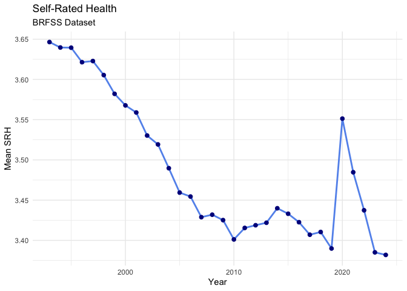<!-- -->

``` r
data_brfss %>%
  group_by(year) %>%
  summarize(
    mean_health = mean(physical_health, na.rm = TRUE),
    .groups = "drop"
  ) %>% 
  ggplot(aes(x = year, y = mean_health)) +
  geom_line(size = 1, color = "cornflowerblue") +
  geom_point(size = 2, color = "darkblue") +
  labs(
    title = "Physical Health",
    x = "Year",
    y = "Mean Physical Health",
    subtitle = "BRFSS Dataset"
  ) +
  theme_minimal()
```

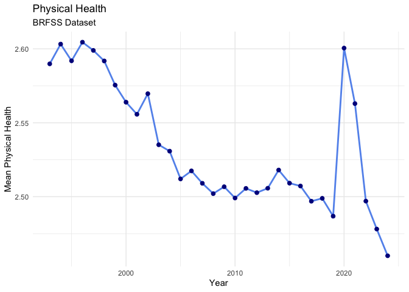<!-- -->

``` r
data_brfss %>%
  group_by(year) %>%
  summarize(
    mean_health = mean(mental_health, na.rm = TRUE),
    .groups = "drop"
  ) %>% 
  ggplot(aes(x = year, y = mean_health)) +
  geom_line(size = 1, color = "cornflowerblue") +
  geom_point(size = 2, color = "darkblue") +
  labs(
    title = "Mental Health",
    x = "Year",
    y = "Mean Mental Health",
    subtitle = "BRFSS Dataset"
  ) +
  theme_minimal()
```

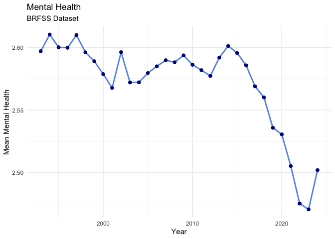<!-- -->

``` r
data_brfss %>%
  group_by(year) %>%
  summarize(
    mean_health = mean(usual_activities_health, na.rm = TRUE),
    .groups = "drop"
  ) %>% 
  ggplot(aes(x = year, y = mean_health)) +
  geom_line(size = 1, color = "cornflowerblue") +
  geom_point(size = 2, color = "darkblue") +
  labs(
    title = "Functional Health",
    x = "Year",
    y = "Mean Functional Health",
    subtitle = "BRFSS Dataset"
  ) +
  theme_minimal()
```

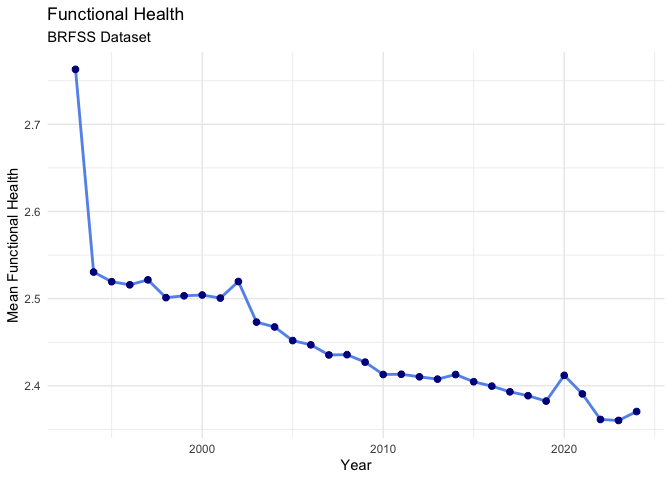<!-- -->

``` r
data_brfss %>% 
  group_by(age_decade_cat, year) %>% 
  summarize(mean_health = mean(srh, na.rm = TRUE)) %>% 
  ggplot(aes(x = year, y = mean_health, color = age_decade_cat)) +
  geom_line() +
  labs(title = "Average SRH Per Year for Each Age Group",
       subtitle = "BRFSS 1993 - 2023 Dataset",
       y = "Average SRH", 
       x = "Year",
       color = "Age Group") +
  scale_color_discrete() +
  theme_minimal() #+
```

    ## `summarise()` has grouped output by 'age_decade_cat'. You can override using
    ## the `.groups` argument.

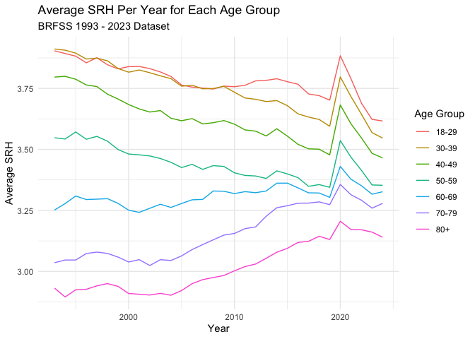<!-- -->

``` r
#  scale_color_brewer(palette = "Set2")

data_brfss %>% 
  group_by(age_decade_cat, year) %>% 
  summarize(mean_health = mean(physical_health_good_days, na.rm = TRUE)) %>% 
  ggplot(aes(x = year, y = mean_health, color = age_decade_cat)) +
  geom_line() +
  labs(title = "Average Days of Good Physical Health Per Year for Each Age Group",
       subtitle = "BRFSS 1993 - 2023 Dataset",
       y = "Average SRH", 
       x = "Year",
       color = "Age Group") +
  scale_color_discrete() +
  theme_minimal() 
```

    ## `summarise()` has grouped output by 'age_decade_cat'. You can override using
    ## the `.groups` argument.

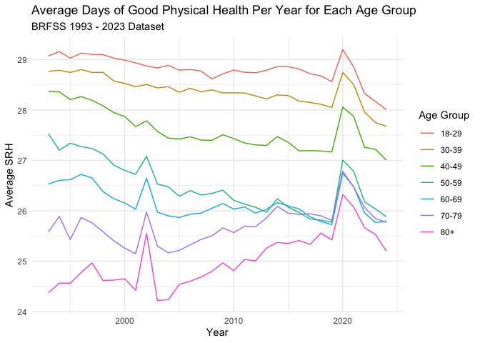<!-- -->

``` r
data_brfss %>% 
  group_by(age_decade_cat, year) %>% 
  summarize(mean_health = mean(mental_health_good_days, na.rm = TRUE)) %>% 
  ggplot(aes(x = year, y = mean_health, color = age_decade_cat)) +
  geom_line() +
  labs(title = "Average Days of Good Mental Health Per Year for Each Age Group",
       subtitle = "BRFSS 1993 - 2023 Dataset",
       y = "Average SRH", 
       x = "Year",
       color = "Age Group") +
  scale_color_discrete() +
  theme_minimal() 
```

    ## `summarise()` has grouped output by 'age_decade_cat'. You can override using
    ## the `.groups` argument.

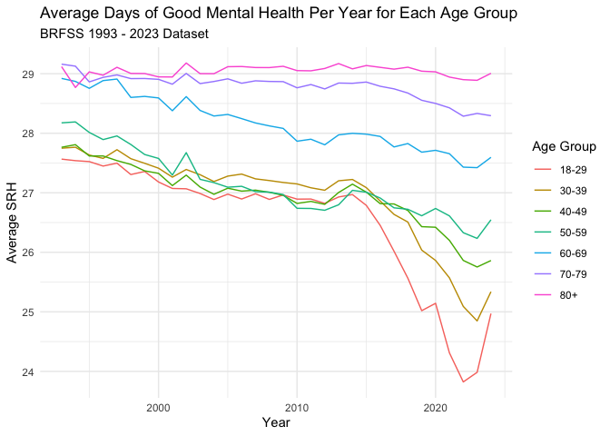<!-- -->

``` r
data_brfss %>% 
  group_by(age_decade_cat, year) %>% 
  summarize(mean_health = mean(usual_activities_health_good_days, na.rm = TRUE)) %>% 
  ggplot(aes(x = year, y = mean_health, color = age_decade_cat)) +
  geom_line() +
  labs(title = "Average Functional Days Per Year for Each Age Group",
       subtitle = "BRFSS 1993 - 2023 Dataset",
       y = "Average SRH", 
       x = "Year",
       color = "Age Group") +
  scale_color_discrete() +
  theme_minimal() 
```

    ## `summarise()` has grouped output by 'age_decade_cat'. You can override using
    ## the `.groups` argument.

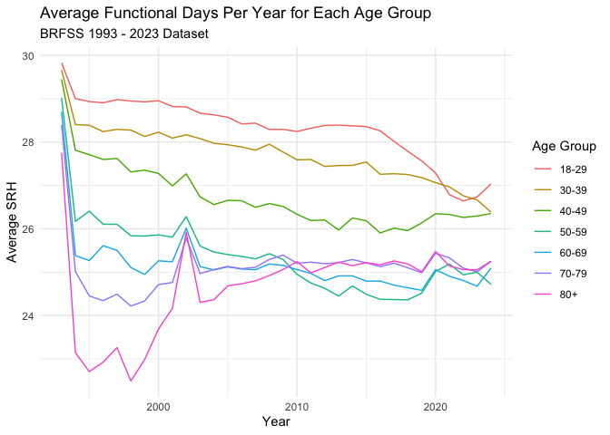<!-- -->

``` r
lm_health_v_age_0 <- data_brfss %>%
  group_by(year) %>%
  do(broom::tidy(lm(srh ~ age_5yr_num, data = .), conf.int = TRUE)) %>%  # Add conf.int = TRUE for CIs
  filter(term == "age_5yr_num") %>%
  select(year, coef = estimate, conf.low, conf.high, se = std.error, t_statistic = statistic,  p_value = p.value)

# View the results with confidence intervals, se, t statistic, and p value
# print(lm_health_v_age_0)
knitr::kable(lm_health_v_age_0,
             caption = "BRFSS 1993 - 2023 Dataset")
```

| year |       coef |   conf.low |  conf.high |        se | t_statistic | p_value |
|-----:|-----------:|-----------:|-----------:|----------:|------------:|--------:|
| 1993 | -0.0174020 | -0.0177531 | -0.0170510 | 0.0001791 |   -97.15212 |       0 |
| 1994 | -0.0171244 | -0.0174702 | -0.0167786 | 0.0001764 |   -97.06080 |       0 |
| 1995 | -0.0164956 | -0.0168284 | -0.0161629 | 0.0001698 |   -97.15894 |       0 |
| 1996 | -0.0158887 | -0.0162106 | -0.0155667 | 0.0001643 |   -96.72744 |       0 |
| 1997 | -0.0160790 | -0.0163871 | -0.0157708 | 0.0001572 |  -102.26575 |       0 |
| 1998 | -0.0155460 | -0.0158422 | -0.0152497 | 0.0001512 |  -102.84509 |       0 |
| 1999 | -0.0154243 | -0.0157133 | -0.0151353 | 0.0001475 |  -104.60405 |       0 |
| 2000 | -0.0159376 | -0.0162098 | -0.0156654 | 0.0001389 |  -114.74750 |       0 |
| 2001 | -0.0160517 | -0.0163065 | -0.0157969 | 0.0001300 |  -123.47918 |       0 |
| 2002 | -0.0161196 | -0.0163557 | -0.0158836 | 0.0001204 |  -133.83301 |       0 |
| 2003 | -0.0156308 | -0.0158615 | -0.0154001 | 0.0001177 |  -132.79473 |       0 |
| 2004 | -0.0155400 | -0.0157557 | -0.0153243 | 0.0001100 |  -141.22558 |       0 |
| 2005 | -0.0147317 | -0.0149324 | -0.0145310 | 0.0001024 |  -143.86934 |       0 |
| 2006 | -0.0143657 | -0.0145684 | -0.0141630 | 0.0001034 |  -138.90348 |       0 |
| 2007 | -0.0138783 | -0.0140647 | -0.0136920 | 0.0000951 |  -145.94056 |       0 |
| 2008 | -0.0135105 | -0.0137005 | -0.0133204 | 0.0000970 |  -139.33641 |       0 |
| 2009 | -0.0135567 | -0.0137440 | -0.0133694 | 0.0000956 |  -141.86013 |       0 |
| 2010 | -0.0130137 | -0.0132003 | -0.0128272 | 0.0000952 |  -136.75918 |       0 |
| 2011 | -0.0121411 | -0.0123076 | -0.0119747 | 0.0000849 |  -142.95360 |       0 |
| 2012 | -0.0120256 | -0.0121953 | -0.0118559 | 0.0000866 |  -138.88719 |       0 |
| 2013 | -0.0112968 | -0.0114622 | -0.0111314 | 0.0000844 |  -133.86671 |       0 |
| 2014 | -0.0108315 | -0.0110017 | -0.0106612 | 0.0000869 |  -124.67535 |       0 |
| 2015 | -0.0102282 | -0.0104020 | -0.0100544 | 0.0000887 |  -115.34269 |       0 |
| 2016 | -0.0095811 | -0.0097464 | -0.0094158 | 0.0000843 |  -113.61832 |       0 |
| 2017 | -0.0090723 | -0.0092413 | -0.0089033 | 0.0000862 |  -105.22508 |       0 |
| 2018 | -0.0087176 | -0.0088893 | -0.0085460 | 0.0000876 |   -99.54027 |       0 |
| 2019 | -0.0084877 | -0.0086591 | -0.0083162 | 0.0000875 |   -97.01912 |       0 |
| 2020 | -0.0107699 | -0.0109393 | -0.0106005 | 0.0000864 |  -124.59307 |       0 |
| 2021 | -0.0098093 | -0.0099751 | -0.0096436 | 0.0000846 |  -115.98216 |       0 |
| 2022 | -0.0083026 | -0.0084652 | -0.0081400 | 0.0000830 |  -100.05762 |       0 |
| 2023 | -0.0073217 | -0.0074834 | -0.0071601 | 0.0000825 |   -88.79818 |       0 |
| 2024 | -0.0070005 | -0.0076733 | -0.0063278 | 0.0003432 |   -20.39526 |       0 |

BRFSS 1993 - 2023 Dataset

``` r
# Plot coefficients
ggplot(lm_health_v_age_0, aes(x = year, y = coef)) +
  geom_point() +
  geom_errorbar(aes(ymin=conf.low, ymax=conf.high), width=.2,
                 position=position_dodge(0.05)) +
  labs(
    title = "Change in 'Age' Coefficient Over Years",
    subtitle = "BRFSS 1993 - 2023 Dataset",
    x = "Year",
    y = "Coefficient of Age"
  ) +
  theme_minimal()
```

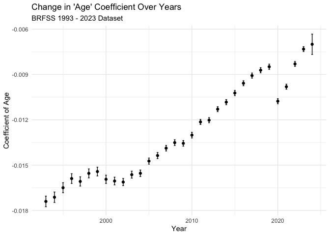<!-- -->

``` r
# Plot coefficients with CI
ggplot(lm_health_v_age_0, aes(x = year, y = coef)) +
  geom_line() +
  geom_point() +
  geom_ribbon(aes(ymin = conf.low, ymax = conf.high), alpha = 0.2) +  # Add shaded area for confidence intervals
  labs(
    title = "Change in 'Age' Coefficient Over Years with Confidence Intervals",
    subtitle = "BRFSS 2004 - 2023 Dataset",
    x = "Year",
    y = "Coefficient of Age"
  ) +
  theme_minimal()
```

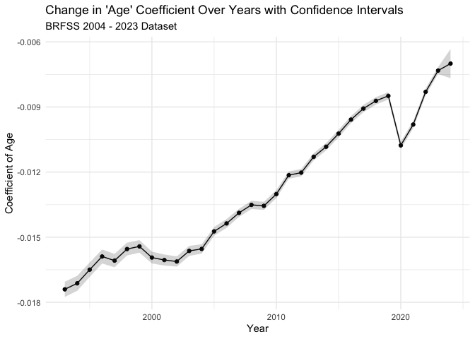<!-- -->

``` r
# Perform linear regression of 'coef' (age coefficient) vs 'year'
lm_coef_vs_year <- lm(coef ~ year, data = lm_health_v_age_0)
```

``` r
data_brfss %>%
  group_by(year) %>%
  do(broom::tidy(lm(srh ~ physical_health_good_days, data = .), conf.int = TRUE)) %>%  # Add conf.int = TRUE for CIs
  filter(term == "physical_health_good_days") %>%
  select(year, coef = estimate, conf.low, conf.high, se = std.error, t_statistic = statistic,  p_value = p.value) %>% 
ggplot(aes(x = year, y = coef)) +
  geom_point() +
  geom_errorbar(aes(ymin=conf.low, ymax=conf.high), width=.2,
                 position=position_dodge(0.05)) +
  labs(
    title = "Change in 'Physical Health' Coefficient on SRH Over Years",
    subtitle = "BRFSS 1993 - 2023 Dataset",
    x = "Year",
    y = "Coefficient of Physical Health on SRH"
  ) +
  theme_minimal()
```

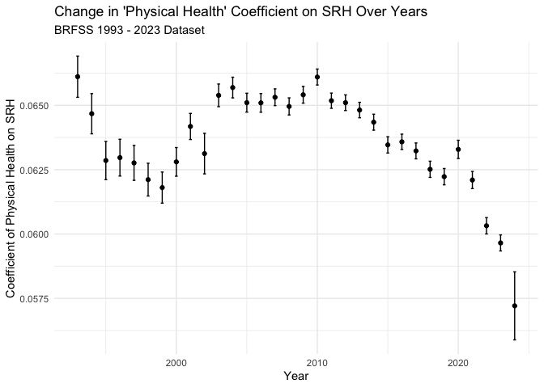<!-- -->

``` r
data_brfss %>%
  group_by(year) %>%
  do(broom::tidy(lm(srh ~ mental_health_good_days, data = .), conf.int = TRUE)) %>%  # Add conf.int = TRUE for CIs
  filter(term == "mental_health_good_days") %>%
  select(year, coef = estimate, conf.low, conf.high, se = std.error, t_statistic = statistic,  p_value = p.value) %>% 
ggplot(aes(x = year, y = coef)) +
  geom_point() +
  geom_errorbar(aes(ymin=conf.low, ymax=conf.high), width=.2,
                 position=position_dodge(0.05)) +
  labs(
    title = "Change in 'Mental Health' Coefficient on SRH Over Years",
    subtitle = "BRFSS 1993 - 2023 Dataset",
    x = "Year",
    y = "Coefficient of Mental Health on SRH"
  ) +
  theme_minimal()
```

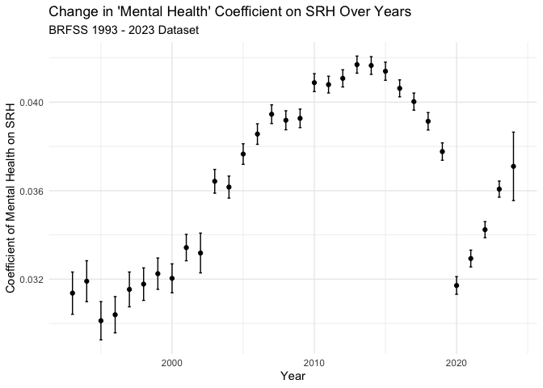<!-- -->

``` r
data_brfss %>%
  group_by(year) %>%
  do(broom::tidy(lm(srh ~ usual_activities_health_good_days, data = .), conf.int = TRUE)) %>%  # Add conf.int = TRUE for CIs
  filter(term == "usual_activities_health_good_days") %>%
  select(year, coef = estimate, conf.low, conf.high, se = std.error, t_statistic = statistic,  p_value = p.value) %>% 
ggplot(aes(x = year, y = coef)) +
  geom_point() +
  geom_errorbar(aes(ymin=conf.low, ymax=conf.high), width=.2,
                 position=position_dodge(0.05)) +
  labs(
    title = "Change in 'Functional Health' Coefficient on SRH Over Years",
    subtitle = "BRFSS 1993 - 2023 Dataset",
    x = "Year",
    y = "Coefficient of Functional Health on SRH"
  ) +
  theme_minimal()
```

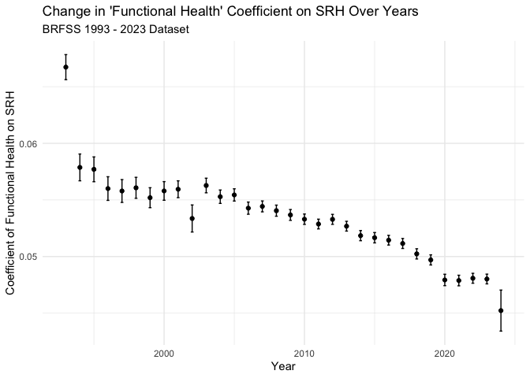<!-- -->

``` r
# Recoded

data_brfss %>%
  group_by(year) %>%
  do(broom::tidy(lm(srh ~ physical_health, data = .), conf.int = TRUE)) %>%  # Add conf.int = TRUE for CIs
  filter(term == "physical_health") %>%
  select(year, coef = estimate, conf.low, conf.high, se = std.error, t_statistic = statistic,  p_value = p.value) %>% 
ggplot(aes(x = year, y = coef)) +
  geom_point() +
  geom_errorbar(aes(ymin=conf.low, ymax=conf.high), width=.2,
                 position=position_dodge(0.05)) +
  labs(
    title = "Change in 'Physical Health' Coefficient on SRH Over Years",
    subtitle = "BRFSS 1993 - 2023 Dataset",
    x = "Year",
    y = "Coefficient of Physical Health on SRH"
  ) +
  theme_minimal()
```

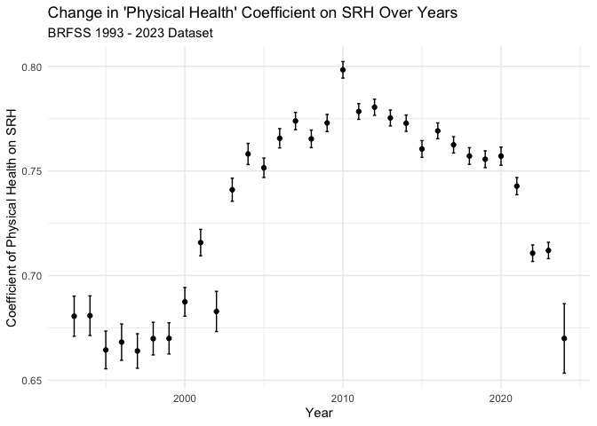<!-- -->

``` r
data_brfss %>%
  group_by(year) %>%
  do(broom::tidy(lm(srh ~ mental_health, data = .), conf.int = TRUE)) %>%  # Add conf.int = TRUE for CIs
  filter(term == "mental_health") %>%
  select(year, coef = estimate, conf.low, conf.high, se = std.error, t_statistic = statistic,  p_value = p.value) %>% 
ggplot(aes(x = year, y = coef)) +
  geom_point() +
  geom_errorbar(aes(ymin=conf.low, ymax=conf.high), width=.2,
                 position=position_dodge(0.05)) +
  labs(
    title = "Change in 'Mental Health' Coefficient on SRH Over Years",
    subtitle = "BRFSS 1993 - 2023 Dataset",
    x = "Year",
    y = "Coefficient of Mental Health on SRH"
  ) +
  theme_minimal()
```

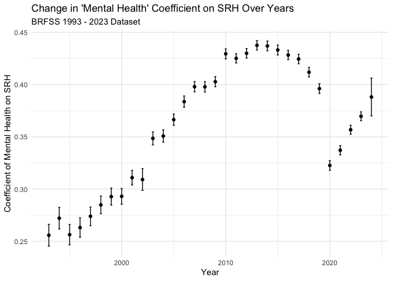<!-- -->

``` r
data_brfss %>%
  group_by(year) %>%
  do(broom::tidy(lm(srh ~ usual_activities_health, data = .), conf.int = TRUE)) %>%  # Add conf.int = TRUE for CIs
  filter(term == "usual_activities_health") %>%
  select(year, coef = estimate, conf.low, conf.high, se = std.error, t_statistic = statistic,  p_value = p.value) %>% 
ggplot(aes(x = year, y = coef)) +
  geom_point() +
  geom_errorbar(aes(ymin=conf.low, ymax=conf.high), width=.2,
                 position=position_dodge(0.05)) +
  labs(
    title = "Change in 'Functional Health' Coefficient on SRH Over Years",
    subtitle = "BRFSS 1993 - 2023 Dataset",
    x = "Year",
    y = "Coefficient of Functional Health on SRH"
  ) +
  theme_minimal()
```

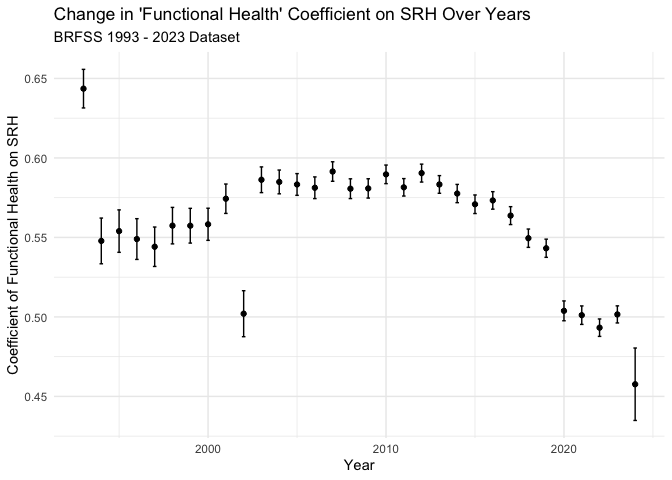<!-- -->

``` r
data_brfss %>%
  mutate(age = cut(age_5yr_num, breaks = 6)) %>% 
  group_by(year, age) %>%
  do(broom::tidy(lm(srh ~ age_5yr_num, data = .), conf.int = TRUE)) %>%  # Add conf.int = TRUE for CIs
  filter(term == "age_5yr_num") %>%
  select(year, coef = estimate, conf.low, conf.high, se = std.error, t_statistic = statistic,  p_value = p.value) %>% 
ggplot(aes(x = year, y = coef, color = age)) +
  geom_point() +
  geom_line() +
  geom_errorbar(aes(ymin=conf.low, ymax=conf.high), width=.2,
                 position=position_dodge(0.05)) +
  labs(
    title = "Change in 'Age' Coefficient on SRH Over Years",
    subtitle = "BRFSS 1993 - 2023 Dataset",
    x = "Year",
    y = "Coefficient of Functional Health on SRH"
  ) +
  scale_color_discrete() +
  theme_minimal() 
```

    ## Adding missing grouping variables: `age`

    ## Warning: Removed 32 rows containing missing values or values outside the scale range
    ## (`geom_point()`).

    ## Warning: Removed 32 rows containing missing values or values outside the scale range
    ## (`geom_line()`).

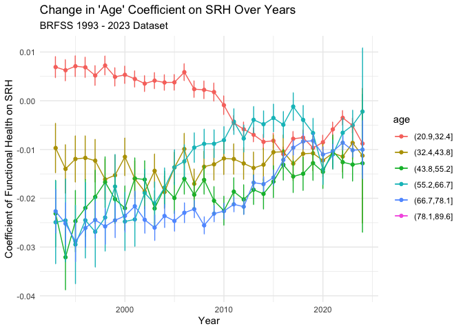<!-- -->

``` r
data_brfss %>%
  group_by(year, age_decade_cat) %>%
  do(broom::tidy(lm(srh ~ physical_health, data = .), conf.int = TRUE)) %>%  # Add conf.int = TRUE for CIs
  filter(term == "physical_health") %>%
  select(year, coef = estimate, conf.low, conf.high, se = std.error, t_statistic = statistic,  p_value = p.value) %>% 
ggplot(aes(x = year, y = coef, color = age_decade_cat)) +
  geom_point() +
  geom_line() +
  geom_errorbar(aes(ymin=conf.low, ymax=conf.high), width=.2,
                 position=position_dodge(0.05)) +
  labs(
    title = "Change in 'Physical Health' Coefficient on SRH Over Years",
    subtitle = "BRFSS 1993 - 2023 Dataset",
    x = "Year",
    y = "Coefficient of Physical Health on SRH"
  ) +
  scale_color_discrete() +
  theme_minimal() 
```

    ## Adding missing grouping variables: `age_decade_cat`

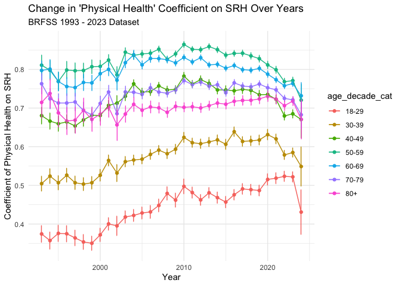<!-- -->

``` r
data_brfss %>%
  group_by(year, age_decade_cat) %>%
  do(broom::tidy(lm(srh ~ mental_health, data = .), conf.int = TRUE)) %>%  # Add conf.int = TRUE for CIs
  filter(term == "mental_health") %>%
  select(year, coef = estimate, conf.low, conf.high, se = std.error, t_statistic = statistic,  p_value = p.value) %>% 
ggplot(aes(x = year, y = coef, color = age_decade_cat)) +
  geom_point() +
  geom_line() +
  geom_errorbar(aes(ymin=conf.low, ymax=conf.high), width=.2,
                 position=position_dodge(0.05)) +
  labs(
    title = "Change in 'Mental Health' Coefficient on SRH Over Years",
    subtitle = "BRFSS 1993 - 2023 Dataset",
    x = "Year",
    y = "Coefficient of Mental Health on SRH"
  ) +
  scale_color_discrete() +
  theme_minimal() 
```

    ## Adding missing grouping variables: `age_decade_cat`

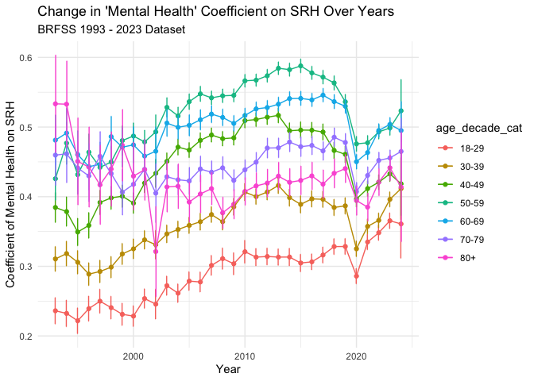<!-- -->

``` r
data_brfss %>%
  group_by(year, age_decade_cat) %>%
  do(broom::tidy(lm(srh ~ usual_activities_health, data = .), conf.int = TRUE)) %>%  # Add conf.int = TRUE for CIs
  filter(term == "usual_activities_health") %>%
  select(year, coef = estimate, conf.low, conf.high, se = std.error, t_statistic = statistic,  p_value = p.value) %>% 
ggplot(aes(x = year, y = coef, color = age_decade_cat)) +
  geom_point() +
  geom_line() +
  geom_errorbar(aes(ymin=conf.low, ymax=conf.high), width=.2,
                 position=position_dodge(0.05)) +
  labs(
    title = "Change in 'Functional Health' Coefficient on SRH Over Years",
    subtitle = "BRFSS 1993 - 2023 Dataset",
    x = "Year",
    y = "Coefficient of Functional Health on SRH"
  ) +
  scale_color_discrete() +
  theme_minimal() 
```

    ## Adding missing grouping variables: `age_decade_cat`

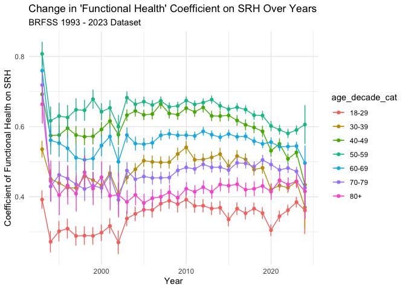<!-- -->

# Regression

``` r
lm(srh ~ physical_health + mental_health + usual_activities_health,
   data = data_brfss)
```

    ## 
    ## Call:
    ## lm(formula = srh ~ physical_health + mental_health + usual_activities_health, 
    ##     data = data_brfss)
    ## 
    ## Coefficients:
    ##             (Intercept)          physical_health            mental_health  
    ##                  0.6193                   0.7180                   0.2274  
    ## usual_activities_health  
    ##                  0.2343

``` r
lm(srh ~ physical_health + mental_health + usual_activities_health +
     physical_health*mental_health + physical_health*usual_activities_health + mental_health*usual_activities_health,
   data = data_brfss)
```

    ## 
    ## Call:
    ## lm(formula = srh ~ physical_health + mental_health + usual_activities_health + 
    ##     physical_health * mental_health + physical_health * usual_activities_health + 
    ##     mental_health * usual_activities_health, data = data_brfss)
    ## 
    ## Coefficients:
    ##                             (Intercept)  
    ##                                 0.37866  
    ##                         physical_health  
    ##                                 0.69629  
    ##                           mental_health  
    ##                                 0.11835  
    ##                 usual_activities_health  
    ##                                 0.60007  
    ##           physical_health:mental_health  
    ##                                 0.15178  
    ## physical_health:usual_activities_health  
    ##                                -0.11530  
    ##   mental_health:usual_activities_health  
    ##                                -0.07981

``` r
library(dplyr)          # For data manipulation
library(broom)          # For tidying model outputs
library(ggplot2)        # For plotting
library(purrr)          # For functional programming utilities
library(tidyr)          # For reshaping data
# If you haven't already installed these packages, install them with:
# install.packages(c("dplyr", "broom", "ggplot2", "purrr", "tidyr"))

# --- Data Preparation and Model Fitting ---

# Suppose your data frame is called data_brfss and has the columns:
#   - srh (the response variable)
#   - physical_health
#   - mental_health
#   - usual_activities_health
#   - year (the grouping variable)

# 1) Group data by 'year'
# 2) Fit a linear model srh ~ physical_health + mental_health + usual_activities_health within each year
# 3) Use broom::tidy() to get coefficient estimates, standard errors, confidence intervals, etc.

model_results <- data_brfss %>%
    group_by(year) %>%
    do(
        broom::tidy(
            lm(srh ~ physical_health + mental_health + usual_activities_health, 
               data = .), 
            conf.int = TRUE
        )
    ) %>%
    ungroup() %>%
    # 4) Filter only the terms of interest
    filter(term %in% c("physical_health", "mental_health", "usual_activities_health"))

# Now 'model_results' has multiple rows per 'year':
#   - one for the intercept
#   - one for physical_health
#   - one for mental_health
#   - one for usual_activities_health
# We keep only the three predictors.

# Inspect the resulting data frame:
head(model_results)
```

    ## # A tibble: 6 × 8
    ##    year term           estimate std.error statistic   p.value conf.low conf.high
    ##   <dbl> <chr>             <dbl>     <dbl>     <dbl>     <dbl>    <dbl>     <dbl>
    ## 1  1993 physical_heal…   0.534    0.00603      88.5 0           0.522     0.546 
    ## 2  1993 mental_health    0.0605   0.00519      11.6 2.62e- 31   0.0503    0.0706
    ## 3  1993 usual_activit…   0.254    0.00742      34.2 2.50e-255   0.239     0.269 
    ## 4  1994 physical_heal…   0.723    0.00773      93.6 0           0.708     0.738 
    ## 5  1994 mental_health    0.253    0.00698      36.3 2.30e-284   0.240     0.267 
    ## 6  1994 usual_activit…   0.228    0.00772      29.6 7.90e-191   0.213     0.244

``` r
# --- Summarize or Explore the Results ---

# For convenience, let's rename some columns and keep relevant ones
model_results_clean <- model_results %>%
    select(
        year,
        term,
        estimate,
        conf.low,
        conf.high,
        std.error,
        statistic,
        p.value
    )

# This clean version can be used for tabular summary or plotting.
# Example tabular summary:
model_results_clean
```

    ## # A tibble: 96 × 8
    ##     year term          estimate conf.low conf.high std.error statistic   p.value
    ##    <dbl> <chr>            <dbl>    <dbl>     <dbl>     <dbl>     <dbl>     <dbl>
    ##  1  1993 physical_hea…   0.534    0.522     0.546    0.00603      88.5 0        
    ##  2  1993 mental_health   0.0605   0.0503    0.0706   0.00519      11.6 2.62e- 31
    ##  3  1993 usual_activi…   0.254    0.239     0.269    0.00742      34.2 2.50e-255
    ##  4  1994 physical_hea…   0.723    0.708     0.738    0.00773      93.6 0        
    ##  5  1994 mental_health   0.253    0.240     0.267    0.00698      36.3 2.30e-284
    ##  6  1994 usual_activi…   0.228    0.213     0.244    0.00772      29.6 7.90e-191
    ##  7  1995 physical_hea…   0.699    0.684     0.713    0.00730      95.7 0        
    ##  8  1995 mental_health   0.241    0.228     0.254    0.00650      37.1 2.16e-297
    ##  9  1995 usual_activi…   0.244    0.230     0.258    0.00720      33.9 3.77e-249
    ## 10  1996 physical_hea…   0.694    0.680     0.708    0.00707      98.2 0        
    ## # ℹ 86 more rows

``` r
# --- Plotting the Coefficients ---

# Approach A: Facet by predictor
# This will place each predictor's time-series coefficient plot in its own facet.
ggplot(model_results_clean, 
       aes(x = year, y = estimate)) +
    geom_point() +
    geom_errorbar(aes(ymin = conf.low, ymax = conf.high), 
                  width = 0.2) +
    facet_wrap(~ term, scales = "free_y") +
    labs(
        title = "Time Trends in Coefficients for Multiple Predictors on SRH",
        subtitle = "BRFSS 1993 - 2023 Dataset (Example)",
        x = "Year",
        y = "Coefficient Estimate"
    ) +
    theme_minimal()
```

<!-- -->

``` r
# Approach B: Single Plot, Different Colors by Predictor
# This will overlay lines for the different predictors on the same plot.
# (May be less clear if the scales differ, but it can be a useful comparison.)
ggplot(model_results_clean, 
       aes(x = year, y = estimate, color = term)) +
    geom_point() +
    geom_line() +
    geom_errorbar(aes(ymin = conf.low, ymax = conf.high), 
                  width = 0.2) +
    labs(
        title = "Time Trends in Coefficients for Multiple Predictors on SRH",
        subtitle = "BRFSS 1993 - 2023 Dataset (Example)",
        x = "Year",
        y = "Coefficient Estimate",
        color = "Predictor"
    ) +
    theme_minimal()
```

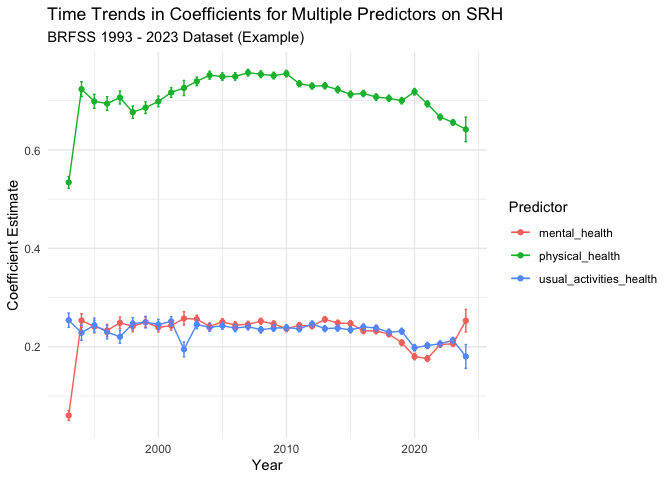<!-- -->

``` r
model_fit_stats <- data_brfss %>%
    group_by(year) %>%
    do(
        broom::glance(
            lm(srh ~ physical_health + mental_health + usual_activities_health, data = .)
        )
    ) %>%
    ungroup()

colnames(model_fit_stats)
```

    ##  [1] "year"          "r.squared"     "adj.r.squared" "sigma"        
    ##  [5] "statistic"     "p.value"       "df"            "logLik"       
    ##  [9] "AIC"           "BIC"           "deviance"      "df.residual"  
    ## [13] "nobs"

``` r
model_fit_stats %>% ggplot(aes(x = year, y = adj.r.squared)) + geom_line()
```

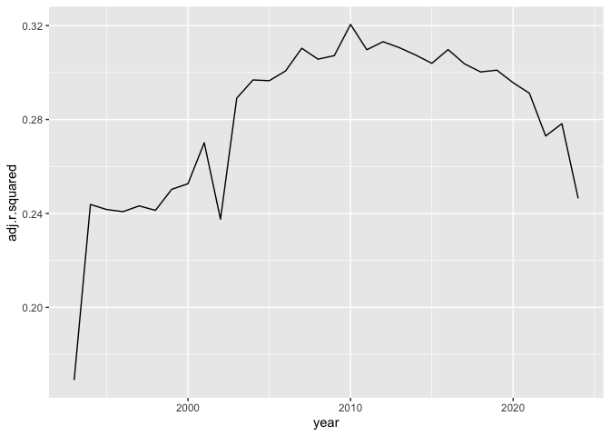<!-- -->

``` r
model_fit_stats %>% ggplot(aes(x = year, y = BIC)) + geom_line()
```

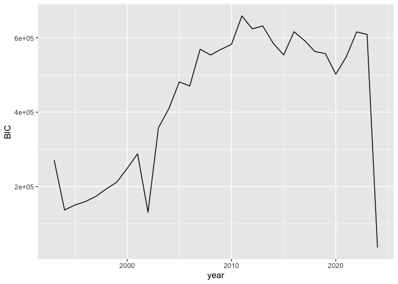<!-- -->
