SRH BRFSS Covariate Analysis
================
Christine Lucille Kuryla
2025-02-11

# Introduction

This report presents an analysis of the BRFSS dataset (1993–2023). We
are interested in exploring:

*Coefficient Analyses:* How do different predictors—Physical Health,
Mental Health, Functional Health (measured by usual_activities_health),
Sex, and Education (EDUCA)—relate to self‑rated health (SRH) over time?
We run separate simple regressions (by year and age group) and visualize
the coefficients (with confidence intervals) over the years. We also
provide a grouped bar plot of the average coefficients (averaged over
all years) by age group.

*Trend Analyses:* Moving away from regression coefficients, we explore
trends in the average values of Mental Health, Physical Health, and
Functional Health (via usual_activities_health) over time for each age
group. An overall bar plot summarizes the average health measures across
all years by age group.

*Setup* Load the required packages and data, wrangle the data.

year age_decade_cat srh mental_health physical_health
usual_activities_health sex EDUCA

``` r
# Load required packages
library(tidyverse)   # For data manipulation and plotting
```

    ## ── Attaching core tidyverse packages ──────────────────────── tidyverse 2.0.0 ──
    ## ✔ dplyr     1.1.4     ✔ readr     2.1.5
    ## ✔ forcats   1.0.0     ✔ stringr   1.5.1
    ## ✔ ggplot2   3.5.1     ✔ tibble    3.2.1
    ## ✔ lubridate 1.9.3     ✔ tidyr     1.3.1
    ## ✔ purrr     1.0.2     
    ## ── Conflicts ────────────────────────────────────────── tidyverse_conflicts() ──
    ## ✖ dplyr::filter() masks stats::filter()
    ## ✖ dplyr::lag()    masks stats::lag()
    ## ℹ Use the conflicted package (<http://conflicted.r-lib.org/>) to force all conflicts to become errors

``` r
library(broom)       # For tidying model outputs
library(purrr)       # For functional programming
library(patchwork)   # For combining ggplot objects
library(here)
```

    ## here() starts at /Users/christinekuryla/Documents/_Research/SRH/self_rated_health

For reference, here is the data aggregation process.

``` r
library(haven)

# intersect col 1993 to 2023
all_year_col <- c( "_STATE",   "_STSTR",   "_PSU",     "IDATE" , "IYEAR"  ,  "DISPCODE" , "GENHLTH",  "PHYSHLTH", "MENTHLTH", "POORHLTH", "SEATBELT", "CHILDREN", "SMOKE100",
"MARITAL" , "EDUCA"  , "PREGNANT", "_AGEG5YR") # "EXEROFT1" "EXERHMM1" "EXEROFT2", "EXERHMM2"

# more col
more_col <- c("_AGE80", "AGE", "_AGE", "SEX", "_SEX", "_IMPAGE", "_LLCPWT")

# file list
brfss_year_to_file <- read_csv(here("big_data/BRFSS/BRFSS_year_file_key.csv"))

# data_brfss_1993 <- read_xpt(here("big_data/BRFSS/CDBRFS93.XPT"))

file_paths <- brfss_year_to_file %>% 
  filter(!(brfss_year %in% 1990:1992)) %>% 
  pull(file_name) 


# Not all variables are in every year
safe_select <- function(df, cols) {
  # 1. Identify which columns from cols are missing in df
  missing_cols <- setdiff(cols, names(df))
  # 2. Create those missing columns in df filled with NA
  if (length(missing_cols) > 0) {
    df[missing_cols] <- NA
  }
  # 3. Finally, select and return only the columns in col_list  (now we are assured they exist, even if NA)
  df %>% select(all_of(cols))
}

# columns of interest
col_list <- vctrs::vec_c(all_year_col, more_col)

# create an empty list to store processed data frames
all_dfs <- vector("list", length = length(file_paths))

# get data from files
for (i in seq_along(file_paths)) {
  
  tmp_df <- read_xpt(paste0(here("big_data/BRFSS/"), file_paths[i], ".XPT"))
  
  # Safely select our columns of interest (any columns not in tmp_df will be NA)
  tmp_df_selected <- safe_select(tmp_df, col_list)
  
  # Store processed data frame
  all_dfs[[i]] <- tmp_df_selected
}

data_brfss_raw <- bind_rows(all_dfs)

# write_csv(data_brfss_raw, here("big_data/BRFSS/brfss_selected_not_recoded_20230111.csv"))
```

### Load data

``` r
data_brfss_raw <- read_csv(here("big_data/BRFSS/brfss_selected_not_recoded_20230111.csv"))
```

    ## Rows: 10436579 Columns: 24
    ## ── Column specification ────────────────────────────────────────────────────────
    ## Delimiter: ","
    ## chr  (1): IDATE
    ## dbl (22): _STATE, _STSTR, _PSU, IYEAR, DISPCODE, GENHLTH, PHYSHLTH, MENTHLTH...
    ## lgl  (1): _AGE
    ## 
    ## ℹ Use `spec()` to retrieve the full column specification for this data.
    ## ℹ Specify the column types or set `show_col_types = FALSE` to quiet this message.

``` r
data_brfss <- data_brfss_raw %>% 
  filter(GENHLTH <= 5) %>% 
  mutate(srh = 6 - GENHLTH) %>% # recode for intuitive order
  mutate(srh_cat = factor(
    srh,
    levels = 1:5,
    labels = c(
      "Poor",
      "Fair",
      "Good",
      "Very Good",
      "Excellent"
    ))) %>% 
  filter(`_AGEG5YR` != 14) %>%  # 14 = unknown
  mutate(
    # 1) age_5yr_cat: ordered factor with intuitive labels
    age_5yr_cat = factor(
      `_AGEG5YR`,
      levels = 1:13,  # Must match all possible codes
      labels = c(
        "18-24",    # 1
        "25-29",    # 2
        "30-34",    # 3
        "35-39",    # 4
        "40-44",    # 5
        "45-49",    # 6
        "50-54",    # 7
        "55-59",    # 8
        "60-64",    # 9
        "65-69",    # 10
        "70-74",    # 11
        "75-79",    # 12
        "80+" # 13
      ),
      ordered = TRUE  # Make it an ordered factor
    ),
    
    # 2) age_5yr_num: a numeric version based on the midpoint of each age band
    #    (or NA for unknown/refused)
    age_5yr_num = case_when(
      `_AGEG5YR` == 1  ~ (18 + 24)/2,   # 21
      `_AGEG5YR` == 2  ~ (25 + 29)/2,   # 27
      `_AGEG5YR` == 3  ~ (30 + 34)/2,   # 32
      `_AGEG5YR` == 4  ~ (35 + 39)/2,   # 37
      `_AGEG5YR` == 5  ~ (40 + 44)/2,   # 42
      `_AGEG5YR` == 6  ~ (45 + 49)/2,   # 47
      `_AGEG5YR` == 7  ~ (50 + 54)/2,   # 52
      `_AGEG5YR` == 8  ~ (55 + 59)/2,   # 57
      `_AGEG5YR` == 9  ~ (60 + 64)/2,   # 62
      `_AGEG5YR` == 10 ~ (65 + 69)/2,   # 67
      `_AGEG5YR` == 11 ~ (70 + 74)/2,   # 72
      `_AGEG5YR` == 12 ~ (75 + 79)/2,   # 77
      `_AGEG5YR` == 13 ~ (80 + 99)/2,   # 89.5 (if your codebook upper bound is 99)
      `_AGEG5YR` == 14 ~ NA_real_       # Unknown
    ),
    
    # 3) age_decade_cat: ordered factor collapsing adjacent age_5yr codes 
    #    into ~10-year bands (plus "80+" and "Unknown")
    age_decade_cat = case_when(
      `_AGEG5YR` %in% c(1,2)   ~ "18-29",
      `_AGEG5YR` %in% c(3,4)   ~ "30-39",
      `_AGEG5YR` %in% c(5,6)   ~ "40-49",
      `_AGEG5YR` %in% c(7,8)   ~ "50-59",
      `_AGEG5YR` %in% c(9,10)  ~ "60-69",
      `_AGEG5YR` %in% c(11,12) ~ "70-79",
      `_AGEG5YR` == 13         ~ "80+",
      `_AGEG5YR` == 14         ~ NA
    )
  ) %>%
  mutate(
    # Convert the decade-level variable to an ordered factor
    age_decade_cat = factor(
      age_decade_cat,
      levels = c("18-29", "30-39", "40-49", "50-59", 
                 "60-69", "70-79", "80+", "Unknown"),
      ordered = TRUE
    )
  ) %>% 
  mutate(year = case_when(
    IYEAR == 93 ~ 1993,
    IYEAR == 94 ~ 1994,
    IYEAR == 95 ~ 1995,
    IYEAR == 96 ~ 1996,
    IYEAR == 97 ~ 1997,
    IYEAR == 98 ~ 1998,
    TRUE ~ IYEAR
    ))

# # ---- Sanity checks ----
# # 1) Check that all categories are present and coded as expected:
# table(data_brfss$`_AGEG5YR`, useNA = "always")
# table(data_brfss$age_5yr_cat, useNA = "always")
# table(data_brfss$age_decade_cat, useNA = "always")
# 
# # 2) Brief check of numeric distribution:
# summary(data_brfss$age_5yr_num)
# 
# # 3) Look at a cross-tab to confirm consistency across new variables:
# with(data_brfss, table(age_5yr_cat, age_decade_cat))


# If want mental, physical, and activities health recoded

data_brfss <- data_brfss %>% 
  mutate(mental_health_good_days = case_when( # Now thinking about your mental health, which includes stress, depression, and problems with emotions, for how many days during the past 30 days was your mental health not good?
    MENTHLTH == 88 ~ 31,  # 88 = No bad days
    MENTHLTH <= 30 ~ 31 - MENTHLTH, # MENTHLTH is number of bad mental health days in past 30 days
    MENTHLTH == 77 ~ NA_real_, # 77 = Don't Know / Not Sure
    MENTHLTH == 99 ~ NA_real_, # 99 = Refused
    TRUE ~ NA_real_
  )) %>% 
mutate(mental_health =  case_when(
  MENTHLTH == 88 ~ 3,
  MENTHLTH >= 1 & MENTHLTH <= 14 ~ 2,
  MENTHLTH > 14 & MENTHLTH <= 30 ~ 1,
  MENTHLTH == 99 ~ NA,
  TRUE ~ NA)) %>% 
mutate(physical_health_good_days = case_when( # Now thinking about your physical health, which includes physical illness and injury, for how many days during the past 30 days was your physical health not good?
    PHYSHLTH == 88 ~ 31,  # 88 = No bad days
    PHYSHLTH <= 30 ~ 31 - PHYSHLTH, # MENTHLTH is number of bad mental health days in past 30 days
    PHYSHLTH == 77 ~ NA_real_, # 77 = Don't Know / Not Sure
    PHYSHLTH == 99 ~ NA_real_, # 99 = Refused
    TRUE ~ NA_real_
  )) %>% 
mutate(physical_health =  case_when(
  PHYSHLTH == 88 ~ 3,
  PHYSHLTH >= 1 & PHYSHLTH <= 14 ~ 2,
  PHYSHLTH > 14 & PHYSHLTH <= 30 ~ 1,
  PHYSHLTH == 99 ~ NA,
  TRUE ~ NA)) %>%
mutate(usual_activities_health_good_days = case_when( #During the past 30 days, for about how many days did poor physical or mental health keep you from doing your usual activities, such as self-care, work, or recreation?
    POORHLTH == 88 ~ 31,  # 88 = No bad days
    POORHLTH <= 30 ~ 31 - POORHLTH, # MENTHLTH is number of bad mental health days in past 30 days
    POORHLTH == 77 ~ NA_real_, # 77 = Don't Know / Not Sure
    POORHLTH == 99 ~ NA_real_, # 99 = Refused
    TRUE ~ NA
  )) %>% 
mutate(usual_activities_health =  case_when(
  POORHLTH == 88 ~ 3,
  POORHLTH >= 1 & POORHLTH <= 14 ~ 2,
  POORHLTH > 14 & POORHLTH <= 30 ~ 1,
  POORHLTH == 99 ~ NA,
  TRUE ~ NA)) %>% 
mutate(sex = case_when(
  year <= 2018 ~ SEX,
  year >= 2019 ~ `_SEX`,
  TRUE ~ NA)) %>% 
filter(EDUCA != 9) %>% 
filter(sex %in% c(1,2)) %>% 
filter(age_decade_cat != "Unknown") %>% 
mutate(age_decade_cat = fct_drop(age_decade_cat)) 

# 

with(data_brfss, table(MENTHLTH, mental_health))
```

    ##         mental_health
    ## MENTHLTH       1       2       3
    ##       1        0  309503       0
    ##       2        0  501019       0
    ##       3        0  290852       0
    ##       4        0  145954       0
    ##       5        0  351596       0
    ##       6        0   39525       0
    ##       7        0  142232       0
    ##       8        0   27929       0
    ##       9        0    4448       0
    ##       10       0  251236       0
    ##       11       0    1650       0
    ##       12       0   17670       0
    ##       13       0    2145       0
    ##       14       0   55177       0
    ##       15  235592       0       0
    ##       16    3507       0       0
    ##       17    2697       0       0
    ##       18    4050       0       0
    ##       19     628       0       0
    ##       20  135520       0       0
    ##       21   10488       0       0
    ##       22    2417       0       0
    ##       23    1510       0       0
    ##       24    1690       0       0
    ##       25   46616       0       0
    ##       26    1836       0       0
    ##       27    3421       0       0
    ##       28   13814       0       0
    ##       29    8459       0       0
    ##       30  512150       0       0
    ##       77       0       0       0
    ##       88       0       0 6391627
    ##       99       0       0       0

``` r
with(data_brfss, table(PHYSHLTH, physical_health))
```

    ##         physical_health
    ## PHYSHLTH       1       2       3
    ##       1        0  411165       0
    ##       2        0  542344       0
    ##       3        0  314096       0
    ##       4        0  162819       0
    ##       5        0  273935       0
    ##       6        0   45628       0
    ##       7        0  181078       0
    ##       8        0   30411       0
    ##       9        0    6872       0
    ##       10       0  193509       0
    ##       11       0    2463       0
    ##       12       0   19048       0
    ##       13       0    2424       0
    ##       14       0  101573       0
    ##       15  177778       0       0
    ##       16    4367       0       0
    ##       17    3257       0       0
    ##       18    5424       0       0
    ##       19     952       0       0
    ##       20  108239       0       0
    ##       21   24363       0       0
    ##       22    2630       0       0
    ##       23    1858       0       0
    ##       24    2329       0       0
    ##       25   43375       0       0
    ##       26    2518       0       0
    ##       27    3982       0       0
    ##       28   15915       0       0
    ##       29    7574       0       0
    ##       30  715296       0       0
    ##       77       0       0       0
    ##       88       0       0 6077245
    ##       99       0       0       0

``` r
with(data_brfss, table(POORHLTH, usual_activities_health))
```

    ##         usual_activities_health
    ## POORHLTH       1       2       3
    ##       1        0  257515       0
    ##       2        0  289265       0
    ##       3        0  176334       0
    ##       4        0   97534       0
    ##       5        0  184406       0
    ##       6        0   30170       0
    ##       7        0  100822       0
    ##       8        0   23867       0
    ##       9        0    4566       0
    ##       10       0  146562       0
    ##       11       0    1740       0
    ##       12       0   14630       0
    ##       13       0    1876       0
    ##       14       0   53528       0
    ##       15  154918       0       0
    ##       16    3018       0       0
    ##       17    2449       0       0
    ##       18    3889       0       0
    ##       19     702       0       0
    ##       20   95542       0       0
    ##       21   14512       0       0
    ##       22    2075       0       0
    ##       23    1353       0       0
    ##       24    1663       0       0
    ##       25   36628       0       0
    ##       26    1733       0       0
    ##       27    2535       0       0
    ##       28    8482       0       0
    ##       29    3257       0       0
    ##       30  405401       0       0
    ##       77       0       0       0
    ##       88       0       0 2903371
    ##       99       0       0       0

``` r
#  select(!(MENTHLTH %in% c(77, 88, 99))) %>% 
#  mutate(mental_health_good_days = 31 - MENTHLTH) # MENTLHLTH is number of bad mental health days in month 

rm(data_brfss_raw)
```

# Part 1. Coefficient Analyses

We begin by estimating the relationship between self‑rated health (srh)
and five predictors:

- Physical Health (physical_health)
- Mental Health (mental_health)
- Functional Health (usual_activities_health)
- Sex (sex)
- Education (EDUCA)

For each predictor, we run a simple linear regression model by subgroup
(year and age group) and extract the coefficient (with 95% confidence
intervals). We then visualize the coefficient estimates over time for
each age group and provide an overall (averaged) bar plot.

## 1.1 Regression and Coefficient Extraction

``` r
# Define a helper function to run a regression for a given predictor.
# Each model is of the form: srh ~ predictor
run_regression <- function(pred, label) {
  data_brfss %>%
    filter(age_decade_cat != "Unknown") %>% 
    mutate(age_decade_cat = fct_drop(age_decade_cat)) %>% 
    group_by(year, age_decade_cat) %>%
    do(
      tidy(
        lm(as.formula(paste("srh ~", pred)), data = .),
        conf.int = TRUE
      )
    ) %>%
    filter(term == pred) %>%  # extract only the row for the predictor
    mutate(predictor = label) %>%
    select(
      year,
      age_decade_cat,
      predictor,
      coef = estimate,
      conf.low,
      conf.high,
      se = std.error,
      t_statistic = statistic,
      p_value = p.value
    ) %>%
    ungroup()
}

# Run regressions for each predictor
results_physical   <- run_regression("physical_health", "Physical Health")
results_mental     <- run_regression("mental_health", "Mental Health")
results_functional <- run_regression("usual_activities_health", "Functional Health")
results_sex        <- run_regression("sex", "Sex")
results_edu        <- run_regression("EDUCA", "Education")

# Combine all results
results_all <- bind_rows(results_physical, results_mental, results_functional,
                         results_sex, results_edu) %>% 
  mutate(predictor = factor(predictor, levels = c("Physical Health", "Mental Health", "Functional Health", "Education", "Sex")))

# Quick sanity check of subgroup sizes
sample_sizes <- data_brfss %>%
  group_by(year, age_decade_cat) %>%
  summarise(n = n(), .groups = "drop")
print(sample_sizes)
```

    ## # A tibble: 224 × 3
    ##     year age_decade_cat     n
    ##    <dbl> <ord>          <int>
    ##  1  1993 18-29          20127
    ##  2  1993 30-39          24323
    ##  3  1993 40-49          19149
    ##  4  1993 50-59          12490
    ##  5  1993 60-69          12116
    ##  6  1993 70-79           9434
    ##  7  1993 80+             3732
    ##  8  1994 18-29          19995
    ##  9  1994 30-39          24703
    ## 10  1994 40-49          20353
    ## # ℹ 214 more rows

# 1.2 Trend Plots of Coefficients by Age Group

We now plot the estimated coefficients (with error bars) over the years
for each age group.

``` r
# Override the default discrete color scale for color aesthetics
scale_colour_discrete <- function(...){
  scale_colour_manual(..., values = pal_cb)
}
# (Also override the American spelling, if needed)
scale_color_discrete <- scale_colour_discrete

# Override the default discrete color scale for fill aesthetics
scale_fill_discrete <- function(...){
  scale_fill_manual(..., values = pal_cb)
}

# Create individual plots (one per age group)
coef_plots <- results_all %>%
  split(.$age_decade_cat) %>%
  map(function(df) {
    age_label <- unique(df$age_decade_cat)
    ggplot(df, aes(x = year, y = coef, color = predictor, group = predictor)) +
      geom_point(size = 2) +
      geom_line() +
      geom_errorbar(aes(ymin = conf.low, ymax = conf.high), width = 0.2,
                    position = position_dodge(0.05)) +
      labs(
        title = paste("Coefficient Trends for Age Group:", age_label),
        x = "Year",
        y = "Coefficient on SRH",
        color = "Predictor"
      ) +
      theme_minimal() 
      
  })

# Compute common axis limits
x_limits <- range(results_all$year, na.rm = TRUE)
y_limits <- range(c(results_all$coef, results_all$conf.low, results_all$conf.high), na.rm = TRUE)

# Update each plot with common limits
coef_plots_fixed <- map(coef_plots, ~ .x +
                          scale_x_continuous(limits = x_limits) +
                          scale_y_continuous(limits = y_limits))

# Print each

walk(coef_plots_fixed, print)
```

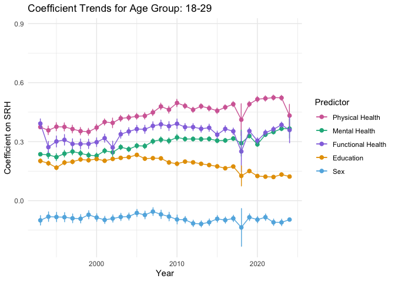<!-- -->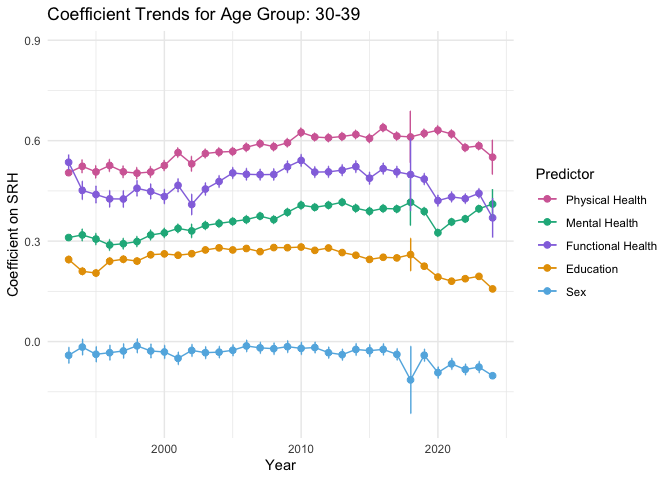<!-- -->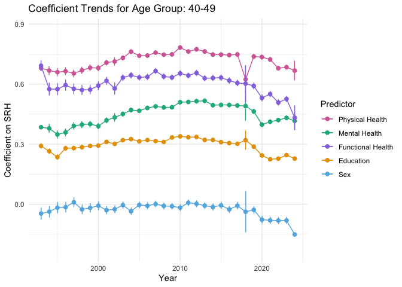<!-- -->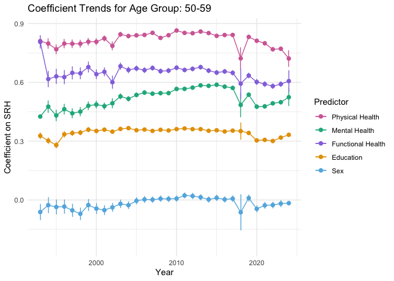<!-- -->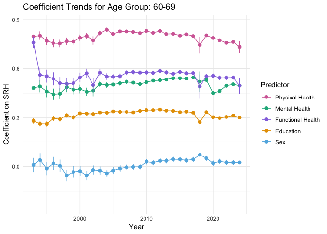<!-- -->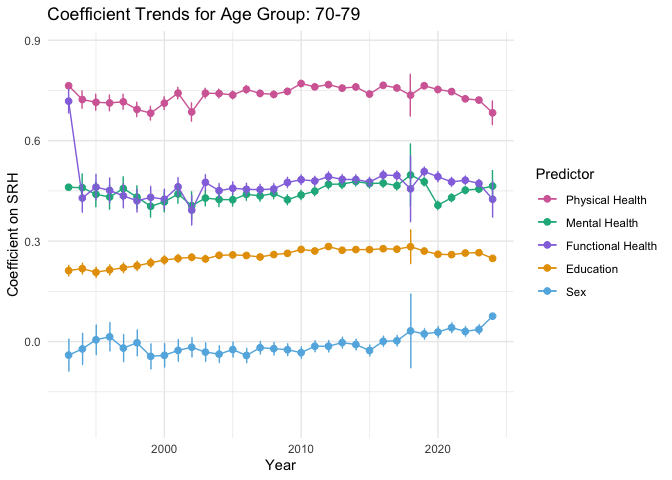<!-- -->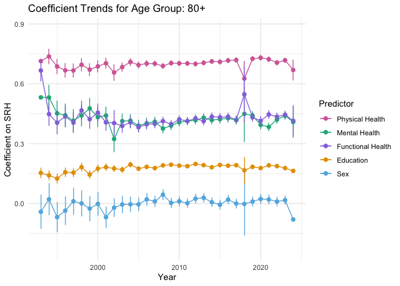<!-- -->

``` r
combined_coef_plot <- wrap_plots(coef_plots_fixed, ncol = 3)
combined_coef_plot
```

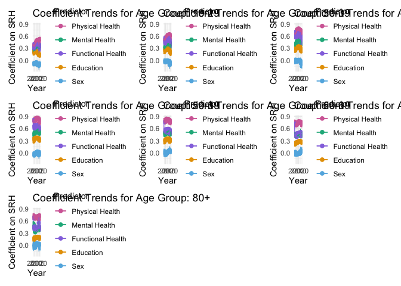<!-- -->

``` r
##### Only health

# take out sex and education, they messes up the axes
results_all_selected <- results_all %>% 
  filter(predictor != "Education") %>% 
  filter(predictor != "Sex")

# Create individual plots (one per age group)
coef_plots <- results_all_selected %>%
  split(.$age_decade_cat) %>%
  map(function(df) {
    age_label <- unique(df$age_decade_cat)
    ggplot(df, aes(x = year, y = coef, color = predictor, group = predictor)) +
      geom_point(size = 2) +
      geom_line() +
      geom_errorbar(aes(ymin = conf.low, ymax = conf.high), width = 0.2,
                    position = position_dodge(0.05)) +
      labs(
        title = paste("Coefficient Trends for Age Group:", age_label),
        x = "Year",
        y = "Coefficient on SRH",
        color = "Predictor"
      ) +
      theme_minimal()
  })

# Compute common axis limits
x_limits <- range(results_all_selected$year, na.rm = TRUE)
y_limits <- range(c(results_all_selected$coef, results_all_selected$conf.low, results_all_selected$conf.high), na.rm = TRUE)

# Update each plot with common limits
coef_plots_fixed <- map(coef_plots, ~ .x +
                          scale_x_continuous(limits = x_limits) +
                          scale_y_continuous(limits = y_limits))

# Print each

walk(coef_plots_fixed, print)
```

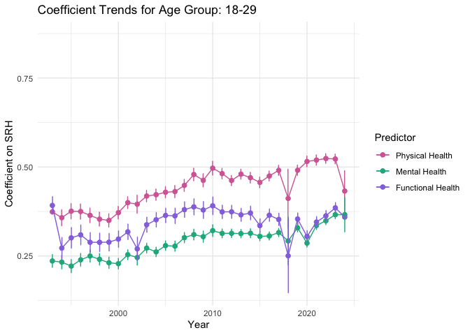<!-- -->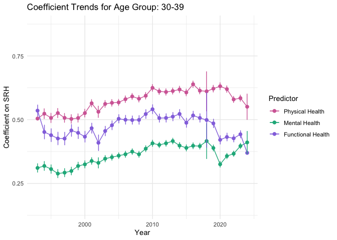<!-- -->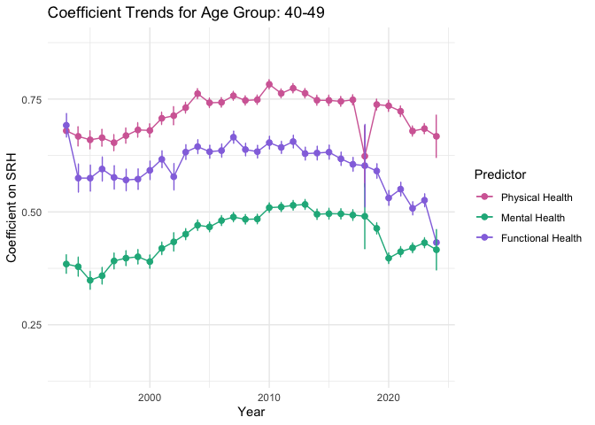<!-- -->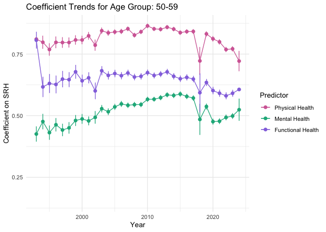<!-- -->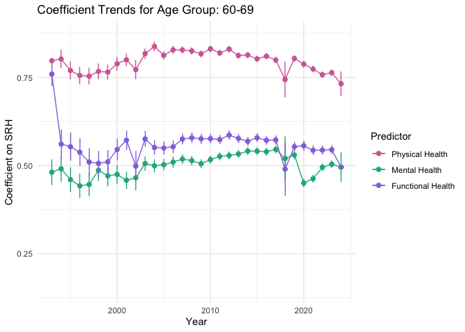<!-- -->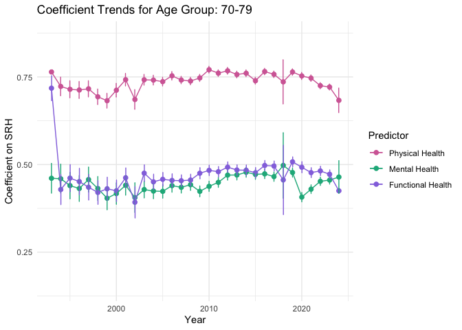<!-- -->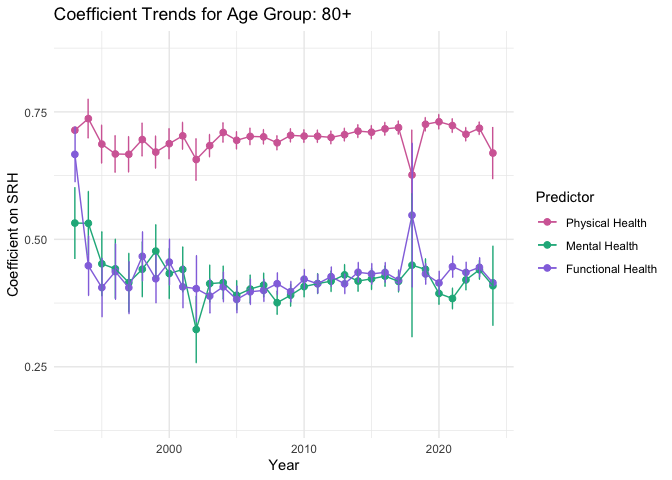<!-- -->

``` r
# Combine the plots into one figure (using 2 columns)
combined_coef_plot <- wrap_plots(coef_plots_fixed, ncol = 3)
combined_coef_plot
```

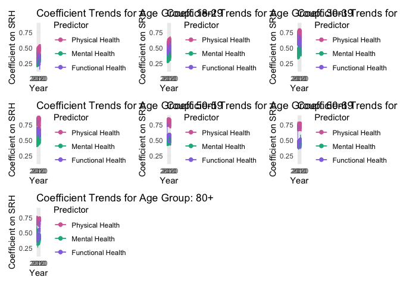<!-- -->

# 1.3 Overall Bar Plot of Average Coefficients

``` r
averaged_coef <- results_all %>%
  group_by(age_decade_cat, predictor) %>%
  summarise(
    avg_coef     = mean(coef, na.rm = TRUE),
    avg_conf_low = mean(conf.low, na.rm = TRUE),
    avg_conf_high= mean(conf.high, na.rm = TRUE),
    .groups = "drop"
  )

bar_coef_plot <- ggplot(averaged_coef, aes(x = age_decade_cat, y = avg_coef, fill = predictor)) +
  geom_bar(stat = "identity", position = position_dodge(width = 0.8)) +
  geom_errorbar(aes(ymin = avg_conf_low, ymax = avg_conf_high),
                position = position_dodge(width = 0.8),
                width = 0.2) +
  labs(
    title = "Average Coefficients for Predictors on SRH by Age Group",
    x = "Age Group",
    y = "Average Coefficient",
    fill = "Predictor"
  ) +
  theme_minimal() +
  theme(axis.text.x = element_text(angle = 45, hjust = 1))
bar_coef_plot
```

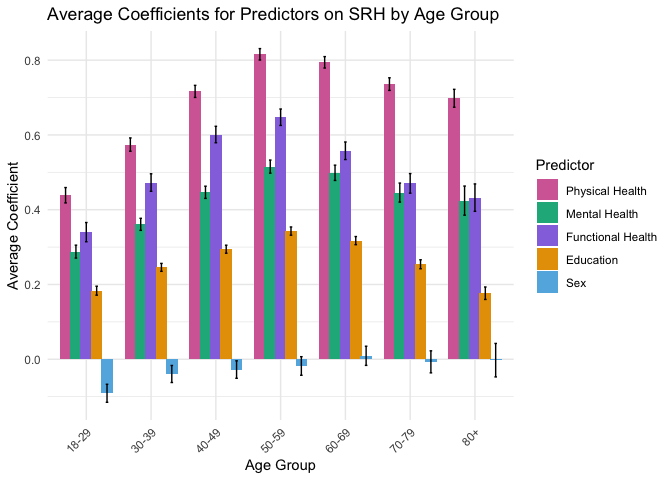<!-- -->

``` r
### Health only
results_all_selected %>%
  group_by(age_decade_cat, predictor) %>%
  summarise(
    avg_coef     = mean(coef, na.rm = TRUE),
    avg_conf_low = mean(conf.low, na.rm = TRUE),
    avg_conf_high= mean(conf.high, na.rm = TRUE),
    .groups = "drop"
  ) %>% 
  ggplot(aes(x = age_decade_cat, y = avg_coef, fill = predictor)) +
  geom_bar(stat = "identity", position = position_dodge(width = 0.8)) +
  geom_errorbar(aes(ymin = avg_conf_low, ymax = avg_conf_high),
                position = position_dodge(width = 0.8),
                width = 0.2) +
  labs(
    title = "Average Coefficients for Predictors on SRH by Age Group",
    x = "Age Group",
    y = "Average Coefficient",
    fill = "Predictor"
  ) +
  theme_minimal() +
  theme(axis.text.x = element_text(angle = 45, hjust = 1))
```

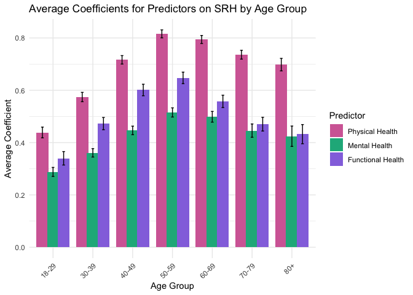<!-- -->

# Part 2. Trend Analyses of Health Measures

Now we move away from regression coefficients to explore trends in
health measures themselves. In this section, we examine the average
values over time of Mental Health, Physical Health, and Functional
Health (via usual_activities_health). (Self‑rated health is not included
here.) We produce:

*Trend Plots:* A line plot (with points) for each age group showing the
trends over the years.

*Overall Bar Plot:* A grouped bar plot comparing the overall (across all
years) average values of these health measures by age group.

## 2.1 Trend Plots by Age Group

``` r
# Compute annual averages for the three health measures by year and age group
trend_data <- data_brfss %>%
  group_by(year, age_decade_cat) %>%
  summarise(
    avg_mental     = mean(mental_health_good_days, na.rm = TRUE),
    avg_physical   = mean(physical_health_good_days, na.rm = TRUE),
    avg_functional = mean(usual_activities_health_good_days, na.rm = TRUE),
    .groups = "drop"
  ) %>%
  pivot_longer(
    cols = c(avg_mental, avg_physical, avg_functional),
    names_to = "health_measure",
    values_to = "average"
  ) %>%
  mutate(health_measure = recode(health_measure,
                                 avg_mental     = "Mental Health",
                                 avg_physical   = "Physical Health",
                                 avg_functional = "Functional Health"))

# Create a line plot for each group

trend_plots <- trend_data %>%
  split(.$age_decade_cat) %>%
  map(function(df) {
    age_label <- unique(df$age_decade_cat)
    ggplot(df, aes(x = year, y = average, color = health_measure, group = health_measure)) +
      geom_line(size = 1) +
      geom_point(size = 2) +
      labs(
        title = paste("Trends in Health Measures for Age Group:", age_label),
        x = "Year",
        y = "Average Value",
        color = "Health Measure"
      ) +
      theme_minimal()
  })
```

    ## Warning: Using `size` aesthetic for lines was deprecated in ggplot2 3.4.0.
    ## ℹ Please use `linewidth` instead.
    ## This warning is displayed once every 8 hours.
    ## Call `lifecycle::last_lifecycle_warnings()` to see where this warning was
    ## generated.

``` r
# Combine the trend plots into one figure (arranged in 2 columns)
combined_trend_plot <- wrap_plots(trend_plots, ncol = 3)
combined_trend_plot
```

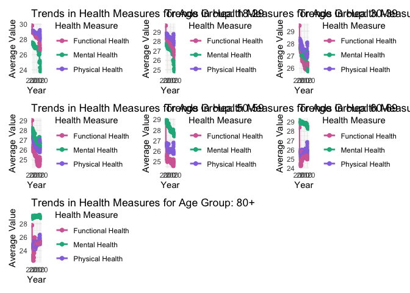<!-- -->

# 2.2 Overall Bar Plot of Health Measures

Finally, we calculate the overall average (across all years) for each
health measure within each age group and display the results as a
grouped bar plot.

``` r
overall_avg <- data_brfss %>%
  group_by(age_decade_cat) %>%
  summarise(
    avg_mental     = mean(mental_health_good_days, na.rm = TRUE),
    avg_physical   = mean(physical_health_good_days, na.rm = TRUE),
    avg_functional = mean(usual_activities_health_good_days, na.rm = TRUE),
    .groups = "drop"
  ) %>%
  pivot_longer(
    cols = c(avg_mental, avg_physical, avg_functional),
    names_to = "health_measure",
    values_to = "average"
  ) %>%
  mutate(health_measure = recode(health_measure,
                                 avg_mental     = "Mental Health",
                                 avg_physical   = "Physical Health",
                                 avg_functional = "Functional Health"))

bar_trend_plot <- ggplot(overall_avg, aes(x = age_decade_cat, y = average, fill = health_measure)) +
  geom_bar(stat = "identity", position = position_dodge(width = 0.8)) +
  labs(
    title = "Overall Average Health Measures by Age Group",
    x = "Age Group",
    y = "Average Value",
    fill = "Health Measure"
  ) +
  theme_minimal() +
  theme(axis.text.x = element_text(angle = 45, hjust = 1))
bar_trend_plot
```

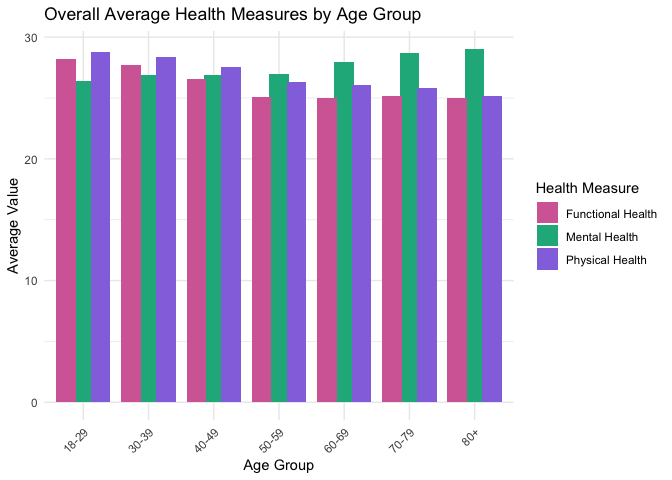<!-- -->

# Conclusion

In this report we have:

- Estimated how five predictors (physical health, mental health,
  functional health, sex, and education) relate to self‑rated health
  across different years and age groups, and visualized the coefficient
  trends as well as overall average coefficients.

- Examined the trends over time for three health measures (mental,
  physical, and functional health) by age group and provided an overall
  comparison via a grouped bar plot.

These analyses provide a comprehensive view of both the predictive
relationships and the underlying trends in health measures across age
groups in the BRFSS dataset.
