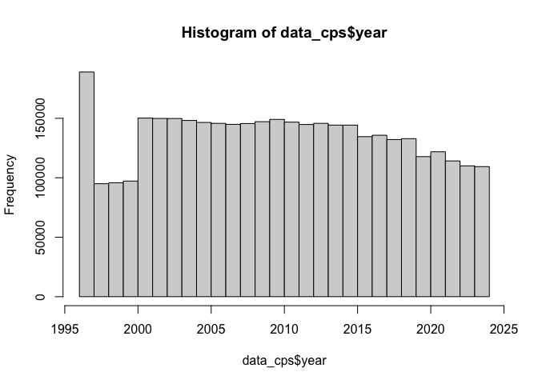
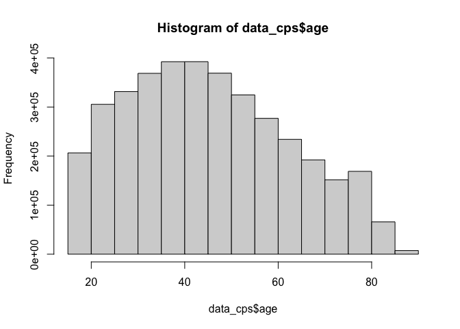
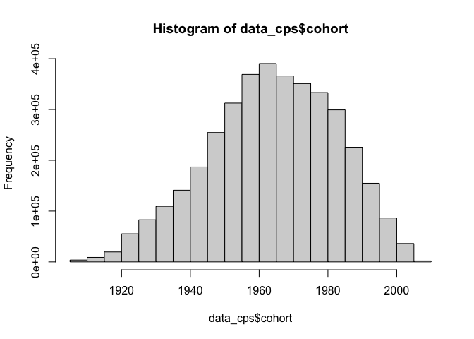
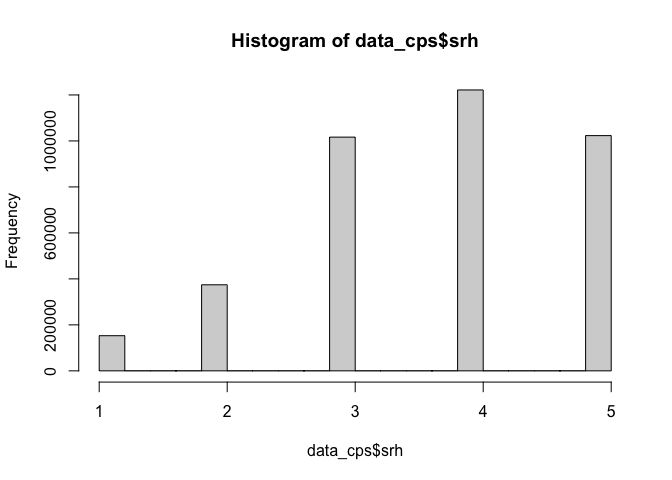
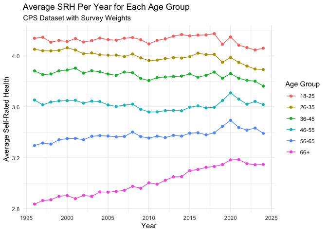
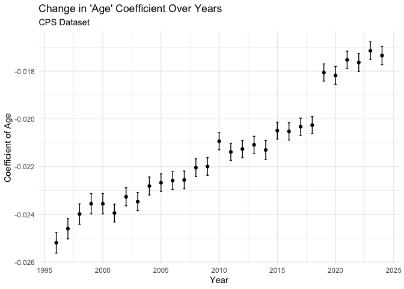
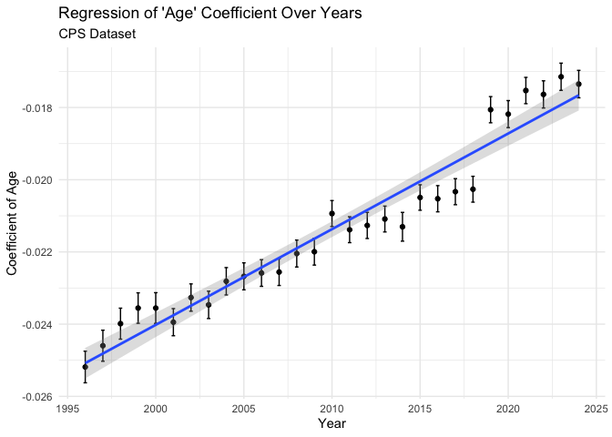
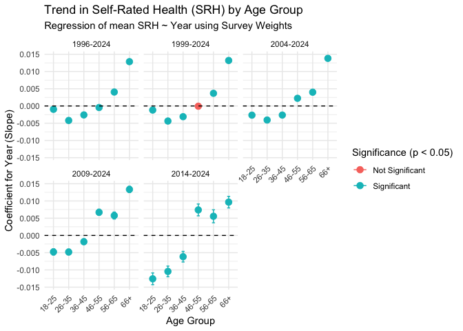
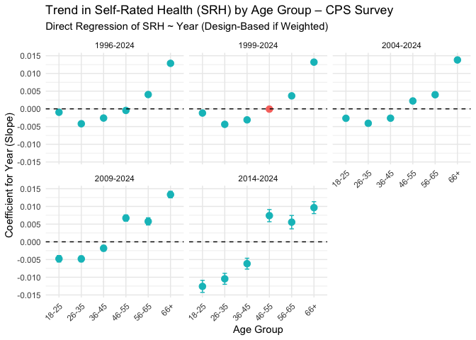

CPS
================
Christine Lucille Kuryla
2025-02-13

``` r
library(ipumsr)

ddi <- read_ipums_ddi(here::here("big_data/CPS/cps_00001.xml"))
data_cps <- read_ipums_micro(
  ddi,
  data_file = here::here("big_data/CPS/cps_00001.dat")
)
```

    ## Use of data from IPUMS CPS is subject to conditions including that users should cite the data appropriately. Use command `ipums_conditions()` for more details.

``` r
# basic checks
dim(data_cps)  # number of rows and columns
```

    ## [1] 87726944       39

``` r
glimpse(data_cps)  # see a quick structure of variables
```

    ## Rows: 87,726,944
    ## Columns: 39
    ## $ YEAR        <dbl> 1962, 1962, 1962, 1962, 1962, 1962, 1962, 1962, 1962, 1962…
    ## $ SERIAL      <dbl> 1, 2, 3, 4, 5, 6, 7, 8, 8, 9, 9, 10, 10, 11, 12, 12, 13, 1…
    ## $ MONTH       <int+lbl> 3, 3, 3, 3, 3, 3, 3, 3, 3, 3, 3, 3, 3, 3, 3, 3, 3, 3, …
    ## $ HWTFINL     <dbl> NA, NA, NA, NA, NA, NA, NA, NA, NA, NA, NA, NA, NA, NA, NA…
    ## $ CPSID       <dbl> NA, NA, NA, NA, NA, NA, NA, NA, NA, NA, NA, NA, NA, NA, NA…
    ## $ ASECFLAG    <int+lbl> NA, NA, NA, NA, NA, NA, NA, NA, NA, NA, NA, NA, NA, NA…
    ## $ HFLAG       <int+lbl> NA, NA, NA, NA, NA, NA, NA, NA, NA, NA, NA, NA, NA, NA…
    ## $ ASECWTH     <dbl> 1494.99, 1568.53, 6443.03, 1473.97, 1538.21, 6427.43, 6588…
    ## $ PERNUM      <dbl> 1, 1, 1, 1, 1, 1, 1, 1, 2, 1, 2, 1, 2, 1, 1, 2, 1, 2, 3, 1…
    ## $ WTFINL      <dbl> NA, NA, NA, NA, NA, NA, NA, NA, NA, NA, NA, NA, NA, NA, NA…
    ## $ CPSIDV      <dbl> NA, NA, NA, NA, NA, NA, NA, NA, NA, NA, NA, NA, NA, NA, NA…
    ## $ CPSIDP      <dbl> NA, NA, NA, NA, NA, NA, NA, NA, NA, NA, NA, NA, NA, NA, NA…
    ## $ ASECWT      <dbl> 1494.99, 1568.53, 6443.03, 1473.97, 1538.21, 6427.43, 6588…
    ## $ AGE         <int+lbl> 18, 14, 72, 29, 21, 60, 56, 20, 20, 20, 20, 19, 19, 18…
    ## $ SEX         <int+lbl> 2, 1, 1, 1, 1, 2, 1, 2, 2, 2, 2, 2, 2, 2, 1, 2, 1, 2, …
    ## $ RACE        <int+lbl> 100, 100, 100, 100, 100, 100, 700, 100, 100, 100, 100,…
    ## $ MARST       <int+lbl> 6, 6, 6, 1, 1, 6, 5, 6, 6, 6, 6, 6, 6, 6, 1, 1, 1, 1, …
    ## $ QAGE        <int+lbl> NA, NA, NA, NA, NA, NA, NA, NA, NA, NA, NA, NA, NA, NA…
    ## $ QMARST      <int+lbl> NA, NA, NA, NA, NA, NA, NA, NA, NA, NA, NA, NA, NA, NA…
    ## $ QSEX        <int+lbl> NA, NA, NA, NA, NA, NA, NA, NA, NA, NA, NA, NA, NA, NA…
    ## $ QRACE       <int+lbl> NA, NA, NA, NA, NA, NA, NA, NA, NA, NA, NA, NA, NA, NA…
    ## $ EDUC        <int+lbl> 72, 31, 40, 72, 50, 32, 21, 72, 72, 72, 72, 72, 72, 72…
    ## $ HIGRADE     <int+lbl> 150, 101, 121, 150, 130, 110, 81, 150, 150, 150, 150, …
    ## $ QEDUC       <int+lbl> NA, NA, NA, NA, NA, NA, NA, NA, NA, NA, NA, NA, NA, NA…
    ## $ QHIGRADE    <int+lbl> NA, NA, NA, NA, NA, NA, NA, NA, NA, NA, NA, NA, NA, NA…
    ## $ DIFFREM     <int+lbl> NA, NA, NA, NA, NA, NA, NA, NA, NA, NA, NA, NA, NA, NA…
    ## $ DIFFMOB     <int+lbl> NA, NA, NA, NA, NA, NA, NA, NA, NA, NA, NA, NA, NA, NA…
    ## $ DIFFCARE    <int+lbl> NA, NA, NA, NA, NA, NA, NA, NA, NA, NA, NA, NA, NA, NA…
    ## $ QDIFREM     <int+lbl> NA, NA, NA, NA, NA, NA, NA, NA, NA, NA, NA, NA, NA, NA…
    ## $ QDIFMOB     <int+lbl> NA, NA, NA, NA, NA, NA, NA, NA, NA, NA, NA, NA, NA, NA…
    ## $ QDIFCARE    <int+lbl> NA, NA, NA, NA, NA, NA, NA, NA, NA, NA, NA, NA, NA, NA…
    ## $ INCTOT      <dbl+lbl>         0, 999999999, 999999999,      1692,      1522,…
    ## $ HEALTH      <int+lbl> NA, NA, NA, NA, NA, NA, NA, NA, NA, NA, NA, NA, NA, NA…
    ## $ QHEALTH     <int+lbl> NA, NA, NA, NA, NA, NA, NA, NA, NA, NA, NA, NA, NA, NA…
    ## $ QHEALTHD    <int+lbl> NA, NA, NA, NA, NA, NA, NA, NA, NA, NA, NA, NA, NA, NA…
    ## $ TSMK6       <int+lbl> NA, NA, NA, NA, NA, NA, NA, NA, NA, NA, NA, NA, NA, NA…
    ## $ IMCHRNLUNG  <int+lbl> NA, NA, NA, NA, NA, NA, NA, NA, NA, NA, NA, NA, NA, NA…
    ## $ IMCHRNHEART <int+lbl> NA, NA, NA, NA, NA, NA, NA, NA, NA, NA, NA, NA, NA, NA…
    ## $ IMDIAB      <int+lbl> NA, NA, NA, NA, NA, NA, NA, NA, NA, NA, NA, NA, NA, NA…

``` r
data_cps_raw <- data_cps

data_cps <- data_cps_raw %>% 
  filter(!(is.na(HEALTH))) %>% 
  filter(QHEALTH == 0)

table(data_cps$SEX)
```

    ## 
    ##       1       2 
    ## 2119037 2253209

``` r
table(data_cps$HEALTH)
```

    ## 
    ##       1       2       3       4       5 
    ## 1500599 1384248 1029488  327535  130376

``` r
data_cps %>% 
  group_by(YEAR) %>%
  summarise(
    missing_count = sum(is.na(ASECWT)),
    total_count = n(),
    percent_missing = (missing_count / total_count) * 100
  ) %>% 
  print(n = 100)
```

    ## # A tibble: 29 × 4
    ##     YEAR missing_count total_count percent_missing
    ##    <dbl>         <int>       <int>           <dbl>
    ##  1  1996             0      113962               0
    ##  2  1997             0      116860               0
    ##  3  1998             0      118641               0
    ##  4  1999             0      116194               0
    ##  5  2000             0      118721               0
    ##  6  2001             0      191287               0
    ##  7  2002             0      191942               0
    ##  8  2003             0      190202               0
    ##  9  2004             0      185817               0
    ## 10  2005             0      183128               0
    ## 11  2006             0      183033               0
    ## 12  2007             0      179917               0
    ## 13  2008             0      182274               0
    ## 14  2009             0      183377               0
    ## 15  2010             0      182648               0
    ## 16  2011             0      172045               0
    ## 17  2012             0      169186               0
    ## 18  2013             0      167887               0
    ## 19  2014             0      161185               0
    ## 20  2015             0      154852               0
    ## 21  2016             0      141251               0
    ## 22  2017             0      144866               0
    ## 23  2018             0      132687               0
    ## 24  2019             0      130824               0
    ## 25  2020             0      113960               0
    ## 26  2021             0      119798               0
    ## 27  2022             0      110889               0
    ## 28  2023             0      107942               0
    ## 29  2024             0      106871               0

``` r
# examine variable labels
ipums_val_labels(data_cps$SEX) 
```

    ## # A tibble: 3 × 2
    ##     val lbl   
    ##   <int> <chr> 
    ## 1     1 Male  
    ## 2     2 Female
    ## 3     9 NIU

``` r
colnames(data_cps)
```

    ##  [1] "YEAR"        "SERIAL"      "MONTH"       "HWTFINL"     "CPSID"      
    ##  [6] "ASECFLAG"    "HFLAG"       "ASECWTH"     "PERNUM"      "WTFINL"     
    ## [11] "CPSIDV"      "CPSIDP"      "ASECWT"      "AGE"         "SEX"        
    ## [16] "RACE"        "MARST"       "QAGE"        "QMARST"      "QSEX"       
    ## [21] "QRACE"       "EDUC"        "HIGRADE"     "QEDUC"       "QHIGRADE"   
    ## [26] "DIFFREM"     "DIFFMOB"     "DIFFCARE"    "QDIFREM"     "QDIFMOB"    
    ## [31] "QDIFCARE"    "INCTOT"      "HEALTH"      "QHEALTH"     "QHEALTHD"   
    ## [36] "TSMK6"       "IMCHRNLUNG"  "IMCHRNHEART" "IMDIAB"

``` r
data_cps <- data_cps_raw %>% 
  select(AGE, YEAR, ASECWT, HEALTH)

data_cps <- data_cps %>% 
  filter(HEALTH %in% 1:5) %>% 
  mutate(srh = 6 - HEALTH) %>% 
  mutate(age = AGE) %>% 
  mutate(year = YEAR) %>% 
  mutate(cohort = YEAR - AGE) %>% 
  select(-YEAR) %>% 
  select(-AGE) %>% 
  select(-HEALTH) %>% 
  mutate(age_group_1 = as.factor( 
                            cut(
                            age,
                            breaks = c(17, 29, 39, 49, 59, 69, Inf),
                            labels = c("18-29", "30-39", "40-49", "50-59", "60-69", "70+"),
                            right = TRUE
                          ))) %>% 
  mutate(age_group = as.factor( 
                            cut(
                            age,
                            breaks = c(17, 25, 35, 45, 55, 65, Inf),
                            labels = c("18-25", "26-35", "36-45", "46-55", "56-65", "66+"),
                            right = TRUE
                          ))) 

colnames(data_cps)
```

    ## [1] "ASECWT"      "srh"         "age"         "year"        "cohort"     
    ## [6] "age_group_1" "age_group"

``` r
data_cps <- data_cps %>% 
  filter(!(is.na(age))) %>% 
  filter(!(is.na(year))) %>% 
  filter(!(is.na(age_group))) %>% 
  filter(!(is.na(srh))) %>% 
  filter(!(is.na(ASECWT)))

hist(data_cps$year)
```

<!-- -->

``` r
hist(data_cps$age)
```

<!-- -->

``` r
#hist(data_cps$age_group)
hist(data_cps$cohort)
```

<!-- -->

``` r
hist(data_cps$srh)
```

<!-- -->

``` r
# Create a survey design object using wtssall for multi-year analysis
svy_cps <- data_cps %>%
  as_survey_design(
    ids = 1,           # PSU identifiers (use 1 if not available)
    weights = ASECWT  
  )
```

``` r
# Compute weighted mean health by age group and year
svy_cps %>%
  group_by(age_group, year) %>%
  summarise(
    mean_health = survey_mean(srh, na.rm = TRUE)
  ) %>% 
  ggplot(aes(x = year, y = mean_health, color = age_group)) +
#  geom_smooth(alpha = 0.2) +
  geom_line() +
  geom_point() +
  labs(
    title = "Average SRH Per Year for Each Age Group",
    subtitle = "CPS Dataset with Survey Weights",
    x = "Year",
    y = "Average Self-Rated Health",
    color = "Age Group"
  ) +
  theme_minimal()
```

<!-- -->

``` r
# health vs age per year
svy_cps %>% 
  group_by(age, year) %>% 
  summarize(mean_health = survey_mean(srh)) %>% 
  ggplot(aes(x = age, y = mean_health)) +
  geom_line(color = "cornflowerblue") +
  facet_wrap(~ year) +
  labs(title = "Self-Rated Health By Age (Per Year)",
       subtitle = "CPS Dataset",
       x = "Age of Respondent", 
       y = "Average SRH",
       )
```

## Regress self-rated health on age, for each year

Let’s do a regression on each self-rated-health vs age, subsetted for
each year (the plots on the faceted figure), look at the significance,
and plot the coefficients for age with 95% CIs:

``` r
# Perform weighted regression for each year
weighted_lm_by_year <- svy_cps %>% 
  group_by(year) %>%
  group_map_dfr(~ {
    model <- survey::svyglm(srh ~ age, design = .x)
    tidy(model, conf.int = TRUE)
  }) %>%
  filter(term == "age") %>%
  select(year, estimate, std.error, conf.low, conf.high, statistic, p.value)
```

    ## Warning in summary.glm(g): observations with zero weight not used for
    ## calculating dispersion

    ## Warning in summary.glm(glm.object): observations with zero weight not used for
    ## calculating dispersion

    ## Warning in summary.glm(g): observations with zero weight not used for
    ## calculating dispersion

    ## Warning in summary.glm(glm.object): observations with zero weight not used for
    ## calculating dispersion

``` r
knitr::kable(weighted_lm_by_year)
```

| year |   estimate | std.error |   conf.low |  conf.high |  statistic | p.value |
|-----:|-----------:|----------:|-----------:|-----------:|-----------:|--------:|
| 1996 | -0.0251866 | 0.0002233 | -0.0256242 | -0.0247489 | -112.78883 |       0 |
| 1997 | -0.0245977 | 0.0002196 | -0.0250280 | -0.0241674 | -112.03644 |       0 |
| 1998 | -0.0239864 | 0.0002190 | -0.0244156 | -0.0235572 | -109.54049 |       0 |
| 1999 | -0.0235545 | 0.0002151 | -0.0239762 | -0.0231328 | -109.48051 |       0 |
| 2000 | -0.0235539 | 0.0002172 | -0.0239796 | -0.0231282 | -108.45123 |       0 |
| 2001 | -0.0239452 | 0.0001917 | -0.0243208 | -0.0235696 | -124.94035 |       0 |
| 2002 | -0.0232636 | 0.0001930 | -0.0236420 | -0.0228853 | -120.52433 |       0 |
| 2003 | -0.0234658 | 0.0001931 | -0.0238442 | -0.0230874 | -121.53888 |       0 |
| 2004 | -0.0228125 | 0.0001933 | -0.0231914 | -0.0224336 | -117.99894 |       0 |
| 2005 | -0.0226757 | 0.0001907 | -0.0230496 | -0.0223019 | -118.88782 |       0 |
| 2006 | -0.0225836 | 0.0001885 | -0.0229530 | -0.0222143 | -119.83459 |       0 |
| 2007 | -0.0225568 | 0.0001901 | -0.0229294 | -0.0221842 | -118.66143 |       0 |
| 2008 | -0.0220445 | 0.0001904 | -0.0224176 | -0.0216715 | -115.80868 |       0 |
| 2009 | -0.0219943 | 0.0001889 | -0.0223645 | -0.0216241 | -116.45662 |       0 |
| 2010 | -0.0209369 | 0.0001833 | -0.0212962 | -0.0205776 | -114.21362 |       0 |
| 2011 | -0.0213847 | 0.0001828 | -0.0217430 | -0.0210263 | -116.96540 |       0 |
| 2012 | -0.0212658 | 0.0001848 | -0.0216279 | -0.0209037 | -115.10343 |       0 |
| 2013 | -0.0210885 | 0.0001828 | -0.0214468 | -0.0207302 | -115.36837 |       0 |
| 2014 | -0.0213033 | 0.0002033 | -0.0217018 | -0.0209047 | -104.76864 |       0 |
| 2015 | -0.0204925 | 0.0001799 | -0.0208451 | -0.0201399 | -113.90652 |       0 |
| 2016 | -0.0205265 | 0.0001852 | -0.0208896 | -0.0201635 | -110.80810 |       0 |
| 2017 | -0.0203315 | 0.0001842 | -0.0206926 | -0.0199705 | -110.37596 |       0 |
| 2018 | -0.0202633 | 0.0001826 | -0.0206213 | -0.0199054 | -110.96258 |       0 |
| 2019 | -0.0180607 | 0.0001848 | -0.0184230 | -0.0176984 |  -97.71339 |       0 |
| 2020 | -0.0181831 | 0.0001910 | -0.0185574 | -0.0178087 |  -95.19628 |       0 |
| 2021 | -0.0175299 | 0.0001858 | -0.0178941 | -0.0171656 |  -94.32852 |       0 |
| 2022 | -0.0176377 | 0.0001923 | -0.0180145 | -0.0172608 |  -91.72516 |       0 |
| 2023 | -0.0171486 | 0.0001924 | -0.0175256 | -0.0167716 |  -89.14751 |       0 |
| 2024 | -0.0173518 | 0.0001939 | -0.0177318 | -0.0169718 |  -89.50302 |       0 |

``` r
summary(weighted_lm_by_year)
```

    ##       year         estimate          std.error            conf.low       
    ##  Min.   :1996   Min.   :-0.02519   Min.   :0.0001799   Min.   :-0.02562  
    ##  1st Qu.:2003   1st Qu.:-0.02326   1st Qu.:0.0001848   1st Qu.:-0.02364  
    ##  Median :2010   Median :-0.02138   Median :0.0001907   Median :-0.02174  
    ##  Mean   :2010   Mean   :-0.02137   Mean   :0.0001939   Mean   :-0.02175  
    ##  3rd Qu.:2017   3rd Qu.:-0.02033   3rd Qu.:0.0001933   3rd Qu.:-0.02069  
    ##  Max.   :2024   Max.   :-0.01715   Max.   :0.0002233   Max.   :-0.01753  
    ##    conf.high          statistic          p.value 
    ##  Min.   :-0.02475   Min.   :-124.94   Min.   :0  
    ##  1st Qu.:-0.02289   1st Qu.:-116.97   1st Qu.:0  
    ##  Median :-0.02103   Median :-112.79   Median :0  
    ##  Mean   :-0.02099   Mean   :-110.24   Mean   :0  
    ##  3rd Qu.:-0.01997   3rd Qu.:-108.45   3rd Qu.:0  
    ##  Max.   :-0.01677   Max.   : -89.15   Max.   :0

``` r
# # with additinal covariates
# weighted_lm_by_year <- gss_svy %>%
#   group_by(year) %>%
#   group_map_dfr(~ {
#     model <- survey::svyglm(srh ~ age + sex + educ + race + happy + class, design = .x)
#     tidy(model, conf.int = TRUE)
#   }) %>%
#   filter(term == "age") %>%
#   select(year, estimate, std.error, conf.low, conf.high, statistic, p.value)
# 
# summary(weighted_lm_by_year)
```

``` r
# Plot the coefficients with error bars
ggplot(weighted_lm_by_year, aes(x = year, y = estimate)) +
#  geom_line() +
  geom_point() +
  geom_errorbar(aes(ymin=conf.low, ymax=conf.high), width=.2,
                 position=position_dodge(0.05)) +
 # geom_ribbon(aes(ymin = conf.low, ymax = conf.high), alpha = 0.2) +
  labs(
    title = "Change in 'Age' Coefficient Over Years",
    subtitle = "CPS Dataset",
    x = "Year",
    y = "Coefficient of Age"
  ) +
  theme_minimal()
```

<!-- -->

``` r
# Regress the age coefficients on year
coef_model <- lm(estimate ~ year, data = weighted_lm_by_year)
summary(coef_model)
```

    ## 
    ## Call:
    ## lm(formula = estimate ~ year, data = weighted_lm_by_year)
    ## 
    ## Residuals:
    ##        Min         1Q     Median         3Q        Max 
    ## -0.0010134 -0.0003920 -0.0001069  0.0004658  0.0009252 
    ## 
    ## Coefficients:
    ##               Estimate Std. Error t value Pr(>|t|)    
    ## (Intercept) -5.540e-01  2.543e-02  -21.79   <2e-16 ***
    ## year         2.650e-04  1.265e-05   20.95   <2e-16 ***
    ## ---
    ## Signif. codes:  0 '***' 0.001 '**' 0.01 '*' 0.05 '.' 0.1 ' ' 1
    ## 
    ## Residual standard error: 0.00057 on 27 degrees of freedom
    ## Multiple R-squared:  0.942,  Adjusted R-squared:  0.9399 
    ## F-statistic: 438.8 on 1 and 27 DF,  p-value: < 2.2e-16

``` r
# Plot the regression
ggplot(weighted_lm_by_year, aes(x = year, y = estimate)) +
  geom_point() +
  geom_errorbar(aes(ymin=conf.low, ymax=conf.high), width=.2,
                 position=position_dodge(0.05)) +
  geom_smooth(method = "lm", se = TRUE, alpha = 0.3) +
  labs(
    title = "Regression of 'Age' Coefficient Over Years",
    subtitle = "CPS Dataset",
    x = "Year",
    y = "Coefficient of Age"
  ) +
  theme_minimal()
```

    ## `geom_smooth()` using formula = 'y ~ x'

<!-- -->

``` r
weighted_lm_by_year
```

    ## # A tibble: 29 × 7
    ##     year estimate std.error conf.low conf.high statistic p.value
    ##    <dbl>    <dbl>     <dbl>    <dbl>     <dbl>     <dbl>   <dbl>
    ##  1  1996  -0.0252  0.000223  -0.0256   -0.0247     -113.       0
    ##  2  1997  -0.0246  0.000220  -0.0250   -0.0242     -112.       0
    ##  3  1998  -0.0240  0.000219  -0.0244   -0.0236     -110.       0
    ##  4  1999  -0.0236  0.000215  -0.0240   -0.0231     -109.       0
    ##  5  2000  -0.0236  0.000217  -0.0240   -0.0231     -108.       0
    ##  6  2001  -0.0239  0.000192  -0.0243   -0.0236     -125.       0
    ##  7  2002  -0.0233  0.000193  -0.0236   -0.0229     -121.       0
    ##  8  2003  -0.0235  0.000193  -0.0238   -0.0231     -122.       0
    ##  9  2004  -0.0228  0.000193  -0.0232   -0.0224     -118.       0
    ## 10  2005  -0.0227  0.000191  -0.0230   -0.0223     -119.       0
    ## # ℹ 19 more rows

``` r
summary(weighted_lm_by_year)
```

    ##       year         estimate          std.error            conf.low       
    ##  Min.   :1996   Min.   :-0.02519   Min.   :0.0001799   Min.   :-0.02562  
    ##  1st Qu.:2003   1st Qu.:-0.02326   1st Qu.:0.0001848   1st Qu.:-0.02364  
    ##  Median :2010   Median :-0.02138   Median :0.0001907   Median :-0.02174  
    ##  Mean   :2010   Mean   :-0.02137   Mean   :0.0001939   Mean   :-0.02175  
    ##  3rd Qu.:2017   3rd Qu.:-0.02033   3rd Qu.:0.0001933   3rd Qu.:-0.02069  
    ##  Max.   :2024   Max.   :-0.01715   Max.   :0.0002233   Max.   :-0.01753  
    ##    conf.high          statistic          p.value 
    ##  Min.   :-0.02475   Min.   :-124.94   Min.   :0  
    ##  1st Qu.:-0.02289   1st Qu.:-116.97   1st Qu.:0  
    ##  Median :-0.02103   Median :-112.79   Median :0  
    ##  Mean   :-0.02099   Mean   :-110.24   Mean   :0  
    ##  3rd Qu.:-0.01997   3rd Qu.:-108.45   3rd Qu.:0  
    ##  Max.   :-0.01677   Max.   : -89.15   Max.   :0

``` r
# Perform linear regression of 'coef' (age coefficient) vs 'year'
lm_coef_vs_year <- lm(estimate ~ year, data = weighted_lm_by_year)

# View the summary of the regression
summary(lm_coef_vs_year)
```

    ## 
    ## Call:
    ## lm(formula = estimate ~ year, data = weighted_lm_by_year)
    ## 
    ## Residuals:
    ##        Min         1Q     Median         3Q        Max 
    ## -0.0010134 -0.0003920 -0.0001069  0.0004658  0.0009252 
    ## 
    ## Coefficients:
    ##               Estimate Std. Error t value Pr(>|t|)    
    ## (Intercept) -5.540e-01  2.543e-02  -21.79   <2e-16 ***
    ## year         2.650e-04  1.265e-05   20.95   <2e-16 ***
    ## ---
    ## Signif. codes:  0 '***' 0.001 '**' 0.01 '*' 0.05 '.' 0.1 ' ' 1
    ## 
    ## Residual standard error: 0.00057 on 27 degrees of freedom
    ## Multiple R-squared:  0.942,  Adjusted R-squared:  0.9399 
    ## F-statistic: 438.8 on 1 and 27 DF,  p-value: < 2.2e-16

# Trends for each age group over different years

``` r
# Load necessary libraries
library(tidyverse)  # For data manipulation and plotting
library(survey)     # For survey design and weighted analyses

# ----- Setup: Define the Year Ranges -----
# We want to examine trends for various lower bounds ending at 2024.
year_lower_bounds <- c(2014, 2009, 2004, 1999, 1996)
year_upper_bound <- 2024

# Initialize an empty tibble to store the regression results
results <- tibble()

# ----- Loop over each year range and each age group -----
# Here, we use the survey design object 'svy_cps' which already contains your data and survey weights.
for (lb in year_lower_bounds) {
  # Subset the survey design to the desired year range
  design_subset <- subset(svy_cps, year >= lb & year <= year_upper_bound)
  
  # Get the unique age groups in this subset.
  # (Note: we access the underlying data via design_subset$variables)
  age_groups <- unique(design_subset$variables$age_group)
  
  for (ag in age_groups) {
    # Further subset the design for the specific age group
    design_age <- subset(design_subset, age_group == ag)
    
    # ---- Sensitivity/Sanity Check: Sample Size Warning ----
    n_obs <- nrow(design_age$variables)
    if (n_obs < 30) { 
      message("Warning: Age group ", ag, " in year range ", lb, "-", year_upper_bound, 
              " has only ", n_obs, " observations. Interpret estimates with caution.")
    }
    
    # ----- Run the Survey-Weighted Regression -----
    # We regress srh on year for this age group using svyglm, which accounts for the survey weights.
    model <- svyglm(srh ~ year, design = design_age)
    
    # Extract the coefficient summary for the 'year' predictor.
    coef_year <- summary(model)$coefficients["year", ]
    estimate <- coef_year["Estimate"]
    se       <- coef_year["Std. Error"]
    pvalue   <- coef_year["Pr(>|t|)"]
    
    # Calculate 95% Confidence Intervals
    lower_ci <- estimate - 1.96 * se
    upper_ci <- estimate + 1.96 * se
    
    # Determine significance (p < 0.05)
    sig_flag <- ifelse(pvalue < 0.05, "Significant", "Not Significant")
    
    # Print the regression coefficient details for this age group and year range
    cat("Year Range:", lb, "-", year_upper_bound, " | Age Group:", ag, "\n")
    print(coef_year)
    cat("\n")
    
    # Append these results to our results tibble
    results <- bind_rows(results, tibble(
      year_range  = paste0(lb, "-", year_upper_bound),
      age_group   = as.character(ag),
      estimate    = estimate,
      se          = se,
      pvalue      = pvalue,
      lower_ci    = lower_ci,
      upper_ci    = upper_ci,
      significance = sig_flag
    ))
  }
}
```

    ## Year Range: 2014 - 2024  | Age Group: 66+ 
    ##     Estimate   Std. Error      t value     Pr(>|t|) 
    ## 9.655303e-03 8.582847e-04 1.124954e+01 2.365422e-29 
    ## 
    ## Year Range: 2014 - 2024  | Age Group: 26-35 
    ##      Estimate    Std. Error       t value      Pr(>|t|) 
    ## -1.044255e-02  7.904287e-04 -1.321125e+01  7.796442e-40 
    ## 
    ## Year Range: 2014 - 2024  | Age Group: 36-45 
    ##      Estimate    Std. Error       t value      Pr(>|t|) 
    ## -6.167300e-03  7.860209e-04 -7.846229e+00  4.303542e-15 
    ## 
    ## Year Range: 2014 - 2024  | Age Group: 46-55 
    ##     Estimate   Std. Error      t value     Pr(>|t|) 
    ## 7.400521e-03 8.763756e-04 8.444462e+00 3.071101e-17 
    ## 
    ## Year Range: 2014 - 2024  | Age Group: 56-65 
    ##     Estimate   Std. Error      t value     Pr(>|t|) 
    ## 5.556851e-03 9.623797e-04 5.774073e+00 7.748216e-09 
    ## 
    ## Year Range: 2014 - 2024  | Age Group: 18-25 
    ##      Estimate    Std. Error       t value      Pr(>|t|) 
    ## -1.258184e-02  8.667851e-04 -1.451553e+01  1.029316e-47 
    ## 
    ## Year Range: 2009 - 2024  | Age Group: 56-65 
    ##     Estimate   Std. Error      t value     Pr(>|t|) 
    ## 5.772673e-03 5.206016e-04 1.108847e+01 1.444289e-28 
    ## 
    ## Year Range: 2009 - 2024  | Age Group: 46-55 
    ##     Estimate   Std. Error      t value     Pr(>|t|) 
    ## 6.708440e-03 4.543158e-04 1.476603e+01 2.502651e-49 
    ## 
    ## Year Range: 2009 - 2024  | Age Group: 26-35 
    ##      Estimate    Std. Error       t value      Pr(>|t|) 
    ## -4.811235e-03  4.194891e-04 -1.146927e+01  1.904237e-30 
    ## 
    ## Year Range: 2009 - 2024  | Age Group: 36-45 
    ##      Estimate    Std. Error       t value      Pr(>|t|) 
    ## -1.814505e-03  4.151704e-04 -4.370508e+00  1.239886e-05 
    ## 
    ## Year Range: 2009 - 2024  | Age Group: 66+ 
    ##      Estimate    Std. Error       t value      Pr(>|t|) 
    ##  1.334777e-02  4.724039e-04  2.825501e+01 1.927012e-175 
    ## 
    ## Year Range: 2009 - 2024  | Age Group: 18-25 
    ##      Estimate    Std. Error       t value      Pr(>|t|) 
    ## -4.779285e-03  4.633797e-04 -1.031397e+01  6.156350e-25 
    ## 
    ## Year Range: 2004 - 2024  | Age Group: 56-65 
    ##     Estimate   Std. Error      t value     Pr(>|t|) 
    ## 3.992664e-03 3.503485e-04 1.139626e+01 4.410123e-30 
    ## 
    ## Year Range: 2004 - 2024  | Age Group: 46-55 
    ##     Estimate   Std. Error      t value     Pr(>|t|) 
    ## 2.225367e-03 2.982125e-04 7.462354e+00 8.511902e-14 
    ## 
    ## Year Range: 2004 - 2024  | Age Group: 18-25 
    ##      Estimate    Std. Error       t value      Pr(>|t|) 
    ## -2.661830e-03  3.002033e-04 -8.866759e+00  7.561875e-19 
    ## 
    ## Year Range: 2004 - 2024  | Age Group: 36-45 
    ##      Estimate    Std. Error       t value      Pr(>|t|) 
    ## -2.634188e-03  2.665511e-04 -9.882488e+00  4.979815e-23 
    ## 
    ## Year Range: 2004 - 2024  | Age Group: 66+ 
    ##     Estimate   Std. Error      t value     Pr(>|t|) 
    ## 1.381043e-02 3.151381e-04 4.382341e+01 0.000000e+00 
    ## 
    ## Year Range: 2004 - 2024  | Age Group: 26-35 
    ##      Estimate    Std. Error       t value      Pr(>|t|) 
    ## -4.074045e-03  2.718160e-04 -1.498825e+01  8.983060e-51 
    ## 
    ## Year Range: 1999 - 2024  | Age Group: 56-65 
    ##     Estimate   Std. Error      t value     Pr(>|t|) 
    ## 3.670353e-03 2.687863e-04 1.365528e+01 1.912244e-42

    ## Warning in summary.glm(g): observations with zero weight not used for
    ## calculating dispersion

    ## Warning in summary.glm(glm.object): observations with zero weight not used for
    ## calculating dispersion

    ## Year Range: 1999 - 2024  | Age Group: 46-55 
    ##      Estimate    Std. Error       t value      Pr(>|t|) 
    ## -7.036007e-05  2.250576e-04 -3.126314e-01  7.545609e-01

    ## Warning in summary.glm(g): observations with zero weight not used for
    ## calculating dispersion
    ## Warning in summary.glm(g): observations with zero weight not used for
    ## calculating dispersion

    ## Year Range: 1999 - 2024  | Age Group: 18-25 
    ##      Estimate    Std. Error       t value      Pr(>|t|) 
    ## -1.180488e-03  2.230101e-04 -5.293430e+00  1.200965e-07 
    ## 
    ## Year Range: 1999 - 2024  | Age Group: 66+ 
    ##     Estimate   Std. Error      t value     Pr(>|t|) 
    ## 1.319602e-02 2.333328e-04 5.655451e+01 0.000000e+00

    ## Warning in summary.glm(g): observations with zero weight not used for
    ## calculating dispersion
    ## Warning in summary.glm(g): observations with zero weight not used for
    ## calculating dispersion

    ## Year Range: 1999 - 2024  | Age Group: 26-35 
    ##       Estimate     Std. Error        t value       Pr(>|t|) 
    ##  -4.370861e-03   1.983250e-04  -2.203888e+01  1.339242e-107 
    ## 
    ## Year Range: 1999 - 2024  | Age Group: 36-45 
    ##      Estimate    Std. Error       t value      Pr(>|t|) 
    ## -3.108203e-03  1.969132e-04 -1.578464e+01  4.055984e-56 
    ## 
    ## Year Range: 1996 - 2024  | Age Group: 36-45 
    ##      Estimate    Std. Error       t value      Pr(>|t|) 
    ## -2.595394e-03  1.733493e-04 -1.497204e+01  1.136487e-50 
    ## 
    ## Year Range: 1996 - 2024  | Age Group: 66+ 
    ##     Estimate   Std. Error      t value     Pr(>|t|) 
    ## 1.285369e-02 2.025868e-04 6.344782e+01 0.000000e+00

    ## Warning in summary.glm(g): observations with zero weight not used for
    ## calculating dispersion
    ## Warning in summary.glm(g): observations with zero weight not used for
    ## calculating dispersion

    ## Year Range: 1996 - 2024  | Age Group: 46-55 
    ##      Estimate    Std. Error       t value      Pr(>|t|) 
    ## -0.0004449476  0.0001992703 -2.2328851951  0.0255568338

    ## Warning in summary.glm(g): observations with zero weight not used for
    ## calculating dispersion
    ## Warning in summary.glm(g): observations with zero weight not used for
    ## calculating dispersion

    ## Year Range: 1996 - 2024  | Age Group: 18-25 
    ##      Estimate    Std. Error       t value      Pr(>|t|) 
    ## -9.652698e-04  1.935821e-04 -4.986358e+00  6.154806e-07 
    ## 
    ## Year Range: 1996 - 2024  | Age Group: 56-65 
    ##     Estimate   Std. Error      t value     Pr(>|t|) 
    ## 4.040900e-03 2.371740e-04 1.703770e+01 4.496382e-65

    ## Warning in summary.glm(g): observations with zero weight not used for
    ## calculating dispersion
    ## Warning in summary.glm(g): observations with zero weight not used for
    ## calculating dispersion

    ## Year Range: 1996 - 2024  | Age Group: 26-35 
    ##       Estimate     Std. Error        t value       Pr(>|t|) 
    ##  -4.202425e-03   1.714777e-04  -2.450711e+01  1.411460e-132

``` r
# Convert age_group to a factor (for nicer plotting order)
results <- results %>%
  mutate(age_group = factor(age_group, levels = sort(unique(age_group))))

# ----- Plotting the Regression Coefficients -----
# The plot shows, for each year range (faceted), the estimated change in srh per year
# (with 95% CI error bars) for each age group. Points are colored by significance.
coef_plot <- ggplot(results, aes(x = age_group, y = estimate, color = significance)) +
  geom_point(size = 3) +
  geom_errorbar(aes(ymin = lower_ci, ymax = upper_ci), width = 0.2) +
  facet_wrap(~ year_range) +
  labs(
    title = "Trend in Self-Rated Health (SRH) by Age Group",
    subtitle = "Regression of mean SRH ~ Year using Survey Weights",
    x = "Age Group",
    y = "Coefficient for Year (Slope)",
    color = "Significance (p < 0.05)"
  ) +
  theme_minimal() +
  geom_hline(yintercept = 0, linetype = "dashed") +
  theme(axis.text.x = element_text(angle = 45, hjust = 1))

# Print the plot
print(coef_plot)
```

<!-- -->

# Function

``` r
# Load required packages
library(tidyverse)  # For data manipulation and plotting
library(survey)     # For survey design and weighted analysis

analyze_trend_age_group_year_range <- function(data_object,
                                               is_weighted = TRUE,     # TRUE if data_object is a survey design object
                                               dataset_title,          # A string for the dataset title/name
                                               age_group_var,          # The variable name (as a string) for the age group
                                               year_var = "year",      # Variable name for the survey year (default "year")
                                               srh_var = "srh",        # Variable name for self-rated health (default "srh")
                                               weight_var = "ASECWT"    # Name of weight variable (if needed)
) {
  # 1. Determine the available year range in the data
  if (is_weighted) {
    years <- data_object$variables[[year_var]]
  } else {
    years <- data_object[[year_var]]
  }
  
  min_year <- min(years, na.rm = TRUE)
  max_year <- max(years, na.rm = TRUE)
  
  message("Data cover years: ", min_year, " to ", max_year)
  
  # 2. Define candidate lower bounds for intervals based on available years
  candidates <- c()
  if (max_year >= 2014 && min_year <= 2014) candidates <- c(candidates, 2014)
  if (max_year >= 2009 && min_year <= 2009) candidates <- c(candidates, 2009)
  if (max_year >= 2004 && min_year <= 2004) candidates <- c(candidates, 2004)
  if (max_year >= 1999 && min_year <= 1999) candidates <- c(candidates, 1999)
  
  if (min_year <= 1989 && max_year >= 1989) {
    candidates <- c(candidates, 1989)
  } else if (min_year > 1989 && min_year < 1999) {
    candidates <- c(candidates, min_year)
  }
  
  if (!(min_year %in% candidates)) {
    candidates <- c(candidates, min_year)
  }
  
  candidates <- sort(unique(candidates), decreasing = TRUE)
  message("Candidate interval lower bounds: ", paste(candidates, collapse = ", "))
  
  # 3. Loop over each candidate interval and each age group
  results <- tibble()
  
  for (lb in candidates) {
    # Subset the data to the interval [lb, max_year]
    # For weighted data (survey design objects), we use subset() with substitute() to build the logical expression.
    if (is_weighted) {
      design_interval <- subset(
        data_object,
        eval(substitute(X >= lb & X <= max_year,
                        list(X = as.name(year_var), lb = lb, max_year = max_year)))
      )
      data_interval <- design_interval$variables
    } else {
      data_interval <- data_object %>%
        filter(eval(substitute(X >= lb & X <= max_year,
                               list(X = as.name(year_var), lb = lb, max_year = max_year))))
    }
    
    # Get unique age groups from the interval
    age_groups <- unique(data_interval[[age_group_var]])
    
    for (ag in age_groups) {
      # Subset to the specific age group using a similar approach for weighted data
      if (is_weighted) {
        design_age <- subset(
          design_interval,
          eval(substitute(X == ag,
                          list(X = as.name(age_group_var), ag = ag)))
        )
        data_age <- design_age$variables
      } else {
        data_age <- data_interval %>%
          filter(!!sym(age_group_var) == ag)
      }
      
      # Sanity check: need at least 3 distinct years for regression on aggregated data
      distinct_years <- length(unique(data_age[[year_var]]))
      if (distinct_years < 3) {
        message("Warning: Age group '", ag, "' in interval ", lb, "-", max_year,
                " has only ", distinct_years, " distinct year(s). Skipping regression.")
        next
      }
      
      # 4. Aggregate data by year to compute the (weighted) mean SRH
      if (is_weighted) {
        # For weighted data, use svyby to compute the weighted mean
        formula_mean <- as.formula(paste0("~", srh_var))
        formula_group <- as.formula(paste0("~", year_var))
        agg <- svyby(formula_mean, formula_group, design_age, svymean, keep.var = TRUE)
        agg <- as_tibble(agg) %>%
          rename(mean_srh = !!sym(srh_var))
      } else {
        agg <- data_age %>%
          group_by(!!sym(year_var)) %>%
          summarise(mean_srh = mean(.data[[srh_var]], na.rm = TRUE)) %>%
          ungroup()
      }
      
      if (nrow(agg) < 3) {
        message("Warning: Aggregated data for age group '", ag, "' in interval ", lb, "-", max_year,
                " has less than 3 years of data. Skipping regression.")
        next
      }
      
      # 5. Run the regression: mean_srh ~ year on the aggregated data.
      model <- lm(mean_srh ~ .data[[year_var]], data = agg)
      coef_summary <- summary(model)$coefficients
      coef_year <- coef_summary[2, ]
      estimate <- coef_year["Estimate"]
      se_coef  <- coef_year["Std. Error"]
      pvalue   <- coef_year["Pr(>|t|)"]
      lower_ci <- estimate - 1.96 * se_coef
      upper_ci <- estimate + 1.96 * se_coef
      
      sig_flag <- ifelse(pvalue < 0.05, "Significant", "Not Significant")
      
      # Print regression details for this age group and interval
      cat("Dataset:", dataset_title, " | Interval:", lb, "-", max_year, " | Age Group:", ag, "\n")
      print(coef_year)
      cat("\n")
      
      # Save the results
      results <- bind_rows(results, tibble(
        dataset      = dataset_title,
        interval     = paste0(lb, "-", max_year),
        age_group    = as.character(ag),
        estimate     = estimate,
        se           = se_coef,
        pvalue       = pvalue,
        lower_ci     = lower_ci,
        upper_ci     = upper_ci,
        significance = sig_flag
      ))
    } # end loop over age groups
  } # end loop over candidate intervals
  
  # Ensure age_group is a factor for consistent ordering in plots
  results <- results %>% 
    mutate(age_group = factor(age_group, levels = sort(unique(age_group))))
  
  # 6. Create the final faceted plot
  # Facets by interval; points are colored by significance (legend removed)
  plot <- ggplot(results, aes(x = age_group, y = estimate, color = significance)) +
    geom_point(size = 3) +
    geom_errorbar(aes(ymin = lower_ci, ymax = upper_ci), width = 0.2) +
    facet_wrap(~ interval) +
    labs(
      title = paste("Trend in Self-Rated Health (SRH) by Age Group –", dataset_title),
      subtitle = "Regression of Aggregated Mean SRH ~ Year",
      x = "Age Group",
      y = "Coefficient for Year (Slope)"
    ) +
    theme_minimal() +
    geom_hline(yintercept = 0, linetype = "dashed") +
    theme(axis.text.x = element_text(angle = 45, hjust = 1),
          legend.position = "none")
  
  print(plot)
  
  # Return both the regression results and the plot for further use
  return(list(results = results, plot = plot))
}
```

``` r
result_cps <- analyze_trend_age_group_year_range(data_object = svy_cps,
                           is_weighted = TRUE,
                           dataset_title = "CPS Survey",
                           age_group_var = "age_group")
```

``` r
# Load required packages
library(tidyverse)
library(survey)

analyze_trend_age_group_year_range_direct <- function(
  data_object,
  is_weighted = TRUE,          # TRUE if data_object is a survey design object
  dataset_title,               # A string for the dataset title/name
  age_group_var,               # The variable name (as a string) for the age group
  year_var = "year",           # Variable name for the survey year (default "year")
  srh_var = "srh",             # Variable name for self-rated health (default "srh")
  weight_var = "ASECWT"        # Name of weight variable (if needed)
) {
  # ------------------------------------------------------------------
  # 1. Determine the available year range in the data
  # ------------------------------------------------------------------
  if (is_weighted) {
    # For survey design objects, the actual data are in the "variables" slot.
    years <- data_object$variables[[year_var]]
  } else {
    # For unweighted data, we assume data_object is a data frame.
    years <- data_object[[year_var]]
  }
  
  min_year <- min(years, na.rm = TRUE)
  max_year <- max(years, na.rm = TRUE)
  
  message("Data cover years: ", min_year, " to ", max_year)
  
  # ------------------------------------------------------------------
  # 2. Define candidate lower bounds for intervals based on available years
  # ------------------------------------------------------------------
  candidates <- c()
  if (max_year >= 2014 && min_year <= 2014) candidates <- c(candidates, 2014)
  if (max_year >= 2009 && min_year <= 2009) candidates <- c(candidates, 2009)
  if (max_year >= 2004 && min_year <= 2004) candidates <- c(candidates, 2004)
  if (max_year >= 1999 && min_year <= 1999) candidates <- c(candidates, 1999)
  
  # For 1989: if data go back that far, or if min_year is between 1989 and 1999
  if (min_year <= 1989 && max_year >= 1989) {
    candidates <- c(candidates, 1989)
  } else if (min_year > 1989 && min_year < 1999) {
    candidates <- c(candidates, min_year)
  }
  
  # Always include the full range if not already included
  if (!(min_year %in% candidates)) {
    candidates <- c(candidates, min_year)
  }
  
  # Sort descending so the most recent intervals appear first
  candidates <- sort(unique(candidates), decreasing = TRUE)
  message("Candidate interval lower bounds: ", paste(candidates, collapse = ", "))
  
  # ------------------------------------------------------------------
  # 3. Loop over each candidate interval and each age group
  #    For each, run direct regressions on the micro data:
  #    - Weighted: svyglm(srh ~ year, design = ...)
  #    - Unweighted: lm(srh ~ year, data = ...)
  # ------------------------------------------------------------------
  results <- tibble()
  
  for (lb in candidates) {
    # Subset to [lb, max_year]
    if (is_weighted) {
      # Subset the survey design by direct indexing of 'variables'
      design_interval <- data_object[
        data_object$variables[[year_var]] >= lb &
          data_object$variables[[year_var]] <= max_year, 
      ]
      data_interval <- design_interval$variables
    } else {
      data_interval <- data_object %>%
        filter(.data[[year_var]] >= lb, .data[[year_var]] <= max_year)
    }
    
    # Identify the age groups in this subset
    age_groups <- unique(data_interval[[age_group_var]])
    
    for (ag in age_groups) {
      # Subset further by age group
      if (is_weighted) {
        design_age <- design_interval[
          design_interval$variables[[age_group_var]] == ag,
        ]
        data_age <- design_age$variables
      } else {
        data_age <- data_interval %>%
          filter(.data[[age_group_var]] == ag)
      }
      
      # Sanity check: ensure at least some variety in years
      distinct_years <- length(unique(data_age[[year_var]]))
      if (distinct_years < 2) {
        message("Warning: Age group '", ag, "' in interval ", lb, "-", max_year,
                " has only ", distinct_years, " distinct year(s). Skipping regression.")
        next
      }
      
      # Also check total sample size for a rough sanity threshold
      n_obs <- nrow(data_age)
      if (n_obs < 30) {
        message("Warning: Age group '", ag, "' in interval ", lb, "-", max_year,
                " has only ", n_obs, " observations. Interpret with caution.")
      }
      
      # ------------------------------------------------------------------
      # 4. Direct regression of srh ~ year on micro data
      # ------------------------------------------------------------------
      if (is_weighted) {
        # Survey-weighted regression
        mod <- svyglm(
          formula = as.formula(paste0(srh_var, " ~ ", year_var)),
          design = design_age
        )
        # Extract slope for year
        coef_year <- summary(mod)$coefficients[year_var, ]
      } else {
        # Unweighted regression on the micro data
        mod <- lm(
          formula = as.formula(paste0(srh_var, " ~ ", year_var)),
          data = data_age
        )
        coef_year <- summary(mod)$coefficients[year_var, ]
      }
      
      estimate <- coef_year["Estimate"]
      se_coef  <- coef_year["Std. Error"]
      pvalue   <- coef_year["Pr(>|t|)"]
      
      # 95% CI
      lower_ci <- estimate - 1.96 * se_coef
      upper_ci <- estimate + 1.96 * se_coef
      
      sig_flag <- ifelse(pvalue < 0.05, "Significant", "Not Significant")
      
      # Print info to console
      cat("Dataset:", dataset_title, " | Interval:", lb, "-", max_year, 
          " | Age Group:", ag, "\n")
      print(coef_year)
      cat("\n")
      
      # Store in results tibble
      results <- bind_rows(results, tibble(
        dataset      = dataset_title,
        interval     = paste0(lb, "-", max_year),
        age_group    = as.character(ag),
        estimate     = estimate,
        se           = se_coef,
        pvalue       = pvalue,
        lower_ci     = lower_ci,
        upper_ci     = upper_ci,
        significance = sig_flag
      ))
      
    } # end loop over age groups
  } # end loop over candidate intervals
  
  # ------------------------------------------------------------------
  # 5. Plot the results
  # ------------------------------------------------------------------
  # Convert age_group to factor for consistent ordering
  results <- results %>%
    mutate(age_group = factor(age_group, levels = sort(unique(age_group))))
  
  # Create the faceted plot
  plot <- ggplot(results, aes(x = age_group, y = estimate, color = significance)) +
    geom_point(size = 3) +
    geom_errorbar(aes(ymin = lower_ci, ymax = upper_ci), width = 0.2) +
    facet_wrap(~ interval) +
    labs(
      title = paste("Trend in Self-Rated Health (SRH) by Age Group –", dataset_title),
      subtitle = "Direct Regression of SRH ~ Year (Design-Based if Weighted)",
      x = "Age Group",
      y = "Coefficient for Year (Slope)"
    ) +
    theme_minimal() +
    geom_hline(yintercept = 0, linetype = "dashed") +
    theme(axis.text.x = element_text(angle = 45, hjust = 1),
          legend.position = "none")  # Remove legend for significance
  
  print(plot)
  
  # Return a list with both the results and the plot
  return(list(results = results, plot = plot))
}
```

``` r
# Weighted data (survey design)
result_cps <- analyze_trend_age_group_year_range_direct(
  data_object   = svy_cps,           # your survey design object
  is_weighted   = TRUE,
  dataset_title = "CPS Survey",
  age_group_var = "age_group"
)
```

    ## Data cover years: 1996 to 2024

    ## Candidate interval lower bounds: 2014, 2009, 2004, 1999, 1996

    ## Dataset: CPS Survey  | Interval: 2014 - 2024  | Age Group: 66+ 
    ##     Estimate   Std. Error      t value     Pr(>|t|) 
    ## 9.655303e-03 8.582847e-04 1.124954e+01 2.365422e-29 
    ## 
    ## Dataset: CPS Survey  | Interval: 2014 - 2024  | Age Group: 26-35 
    ##      Estimate    Std. Error       t value      Pr(>|t|) 
    ## -1.044255e-02  7.904287e-04 -1.321125e+01  7.796442e-40 
    ## 
    ## Dataset: CPS Survey  | Interval: 2014 - 2024  | Age Group: 36-45 
    ##      Estimate    Std. Error       t value      Pr(>|t|) 
    ## -6.167300e-03  7.860209e-04 -7.846229e+00  4.303542e-15 
    ## 
    ## Dataset: CPS Survey  | Interval: 2014 - 2024  | Age Group: 46-55 
    ##     Estimate   Std. Error      t value     Pr(>|t|) 
    ## 7.400521e-03 8.763756e-04 8.444462e+00 3.071101e-17 
    ## 
    ## Dataset: CPS Survey  | Interval: 2014 - 2024  | Age Group: 56-65 
    ##     Estimate   Std. Error      t value     Pr(>|t|) 
    ## 5.556851e-03 9.623797e-04 5.774073e+00 7.748216e-09 
    ## 
    ## Dataset: CPS Survey  | Interval: 2014 - 2024  | Age Group: 18-25 
    ##      Estimate    Std. Error       t value      Pr(>|t|) 
    ## -1.258184e-02  8.667851e-04 -1.451553e+01  1.029316e-47 
    ## 
    ## Dataset: CPS Survey  | Interval: 2009 - 2024  | Age Group: 56-65 
    ##     Estimate   Std. Error      t value     Pr(>|t|) 
    ## 5.772673e-03 5.206016e-04 1.108847e+01 1.444289e-28 
    ## 
    ## Dataset: CPS Survey  | Interval: 2009 - 2024  | Age Group: 46-55 
    ##     Estimate   Std. Error      t value     Pr(>|t|) 
    ## 6.708440e-03 4.543158e-04 1.476603e+01 2.502651e-49 
    ## 
    ## Dataset: CPS Survey  | Interval: 2009 - 2024  | Age Group: 26-35 
    ##      Estimate    Std. Error       t value      Pr(>|t|) 
    ## -4.811235e-03  4.194891e-04 -1.146927e+01  1.904237e-30 
    ## 
    ## Dataset: CPS Survey  | Interval: 2009 - 2024  | Age Group: 36-45 
    ##      Estimate    Std. Error       t value      Pr(>|t|) 
    ## -1.814505e-03  4.151704e-04 -4.370508e+00  1.239886e-05 
    ## 
    ## Dataset: CPS Survey  | Interval: 2009 - 2024  | Age Group: 66+ 
    ##      Estimate    Std. Error       t value      Pr(>|t|) 
    ##  1.334777e-02  4.724039e-04  2.825501e+01 1.927012e-175 
    ## 
    ## Dataset: CPS Survey  | Interval: 2009 - 2024  | Age Group: 18-25 
    ##      Estimate    Std. Error       t value      Pr(>|t|) 
    ## -4.779285e-03  4.633797e-04 -1.031397e+01  6.156350e-25 
    ## 
    ## Dataset: CPS Survey  | Interval: 2004 - 2024  | Age Group: 56-65 
    ##     Estimate   Std. Error      t value     Pr(>|t|) 
    ## 3.992664e-03 3.503485e-04 1.139626e+01 4.410123e-30 
    ## 
    ## Dataset: CPS Survey  | Interval: 2004 - 2024  | Age Group: 46-55 
    ##     Estimate   Std. Error      t value     Pr(>|t|) 
    ## 2.225367e-03 2.982125e-04 7.462354e+00 8.511902e-14 
    ## 
    ## Dataset: CPS Survey  | Interval: 2004 - 2024  | Age Group: 18-25 
    ##      Estimate    Std. Error       t value      Pr(>|t|) 
    ## -2.661830e-03  3.002033e-04 -8.866759e+00  7.561875e-19 
    ## 
    ## Dataset: CPS Survey  | Interval: 2004 - 2024  | Age Group: 36-45 
    ##      Estimate    Std. Error       t value      Pr(>|t|) 
    ## -2.634188e-03  2.665511e-04 -9.882488e+00  4.979815e-23 
    ## 
    ## Dataset: CPS Survey  | Interval: 2004 - 2024  | Age Group: 66+ 
    ##     Estimate   Std. Error      t value     Pr(>|t|) 
    ## 1.381043e-02 3.151381e-04 4.382341e+01 0.000000e+00 
    ## 
    ## Dataset: CPS Survey  | Interval: 2004 - 2024  | Age Group: 26-35 
    ##      Estimate    Std. Error       t value      Pr(>|t|) 
    ## -4.074045e-03  2.718160e-04 -1.498825e+01  8.983060e-51 
    ## 
    ## Dataset: CPS Survey  | Interval: 1999 - 2024  | Age Group: 56-65 
    ##     Estimate   Std. Error      t value     Pr(>|t|) 
    ## 3.670353e-03 2.687863e-04 1.365528e+01 1.912244e-42

    ## Warning in summary.glm(g): observations with zero weight not used for
    ## calculating dispersion

    ## Warning in summary.glm(glm.object): observations with zero weight not used for
    ## calculating dispersion

    ## Dataset: CPS Survey  | Interval: 1999 - 2024  | Age Group: 46-55 
    ##      Estimate    Std. Error       t value      Pr(>|t|) 
    ## -7.036007e-05  2.250576e-04 -3.126314e-01  7.545609e-01

    ## Warning in summary.glm(g): observations with zero weight not used for
    ## calculating dispersion
    ## Warning in summary.glm(g): observations with zero weight not used for
    ## calculating dispersion

    ## Dataset: CPS Survey  | Interval: 1999 - 2024  | Age Group: 18-25 
    ##      Estimate    Std. Error       t value      Pr(>|t|) 
    ## -1.180488e-03  2.230101e-04 -5.293430e+00  1.200965e-07 
    ## 
    ## Dataset: CPS Survey  | Interval: 1999 - 2024  | Age Group: 66+ 
    ##     Estimate   Std. Error      t value     Pr(>|t|) 
    ## 1.319602e-02 2.333328e-04 5.655451e+01 0.000000e+00

    ## Warning in summary.glm(g): observations with zero weight not used for
    ## calculating dispersion
    ## Warning in summary.glm(g): observations with zero weight not used for
    ## calculating dispersion

    ## Dataset: CPS Survey  | Interval: 1999 - 2024  | Age Group: 26-35 
    ##       Estimate     Std. Error        t value       Pr(>|t|) 
    ##  -4.370861e-03   1.983250e-04  -2.203888e+01  1.339242e-107 
    ## 
    ## Dataset: CPS Survey  | Interval: 1999 - 2024  | Age Group: 36-45 
    ##      Estimate    Std. Error       t value      Pr(>|t|) 
    ## -3.108203e-03  1.969132e-04 -1.578464e+01  4.055984e-56 
    ## 
    ## Dataset: CPS Survey  | Interval: 1996 - 2024  | Age Group: 36-45 
    ##      Estimate    Std. Error       t value      Pr(>|t|) 
    ## -2.595394e-03  1.733493e-04 -1.497204e+01  1.136487e-50 
    ## 
    ## Dataset: CPS Survey  | Interval: 1996 - 2024  | Age Group: 66+ 
    ##     Estimate   Std. Error      t value     Pr(>|t|) 
    ## 1.285369e-02 2.025868e-04 6.344782e+01 0.000000e+00

    ## Warning in summary.glm(g): observations with zero weight not used for
    ## calculating dispersion
    ## Warning in summary.glm(g): observations with zero weight not used for
    ## calculating dispersion

    ## Dataset: CPS Survey  | Interval: 1996 - 2024  | Age Group: 46-55 
    ##      Estimate    Std. Error       t value      Pr(>|t|) 
    ## -0.0004449476  0.0001992703 -2.2328851951  0.0255568338

    ## Warning in summary.glm(g): observations with zero weight not used for
    ## calculating dispersion
    ## Warning in summary.glm(g): observations with zero weight not used for
    ## calculating dispersion

    ## Dataset: CPS Survey  | Interval: 1996 - 2024  | Age Group: 18-25 
    ##      Estimate    Std. Error       t value      Pr(>|t|) 
    ## -9.652698e-04  1.935821e-04 -4.986358e+00  6.154806e-07 
    ## 
    ## Dataset: CPS Survey  | Interval: 1996 - 2024  | Age Group: 56-65 
    ##     Estimate   Std. Error      t value     Pr(>|t|) 
    ## 4.040900e-03 2.371740e-04 1.703770e+01 4.496382e-65

    ## Warning in summary.glm(g): observations with zero weight not used for
    ## calculating dispersion
    ## Warning in summary.glm(g): observations with zero weight not used for
    ## calculating dispersion

    ## Dataset: CPS Survey  | Interval: 1996 - 2024  | Age Group: 26-35 
    ##       Estimate     Std. Error        t value       Pr(>|t|) 
    ##  -4.202425e-03   1.714777e-04  -2.450711e+01  1.411460e-132

<!-- -->

``` r
result_cps$results
```

    ## # A tibble: 30 × 9
    ##    dataset    interval  age_group estimate       se   pvalue lower_ci upper_ci
    ##    <chr>      <chr>     <fct>        <dbl>    <dbl>    <dbl>    <dbl>    <dbl>
    ##  1 CPS Survey 2014-2024 66+        0.00966 0.000858 2.37e-29  0.00797  0.0113 
    ##  2 CPS Survey 2014-2024 26-35     -0.0104  0.000790 7.80e-40 -0.0120  -0.00889
    ##  3 CPS Survey 2014-2024 36-45     -0.00617 0.000786 4.30e-15 -0.00771 -0.00463
    ##  4 CPS Survey 2014-2024 46-55      0.00740 0.000876 3.07e-17  0.00568  0.00912
    ##  5 CPS Survey 2014-2024 56-65      0.00556 0.000962 7.75e- 9  0.00367  0.00744
    ##  6 CPS Survey 2014-2024 18-25     -0.0126  0.000867 1.03e-47 -0.0143  -0.0109 
    ##  7 CPS Survey 2009-2024 56-65      0.00577 0.000521 1.44e-28  0.00475  0.00679
    ##  8 CPS Survey 2009-2024 46-55      0.00671 0.000454 2.50e-49  0.00582  0.00760
    ##  9 CPS Survey 2009-2024 26-35     -0.00481 0.000419 1.90e-30 -0.00563 -0.00399
    ## 10 CPS Survey 2009-2024 36-45     -0.00181 0.000415 1.24e- 5 -0.00263 -0.00100
    ## # ℹ 20 more rows
    ## # ℹ 1 more variable: significance <chr>

``` r
result_cps$plot
```

<!-- -->
