# Median Polish APC Decomposition of Self-Rated Health
Christine Lucille Kuryla
2026-02-09

- [<span class="toc-section-number">1</span> Overview](#overview)
  - [<span class="toc-section-number">1.1</span> Method](#method)
  - [<span class="toc-section-number">1.2</span> Surveys](#surveys)
- [<span class="toc-section-number">2</span> Combined
  Results](#combined-results)
  - [<span class="toc-section-number">2.1</span> Mean-Residual APC
    Effects](#mean-residual-apc-effects)
  - [<span class="toc-section-number">2.2</span> Direct Medpolish
    Effects](#direct-medpolish-effects)
  - [<span class="toc-section-number">2.3</span> Residual
    Diagnostics](#residual-diagnostics)
- [<span class="toc-section-number">3</span> Variance
  Decomposition](#variance-decomposition)
  - [AP Matrix: Age vs Period](#ap-matrix-age-vs-period)
  - [AC Matrix: Age vs Cohort](#ac-matrix-age-vs-cohort)
  - [PC Matrix: Period vs Cohort](#pc-matrix-period-vs-cohort)
- [<span class="toc-section-number">4</span> Linear Trend
  Tests](#linear-trend-tests)
- [<span class="toc-section-number">5</span> Per-Survey
  Detail](#per-survey-detail)
  - [GSS](#gss)
  - [NHANES](#nhanes)
  - [MEPS](#meps)
  - [NHIS](#nhis)
  - [CPS](#cps)
  - [BRFSS](#brfss)
    - [<span class="toc-section-number">5.0.1</span> Per-survey effects
      plots](#per-survey-effects-plots)
    - [<span class="toc-section-number">5.0.2</span> Per-survey direct
      effects plots](#per-survey-direct-effects-plots)
- [<span class="toc-section-number">6</span> Summary](#summary)
  - [<span class="toc-section-number">6.1</span> Key
    Findings](#key-findings)

<details class="code-fold">
<summary>Code</summary>

``` r
library(tidyverse)
library(here)
library(survey)
library(srvyr)
library(patchwork)
library(broom)
library(knitr)
library(kableExtra)

is_html <- knitr::is_html_output()

# Helper: apply kable_styling only for HTML output
styled_kable <- function(k, ...) {
  if (is_html) kable_styling(k, ...) else k
}

source(here::here("R", "paths.R"))
source(here::here("R", "functions", "theme_srh.R"))
source(here::here("R", "functions", "plot_utils.R"))
source(here::here("R", "functions", "medpolish_apc.R"))

mp_output_dir <- here::here("output", "apc", "medpolish")

# Survey order and labels
surveys <- c("gss", "nhanes", "meps", "nhis", "cps", "brfss")
survey_labels <- c(GSS = "GSS", NHANES = "NHANES", MEPS = "MEPS",
                   NHIS = "NHIS", CPS = "CPS", BRFSS = "BRFSS")
```

</details>

# Overview

This report presents a **median polish** decomposition of self-rated
health (SRH) across six US surveys. The median polish is a
non-parametric method that complements the Bayesian HAPC analysis by
extracting additive Age, Period, and Cohort effects without
distributional assumptions.

## Method

1.  Compute **survey-weighted mean SRH** in 5-year age group $\times$
    5-year period cells
2.  Construct three 2D matrices: **AP** (age $\times$ period), **AC**
    (age $\times$ cohort), **PC** (period $\times$ cohort)
3.  Apply `medpolish()` to each matrix to extract row effects, column
    effects, and residuals
4.  The residuals from each slice reveal the effect of the *third*
    dimension (e.g., AP residuals $\to$ cohort effects)

## Surveys

| Survey | SRH Scale | Years     | Design                        |
|--------|-----------|-----------|-------------------------------|
| GSS    | 1–4       | 1972–2024 | Weights only                  |
| NHANES | 1–5       | 1999–2022 | Full (strata + PSU + weights) |
| MEPS   | 1–5       | 2000–2023 | Full (strata + PSU + weights) |
| NHIS   | 1–5       | 1983–2024 | Full (strata + PSU + weights) |
| CPS    | 1–5       | 1996–2025 | Weights only                  |
| BRFSS  | 1–5       | 1993–2025 | Weights only (computational)  |

SRH is coded higher = better in all surveys.

``` r
# Load all saved results from the pipeline
all_results <- list()
all_effects <- tibble()
all_direct  <- tibble()
all_lm      <- tibble()
all_var     <- tibble()

for (sv in surveys) {
  r <- readRDS(file.path(mp_output_dir, paste0("medpolish_full_", sv, ".rds")))
  all_results[[sv]] <- r

  all_effects <- bind_rows(all_effects,
                           r$effects |> mutate(survey = toupper(sv)))
  all_direct  <- bind_rows(all_direct,
                           r$direct_effects |> mutate(survey = toupper(sv)))
  all_lm      <- bind_rows(all_lm,
                           r$lm_summary |> mutate(survey = toupper(sv)))
  all_var     <- bind_rows(all_var,
                           r$var_decomp |> mutate(survey = toupper(sv)))
}

sv_levels <- toupper(surveys)
all_effects <- all_effects |> mutate(survey = factor(survey, levels = sv_levels))
all_direct  <- all_direct  |> mutate(survey = factor(survey, levels = sv_levels))
```

# Combined Results

## Mean-Residual APC Effects

The combined figure shows **mean residuals** from the two-way median
polish, averaged across cells for each APC dimension. Points represent
the estimated effect; lines show linear trend fits.

``` r
plot_medpolish_combined_simple(all_effects, survey_order = sv_levels)
```

<div id="fig-combined">

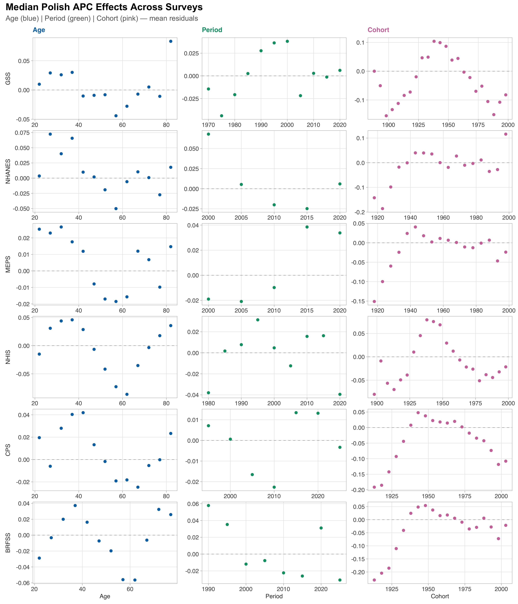

Figure 1: Median polish APC effects across all 6 surveys. Columns: Age
(blue), Period (green), Cohort (pink). Each point is the mean residual
for that dimension value.

</div>

## Direct Medpolish Effects

The direct effects are the **row and column effects** extracted directly
by `medpolish()`. Each dimension appears in two slices (e.g., Age is a
row effect in both the AP and AC matrices), providing two independent
estimates. Agreement between slices indicates a robust effect;
divergence indicates sensitivity to the conditioning dimension.

``` r
plot_direct_effects_all_surveys(all_direct, survey_order = sv_levels)
```

<div id="fig-direct">

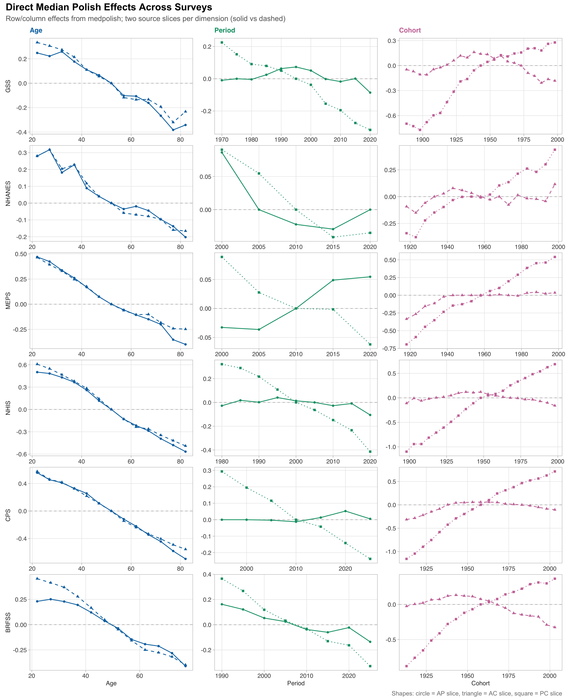

Figure 2: Direct row/column effects from medpolish. Each dimension has
two estimates from different matrix slices (solid vs dashed lines).
Close agreement = robust effect.

</div>

## Residual Diagnostics

Cell-level residuals from each matrix slice, plotted against the third
dimension. Systematic patterns in residuals indicate effects not
captured by the additive row + column decomposition.

``` r
plot_residuals_all_surveys(all_results, survey_order = surveys)
```

<div id="fig-residuals">

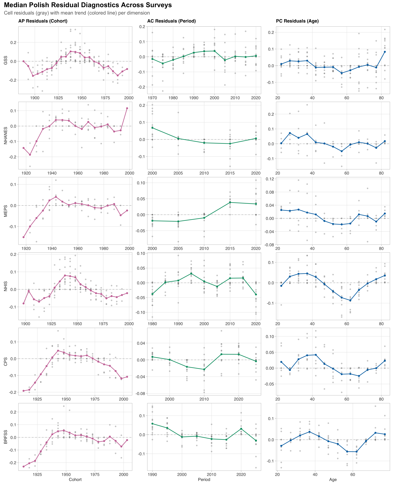

Figure 3: Median polish residuals across surveys. Gray dots = individual
cell residuals; colored line = mean residual trend. Structured patterns
indicate real effects of the third dimension.

</div>

# Variance Decomposition

For each matrix slice, the table shows the percentage of total cell-mean
variation (sum of squares) explained by row effects, column effects, and
residuals.

> [!NOTE]
>
> Because median polish uses medians (not means), the decomposition is
> not orthogonal — component percentages may not sum to exactly 100%.

## AP Matrix: Age vs Period

``` r
all_var |>
  filter(slice == "AP", component != "Total") |>
  select(Survey = survey, Component = component, `SS` = ss, `% of Total` = pct) |>
  mutate(`SS` = round(`SS`, 3),
         `% of Total` = round(`% of Total`, 1)) |>
  pivot_wider(names_from = Component, values_from = c(`SS`, `% of Total`)) |>
  select(Survey,
         `Age SS` = `SS_Age`, `Age %` = `% of Total_Age`,
         `Period SS` = `SS_Period`, `Period %` = `% of Total_Period`,
         `Residual SS` = `SS_Residual`, `Residual %` = `% of Total_Residual`) |>
  kable(digits = 1, caption = "AP matrix: Age dominates Period in every survey.") |>
  styled_kable(bootstrap_options = c("striped", "hover", "condensed"),
               full_width = FALSE)
```

<div id="tbl-ap">

Table 1: AP matrix: Age dominates Period in every survey.

<div class="cell-output-display">

| Survey | Age SS | Age % | Period SS | Period % | Residual SS | Residual % |
|:-------|-------:|------:|----------:|---------:|------------:|-----------:|
| GSS    |    6.7 |  84.6 |       0.3 |      3.3 |         1.7 |       21.4 |
| NHANES |    1.7 |  73.6 |       0.1 |      4.9 |         0.4 |       15.4 |
| MEPS   |    4.9 |  93.1 |       0.1 |      1.9 |         0.1 |        2.8 |
| NHIS   |   15.6 | 104.4 |       0.2 |      1.3 |         0.5 |        3.5 |
| CPS    |   14.5 |  95.7 |       0.0 |      0.3 |         0.5 |        3.1 |
| BRFSS  |    4.6 |  80.6 |       0.8 |     14.4 |         0.6 |       10.6 |

</div>

</div>

## AC Matrix: Age vs Cohort

``` r
all_var |>
  filter(slice == "AC", component != "Total") |>
  select(Survey = survey, Component = component, `SS` = ss, `% of Total` = pct) |>
  mutate(`SS` = round(`SS`, 3),
         `% of Total` = round(`% of Total`, 1)) |>
  pivot_wider(names_from = Component, values_from = c(`SS`, `% of Total`)) |>
  select(Survey,
         `Age SS` = `SS_Age`, `Age %` = `% of Total_Age`,
         `Cohort SS` = `SS_Cohort`, `Cohort %` = `% of Total_Cohort`,
         `Residual SS` = `SS_Residual`, `Residual %` = `% of Total_Residual`) |>
  kable(digits = 1, caption = "AC matrix: Age dominates Cohort, though Cohort contributes modestly (4-21%).") |>
  styled_kable(bootstrap_options = c("striped", "hover", "condensed"),
               full_width = FALSE)
```

<div id="tbl-ac">

Table 2: AC matrix: Age dominates Cohort, though Cohort contributes
modestly (4-21%).

<div class="cell-output-display">

| Survey | Age SS | Age % | Cohort SS | Cohort % | Residual SS | Residual % |
|:-------|-------:|------:|----------:|---------:|------------:|-----------:|
| GSS    |    6.4 |  76.8 |       1.6 |     19.0 |         0.6 |        7.2 |
| NHANES |    1.8 |  77.5 |       0.2 |      7.5 |         0.3 |       10.9 |
| MEPS   |    3.8 |  71.9 |       0.4 |      7.5 |         0.1 |        1.7 |
| NHIS   |   16.3 | 103.8 |       0.6 |      4.0 |         0.2 |        1.1 |
| CPS    |   12.5 |  82.8 |       0.7 |      4.6 |         0.1 |        0.4 |
| BRFSS  |    8.4 | 143.4 |       1.2 |     21.2 |         0.2 |        4.1 |

</div>

</div>

## PC Matrix: Period vs Cohort

``` r
all_var |>
  filter(slice == "PC", component != "Total") |>
  select(Survey = survey, Component = component, `SS` = ss, `% of Total` = pct) |>
  mutate(`SS` = round(`SS`, 3),
         `% of Total` = round(`% of Total`, 1)) |>
  pivot_wider(names_from = Component, values_from = c(`SS`, `% of Total`)) |>
  select(Survey,
         `Period SS` = `SS_Period`, `Period %` = `% of Total_Period`,
         `Cohort SS` = `SS_Cohort`, `Cohort %` = `% of Total_Cohort`,
         `Residual SS` = `SS_Residual`, `Residual %` = `% of Total_Residual`) |>
  kable(digits = 1, caption = "PC matrix: Cohort dominates Period once age is removed.") |>
  styled_kable(bootstrap_options = c("striped", "hover", "condensed"),
               full_width = FALSE)
```

<div id="tbl-pc">

Table 3: PC matrix: Cohort dominates Period once age is removed.

<div class="cell-output-display">

| Survey | Period SS | Period % | Cohort SS | Cohort % | Residual SS | Residual % |
|:-------|----------:|---------:|----------:|---------:|------------:|-----------:|
| GSS    |       4.3 |     41.3 |      12.9 |    124.3 |         0.6 |        6.0 |
| NHANES |       0.2 |      7.6 |       1.9 |     78.1 |         0.3 |       14.3 |
| MEPS   |       0.2 |      3.1 |       5.4 |    104.0 |         0.1 |        2.0 |
| NHIS   |       6.5 |     40.2 |      21.6 |    134.0 |         0.4 |        2.4 |
| CPS    |       2.8 |     18.6 |      18.4 |    122.1 |         0.1 |        0.9 |
| BRFSS  |       4.5 |     75.4 |       7.6 |    128.6 |         0.2 |        3.9 |

</div>

</div>

# Linear Trend Tests

Linear models fit to the mean-residual effects test whether each APC
dimension has a significant linear trend. Slopes represent the change in
residual effect (SRH units) per unit increase in the dimension.

``` r
all_lm |>
  filter(term == "value") |>
  mutate(
    sig = case_when(
      p.value < 0.001 ~ "***",
      p.value < 0.01  ~ "**",
      p.value < 0.05  ~ "*",
      TRUE ~ ""
    ),
    Slope = sprintf("%.4f", estimate),
    `95% CI` = sprintf("[%.4f, %.4f]", conf.low, conf.high),
    p = sprintf("%.4f", p.value)
  ) |>
  select(Survey = survey, Dimension = dimension, Slope, `95% CI`, p, sig) |>
  kable(caption = "Linear trend slopes for median polish effects. * p < 0.05, ** p < 0.01, *** p < 0.001.") |>
  styled_kable(bootstrap_options = c("striped", "hover", "condensed"),
               full_width = FALSE)
```

<div id="tbl-lm">

Table 4: Linear trend slopes for median polish effects. \* p \< 0.05,
\*\* p \< 0.01, \*\*\* p \< 0.001.

<div class="cell-output-display">

| Survey | Dimension | Slope   | 95% CI              | p      | sig |
|:-------|:----------|:--------|:--------------------|:-------|:----|
| GSS    | Age       | -0.0000 | \[-0.0011, 0.0011\] | 0.9575 |     |
| GSS    | Cohort    | -0.0001 | \[-0.0012, 0.0010\] | 0.8686 |     |
| GSS    | Period    | 0.0006  | \[-0.0005, 0.0016\] | 0.2798 |     |
| NHANES | Age       | -0.0009 | \[-0.0019, 0.0001\] | 0.0758 |     |
| NHANES | Cohort    | 0.0017  | \[0.0004, 0.0029\]  | 0.0111 | \*  |
| NHANES | Period    | -0.0031 | \[-0.0095, 0.0034\] | 0.2262 |     |
| MEPS   | Age       | -0.0004 | \[-0.0009, 0.0001\] | 0.0857 |     |
| MEPS   | Cohort    | 0.0008  | \[-0.0002, 0.0017\] | 0.1055 |     |
| MEPS   | Period    | 0.0033  | \[0.0002, 0.0064\]  | 0.0416 | \*  |
| NHIS   | Age       | -0.0005 | \[-0.0020, 0.0009\] | 0.4316 |     |
| NHIS   | Cohort    | 0.0001  | \[-0.0007, 0.0008\] | 0.8342 |     |
| NHIS   | Period    | 0.0000  | \[-0.0016, 0.0016\] | 0.9632 |     |
| CPS    | Age       | -0.0005 | \[-0.0012, 0.0002\] | 0.1632 |     |
| CPS    | Cohort    | 0.0006  | \[-0.0007, 0.0020\] | 0.3165 |     |
| CPS    | Period    | 0.0002  | \[-0.0013, 0.0017\] | 0.7811 |     |
| BRFSS  | Age       | 0.0000  | \[-0.0012, 0.0013\] | 0.9600 |     |
| BRFSS  | Cohort    | 0.0015  | \[0.0002, 0.0028\]  | 0.0305 | \*  |
| BRFSS  | Period    | -0.0017 | \[-0.0038, 0.0005\] | 0.1082 |     |

</div>

</div>

# Per-Survey Detail

``` r
for (sv in surveys) {
  cat("\n\n## ", toupper(sv), " {.unnumbered}\n\n")

  r <- all_results[[sv]]

  cat("**Cell means:**", nrow(r$cell_means), "cells |",
      "**SRH range:**", round(min(r$cell_means$mean_srh), 2), "--",
      round(max(r$cell_means$mean_srh), 2), "\n\n")

  # Variance decomposition mini-table
  vd <- r$var_decomp |>
    filter(component != "Total") |>
    mutate(pct = round(pct, 1)) |>
    select(Slice = slice, Component = component, `% of Total` = pct)

  print(kable(vd, caption = paste0(toupper(sv), " variance decomposition")) |>
          styled_kable(bootstrap_options = c("striped", "condensed"),
                       full_width = FALSE))

  cat("\n\n")
}
```

## GSS

**Cell means:** 143 cells \| **SRH range:** 2.37 – 3.34

| Slice | Component | % of Total |
|:------|:----------|-----------:|
| AP    | Age       |       84.6 |
| AP    | Period    |        3.3 |
| AP    | Residual  |       21.4 |
| AC    | Age       |       76.8 |
| AC    | Cohort    |       19.0 |
| AC    | Residual  |        7.2 |
| PC    | Period    |       41.3 |
| PC    | Cohort    |      124.3 |
| PC    | Residual  |        6.0 |

GSS variance decomposition

## NHANES

**Cell means:** 65 cells \| **SRH range:** 3.04 – 3.78

| Slice | Component | % of Total |
|:------|:----------|-----------:|
| AP    | Age       |       73.6 |
| AP    | Period    |        4.9 |
| AP    | Residual  |       15.4 |
| AC    | Age       |       77.5 |
| AC    | Cohort    |        7.5 |
| AC    | Residual  |       10.9 |
| PC    | Period    |        7.6 |
| PC    | Cohort    |       78.1 |
| PC    | Residual  |       14.3 |

NHANES variance decomposition

## MEPS

**Cell means:** 65 cells \| **SRH range:** 2.91 – 4.01

| Slice | Component | % of Total |
|:------|:----------|-----------:|
| AP    | Age       |       93.1 |
| AP    | Period    |        1.9 |
| AP    | Residual  |        2.8 |
| AC    | Age       |       71.9 |
| AC    | Cohort    |        7.5 |
| AC    | Residual  |        1.7 |
| PC    | Period    |        3.1 |
| PC    | Cohort    |      104.0 |
| PC    | Residual  |        2.0 |

MEPS variance decomposition

## NHIS

**Cell means:** 117 cells \| **SRH range:** 2.95 – 4.18

| Slice | Component | % of Total |
|:------|:----------|-----------:|
| AP    | Age       |      104.4 |
| AP    | Period    |        1.3 |
| AP    | Residual  |        3.5 |
| AC    | Age       |      103.8 |
| AC    | Cohort    |        4.0 |
| AC    | Residual  |        1.1 |
| PC    | Period    |       40.2 |
| PC    | Cohort    |      134.0 |
| PC    | Residual  |        2.4 |

NHIS variance decomposition

## CPS

**Cell means:** 91 cells \| **SRH range:** 2.68 – 4.15

| Slice | Component | % of Total |
|:------|:----------|-----------:|
| AP    | Age       |       95.7 |
| AP    | Period    |        0.3 |
| AP    | Residual  |        3.1 |
| AC    | Age       |       82.8 |
| AC    | Cohort    |        4.6 |
| AC    | Residual  |        0.4 |
| PC    | Period    |       18.6 |
| PC    | Cohort    |      122.1 |
| PC    | Residual  |        0.9 |

CPS variance decomposition

## BRFSS

**Cell means:** 96 cells \| **SRH range:** 2.99 – 3.92

| Slice | Component | % of Total |
|:------|:----------|-----------:|
| AP    | Age       |       80.6 |
| AP    | Period    |       14.4 |
| AP    | Residual  |       10.6 |
| AC    | Age       |      143.4 |
| AC    | Cohort    |       21.2 |
| AC    | Residual  |        4.1 |
| PC    | Period    |       75.4 |
| PC    | Cohort    |      128.6 |
| PC    | Residual  |        3.9 |

BRFSS variance decomposition

### Per-survey effects plots

<div class="panel-tabset">

#### GSS

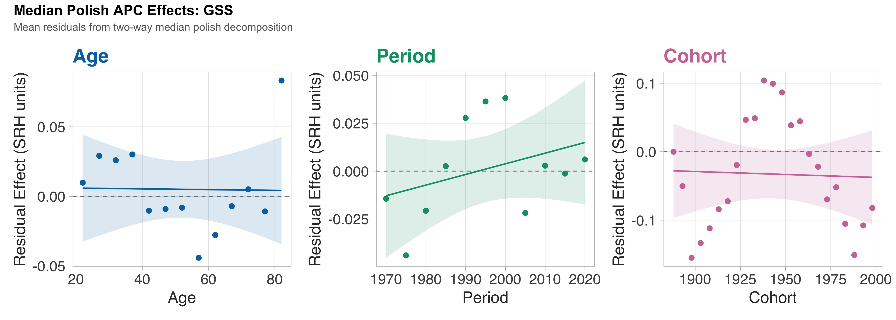

#### NHANES

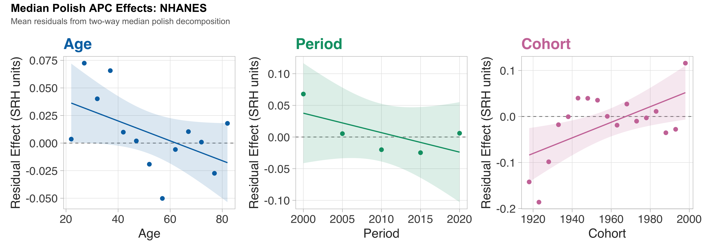

#### MEPS

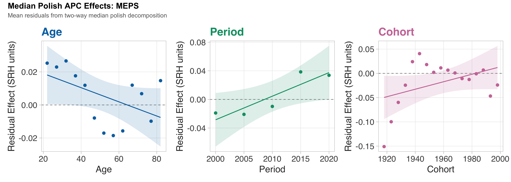

#### NHIS

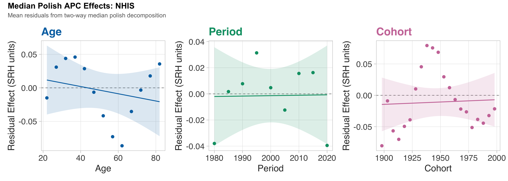

#### CPS

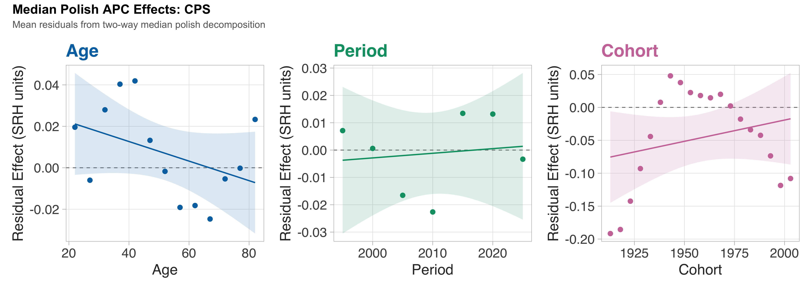

#### BRFSS


</div>

### Per-survey direct effects plots

<div class="panel-tabset">

#### GSS

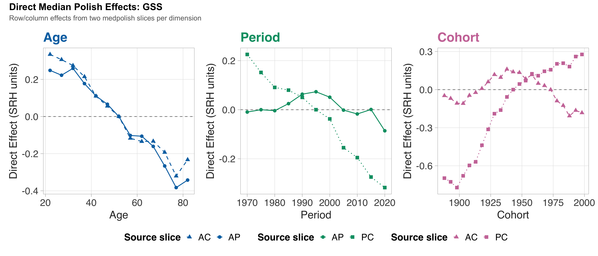

#### NHANES

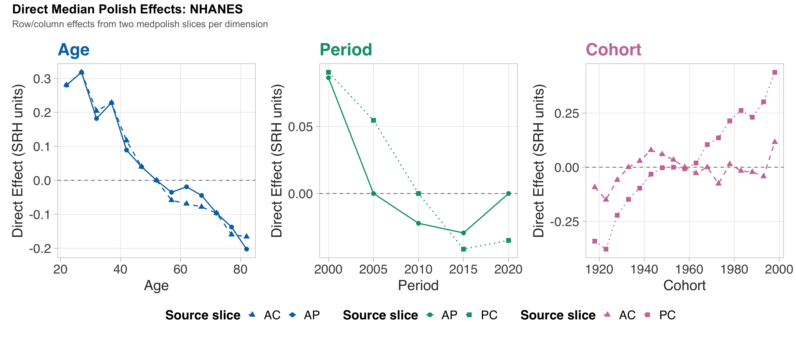

#### MEPS

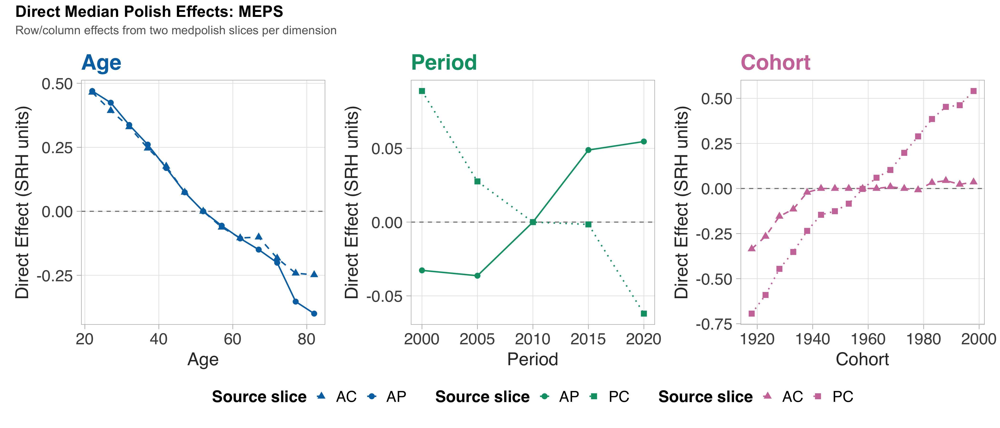

#### NHIS

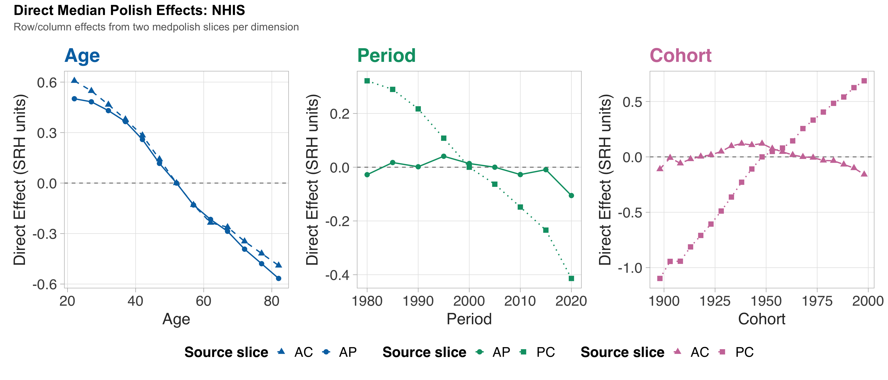

#### CPS

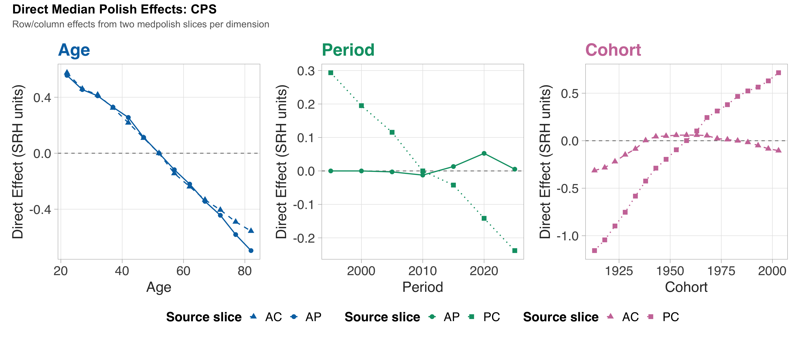

#### BRFSS

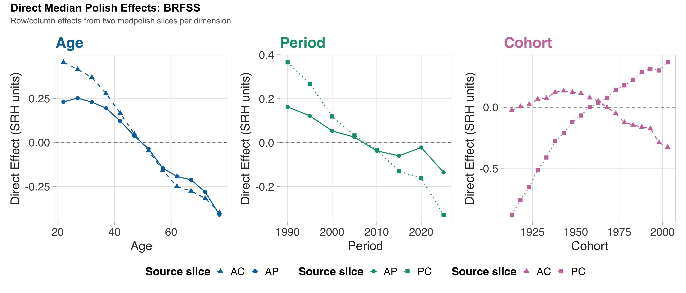

</div>

# Summary

``` r
# Build a concise summary table
summary_tbl <- all_var |>
  filter(component != "Total") |>
  select(survey, slice, component, pct) |>
  mutate(pct = round(pct, 1)) |>
  unite("slice_comp", slice, component, sep = ": ") |>
  pivot_wider(names_from = slice_comp, values_from = pct)

k <- kable(summary_tbl,
           caption = "Variance decomposition summary (% of total SS) across all slices and surveys.")
if (is_html) {
  k |>
    kable_styling(bootstrap_options = c("striped", "hover", "condensed"),
                  full_width = TRUE, font_size = 12) |>
    add_header_above(c(" " = 1, "AP (Age vs Period)" = 3,
                        "AC (Age vs Cohort)" = 3,
                        "PC (Period vs Cohort)" = 3))
} else {
  k
}
```

<div id="tbl-summary">

Table 5: Variance decomposition summary (% of total SS) across all
slices and surveys.

<div class="cell-output-display">

| survey | AP: Age | AP: Period | AP: Residual | AC: Age | AC: Cohort | AC: Residual | PC: Period | PC: Cohort | PC: Residual |
|:---|---:|---:|---:|---:|---:|---:|---:|---:|---:|
| GSS | 84.6 | 3.3 | 21.4 | 76.8 | 19.0 | 7.2 | 41.3 | 124.3 | 6.0 |
| NHANES | 73.6 | 4.9 | 15.4 | 77.5 | 7.5 | 10.9 | 7.6 | 78.1 | 14.3 |
| MEPS | 93.1 | 1.9 | 2.8 | 71.9 | 7.5 | 1.7 | 3.1 | 104.0 | 2.0 |
| NHIS | 104.4 | 1.3 | 3.5 | 103.8 | 4.0 | 1.1 | 40.2 | 134.0 | 2.4 |
| CPS | 95.7 | 0.3 | 3.1 | 82.8 | 4.6 | 0.4 | 18.6 | 122.1 | 0.9 |
| BRFSS | 80.6 | 14.4 | 10.6 | 143.4 | 21.2 | 4.1 | 75.4 | 128.6 | 3.9 |

</div>

</div>

## Key Findings

1.  **Age dominates** SRH variation in every survey and every matrix
    slice. In the AP matrix, Age explains 74–104% of total SS versus
    0.3–14% for Period.

2.  **Cohort effects are secondary but real.** In the AC matrix, Cohort
    explains 4–21% of variation. In the PC matrix (after removing age),
    Cohort dominates Period (78–134% vs 3–75%).

3.  **Period effects are minimal.** Period is consistently the weakest
    dimension, explaining \<5% in the AP matrix for most surveys (except
    BRFSS at 14%).

4.  **Linear trends** in the residual effects are mostly
    non-significant. Only NHANES and BRFSS show significant positive
    cohort slopes, and MEPS shows a significant positive period slope.

5.  **Direct effects agree across slices for Age** (robust), but
    **diverge for Period and Cohort** (reflecting the fundamental APC
    identification problem).

These results are consistent with the parametric BHAPC analysis: SRH is
primarily structured by age, with modest birth-cohort variation and
negligible calendar-time trends.

------------------------------------------------------------------------

*Report generated 2026-02-09 18:46:36.23665*
